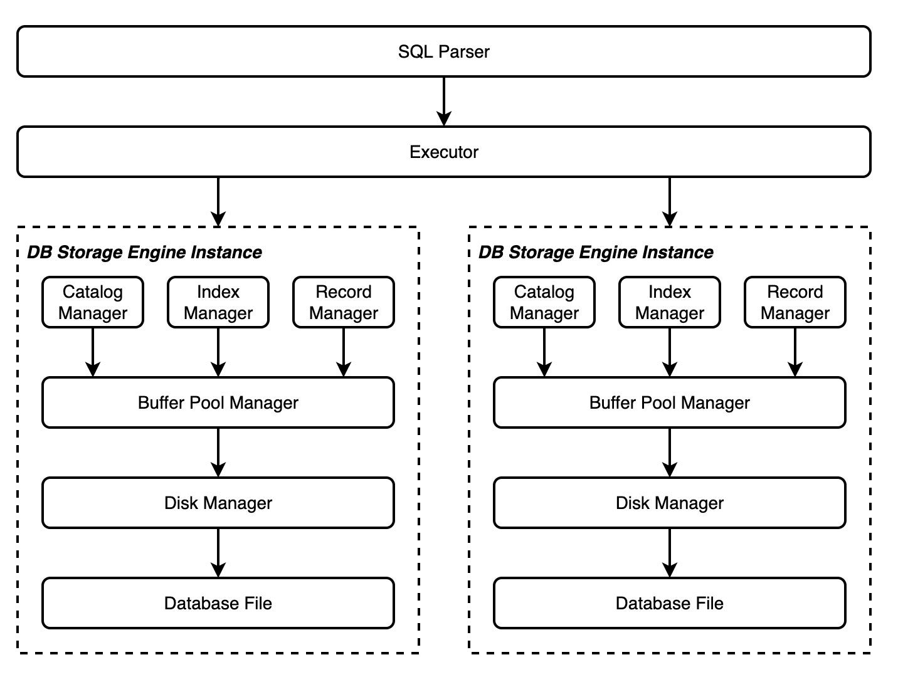
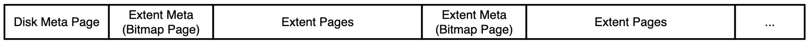
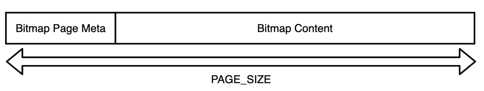
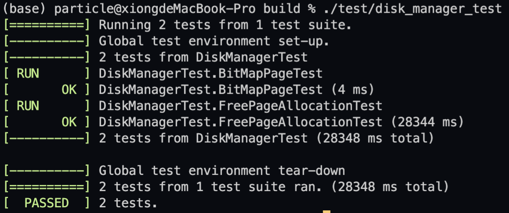
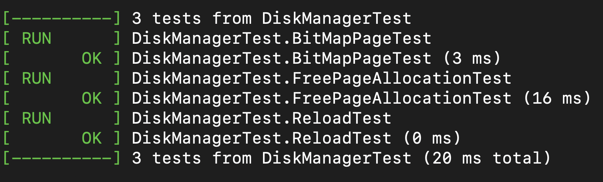
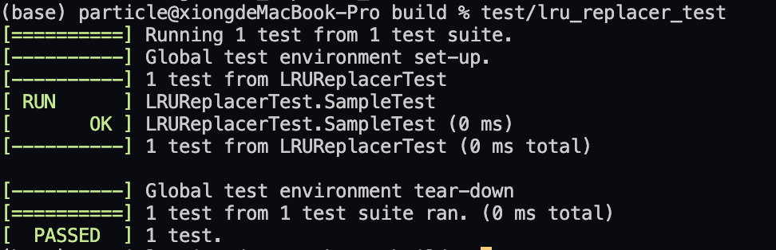
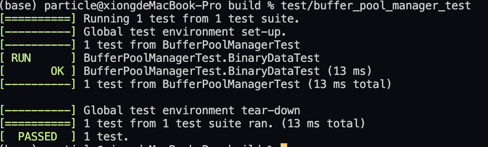
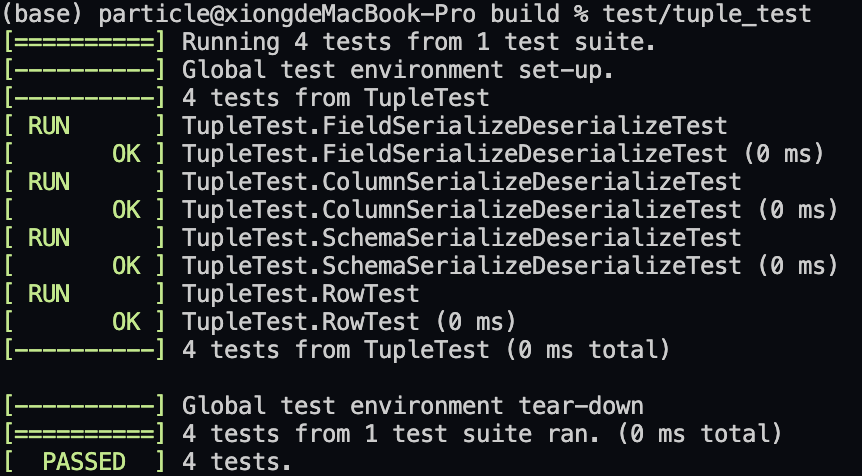

<div class="cover" style="page-break-after:always;font-family:方正公文仿宋;width:100%;height:100%;border:none;margin: 0 auto;">
  </br></br></br>
    <div style="font-family:Arial;font-weight:Bold;text-align:center;font-size:22pt;margin: 10pt auto;line-height:30pt;">MINISQL Report</div>
    </br></br></br></br></br></br></br></br></br></br></br></br>
    <table style="border:none;text-align:center;width:72%;font-family:仿宋;font-size:12pt; margin: 0 auto;">
    <tbody style="font-family:方正公文仿宋;font-size:14pt;">
    	<tr style="font-weight:normal;"> 
    		<td style="width:20%;text-align:right;">Title</td>
    		<td style="width:2%">：</td> 
        <td style="width:70%;font-weight:normal;text-align:center;font-family:华文仿宋"> MINISQL Report</td>     </tr>
    	<tr style="font-weight:normal;"> 
    		<td style="width:20%;text-align:right;">Author</td>
    		<td style="width:2%">：</td> 
    		<td style="width:40%;font-weight:normal;text-align:center;font-family:华文仿宋"> 熊子宇 3200105278</td>     </tr>
    </tbody>              
    </table>
</br></br></br></br></br></br>
</div>

[TOC]


## MiniSQL概述

设计并实现一个精简型单用户SQL引擎MiniSQL，允许用户通过字符界面输入SQL语句实现基本的增删改查操作，并能够通过索引来优化性能。系统架构如下：



在这其中，我负责了Disk Manager和Buffer Pool Manager的全部工作，并进行了优化。此外，我还完成了Record Manager对Schema, Column, Row的序列化&反序列化函数，以及Executor持久化db入口的工作。下文一一介绍。


## Disk Manager

### 功能概述

Disk Manager模块位于Minisql架构的最底层。Disk Manager的主要功能有：

- 建立逻辑页号和物理页号的映射，为Buffer Pool Manager提供接口

- 分配和回收数据页
- 从磁盘将数据读取到数据页中
- 将数据页中的数据写回磁盘

### 数据结构

在磁盘中，数据是以页（Page）为单位存储的。Page作为抽象的容器，可以容纳不同种类的数据。在Disk Manager中，包含三种页：Disk Meta Page, Bitmap Page和实际存放数据的页Extent Page。



Disk Meta Page是数据库文件中的第`0`个数据页，它维护了分区相关的信息，如分区的数量、每个分区中已经分配的页的数量等等。接下来，每一个分区都包含了一个位图页和一段连续的数据页。

Bitmap Page是每一个分区中的第`0`个数据页。位图中每个比特（Bit）对应一个数据页的分配情况，用于标记该数据页是否空闲（`0`表示空闲，`1`表示已分配）。

通过复用Bitmap Page + Extent Pages层次，可以磁盘文件能够维护更多的数据页信息。


### Bitmap Page

#### 功能概述

我们先来看，在一个分区中，Bitmap是如何实现磁盘页分配与回收工作的。位图页与数据页一样，占用`PAGE_SIZE`（4KB）的空间，标记一段连续页的分配情况。

Bitmap Page由两部分组成：

- 一部分是用于加速Bitmap内部查找的元信息（Bitmap Page Meta），它包含当前已经分配的页的数量（`page_allocated_`）以及下一个空闲的数据页(`next_free_page_`)。
- 页中剩余的部分就是Bitmap存储的具体数据，其大小`BITMAP_CONTENT_SIZE`可以通过`PAGE_SIZE - BITMAP_PAGE_META_SIZE`来计算。这个Bitmap Page能够支持最多纪录`BITMAP_CONTENT_SIZE * 8`个连续页的分配情况。



#### 类的设计

助教已经在`/include/page/bitmap_page.h`中给出了框架。为了方便扩展不同的`PageSize`（而非仅是固定的4KB），使用模版定义`BitmapPage`。

正如上文所述，bitmap包括三个私有属性，`page_allocated_`和`next_free_page_`是元数据，`unsigned char bytes[]`是标记页的分配情况。

`BitmapPage`有四个公开方法和两个私有方法，具体功能见代码注释。其中`getNextFreePage()`是我为了实现`AllocatePage`而新增的函数，使用线性扫描的方法找到下一个空闲页的offset。

在这一节中，我需要完成如下函数的补充：

- `BitmapPage::AllocatePage(&page_offset)`，分配一个空闲页，并通过`page_offset`返回所分配的空闲页位于该段中的下标（从`0`开始）
- `BitmapPage::DeAllocatePage(page_offset)`，回收已经被分配的页
- `BitmapPage::IsPageFree(page_offset)`：判断给定的页是否是空闲（未分配）的
- `BitmapPage::IsPageFreeLow(byte_index, bit_index)`，判断给定的bit对应的页是否空闲（`bytes[bit] == 0`） 


#### 方法实现

##### `BitmapPage::AllocatePage(&page_offset)`

```c++
template<size_t PageSize>
bool BitmapPage<PageSize>::AllocatePage(uint32_t &page_offset) {
  // 如果所有页已经分配完毕，则返回false
  if (page_allocated_ == GetMaxSupportedSize()) return false;
  else {
    page_offset = next_free_page_;
    // 将page_offset对应的bit置1
    bytes[page_offset / 8] |= 1 << (page_offset % 8);
    page_allocated_++;
    // 调用线性扫描函数，找到下一个free page
    getNextFreePage();
    return true;
  }
}
```

这里需要注意的是按位或的小技巧。由于使用`unsigned char[]`来存储bit，通过`page_offset / 8`索引到对应的byte，再通过`page_offset % 8`索引到当前byte的第几个bit，使用按位左移和按位或将该bit置为1。


##### `BitmapPage::getNextFreePage()`

```c++
template<size_t PageSize>
void BitmapPage<PageSize>::getNextFreePage() {
  const size_t size = GetMaxSupportedSize();
  if (page_allocated_ == size) {
    next_free_page_ = size;
    return;
  }
  while (1) {
    if (next_free_page_ < size && IsPageFree(next_free_page_)) break;
    else if (next_free_page_ < size && !IsPageFree(next_free_page_)) next_free_page_++;
    else if (next_free_page_ == size) next_free_page_ = 0;
  }
}
```

这里采取了比较简单的方法，即如果分配页数还没达到最大页数，则一定存在空闲页。从当前`next_free_page_`向后遍历，直至找到第一个空闲页，存入`next_free_page_`中。如果`next_free_page_`超过了最大页数，则重新置0再遍历。


##### `BitmapPage::DeAllocatePage(page_offset)`

```c++
template<size_t PageSize>
bool BitmapPage<PageSize>::DeAllocatePage(uint32_t page_offset) {
  if (page_offset >= GetMaxSupportedSize() ||  IsPageFree(page_offset)) return false;
  else {
    /** ~(1 << (page_offset % 8)) is the and-bit-mask to reset the corresponding bit 0 */
    bytes[page_offset / 8] &= ~(1 << (page_offset % 8));
    page_allocated_--;
    getNextFreePage();
    return true;
  }
}
```

`DeAllocatePage()`是`AllocatePage()`的逆操作，思路十分类似，不过将按位或的置1操作用按位与的置0操作来替代。


##### `BitmapPage::IsPageFree(page_offset)`和`BitmapPage::IsPageFreeLow(byte_index, bit_index)`

```c++
template<size_t PageSize>
bool BitmapPage<PageSize>::IsPageFree(uint32_t page_offset) const {
  if (page_offset >= GetMaxSupportedSize()) return false;
  else return IsPageFreeLow(page_offset/8, page_offset%8);
}
```

```c++
template<size_t PageSize>
bool BitmapPage<PageSize>::IsPageFreeLow(uint32_t byte_index, uint8_t bit_index) const {
  if (bytes[byte_index] & (1 << bit_index)) return 0;
  else return 1;
}
```

此处和`AllocatePage()`基本相同，也是利用按位与判断`page_offset`在`bytes`中对应bit是否为1。


### 类的设计

`DiskManager`类按功能划分有以下几个部分：

#### 连接/断连database文件

- `DiskManager(&db_file)`，与指定db文件连接
- `~DiskManager()`，与db文件断开连接
- 该部分已由助教给出


#### 读/写数据页

- `ReadPage(logical_page_id, page_data)`，公开方法，Buffer Pool Manager向Disk Manager提供逻辑页号后读取数据，存放在`page_data`中
  - 该方法将逻辑页号映射成对应物理页号后，调用私有函数`ReadPhysicalPage(physical_page_id, page_data)`读取物理页
- `WritePage(logical_page_id, page_data)`，公开方法，Buffer Pool Manager向Disk Manager提供逻辑页号后，将`page_data`存入数据页
  - 该方法将逻辑页号映射成对应物理页号后，调用私有函数`WritePhysicalPage(physical_page_id, page_data)`写入物理页
- 该部分已由助教给出


#### 由逻辑页号获得必要参数

- `MapPageId(logical_page_id)`，私有方法，由逻辑页号映射为物理页号
- `getExtentId(logical_page_id)`，私有方法，由逻辑页号获得分区号
- `getPageOffset(logical_page_id)`，私有方法，由逻辑页号获得在分区中的偏移量
- 该部分需要我实现


#### 分配/回收数据页

- `AllocatePage()`，公开方法，返回新分配的逻辑页号
- `DeAllocatePage(logical_page_id)`，公开方法，回收数据页
- `IsPageFree(logical_page_id)`，公开方法，判断给定逻辑页是否空闲
- 该部分需要我实现

另外，DiskManager中还有一个私有成员`char meta_data_[PAGE_SIZE];`，以字符串的形式存储元数据。在实际使用时，通过`DiskFileMetaPage *meta_page = reinterpret_cast<DiskFileMetaPage *>(meta_data_);`强制类型转换为`DiskFileMetaPage`类的指针，即可获得DiskManager中已分配页数、分区数、每个分区已分配页数等元信息。


### 方法实现

#### 由逻辑页号获得必要参数

在Disk Manager中，逻辑页号与物理页号的映射关系如下：

| 物理页号 | 0          | 1      | 2      | 3      | 4      | 5      | 6      | ...  |
| -------- | ---------- | ------ | ------ | ------ | ------ | ------ | ------ | ---- |
| 职责     | 磁盘元数据 | 位图页 | 数据页 | 数据页 | 数据页 | 位图页 | 数据页 |      |
| 逻辑页号 | /          | /      | 0      | 1      | 2      |        | 3      |      |

分析可知，有如下定量关系：

- `physical_page_id = logical_page_id + extent_id + 2`
- `extent_id = logical_page_id / BITMAP_SIZE`
- `page_offset = physical_page_id - 2 - extent_id - extent_id*BITMAP_SIZE`


#### 分配/回收数据页

`DiskManager::AllocatePage()`如下：

```c++
page_id_t DiskManager::AllocatePage() {
  DiskFileMetaPage *meta_page = reinterpret_cast<DiskFileMetaPage *>(meta_data_);
  /** 如果所有page都分配完了，则返回INVALID_PAGE_ID */
  if (meta_page->GetAllocatedPages() == MAX_VALID_PAGE_ID + 1) return INVALID_PAGE_ID;
  uint32_t num_extents = meta_page->GetExtentNums();
  uint32_t extent_id;
  /** 找到有空闲页的分区 */
  for (extent_id = 0; extent_id < num_extents; extent_id++) {
    if (meta_page->GetExtentUsedPage(extent_id) < BITMAP_SIZE) break;
  }
  /** 如果extent_id == num_extents，说明需要开辟新的分区 */
  if (extent_id == num_extents) {
    meta_page->num_extents_++;
    meta_page->extent_used_page_[extent_id] = 0;
  }
  /** 读出有空闲页分区的位图页 
   *  物理页号为 1 + extent_id + extent_id*BITMAP_SIZE */
  char *buf = new char[PAGE_SIZE];
  uint32_t physical_page_id = 1+extent_id+extent_id*BITMAP_SIZE;
  ReadPhysicalPage(physical_page_id, buf);
  BitmapPage<PAGE_SIZE> *bitmap = reinterpret_cast<BitmapPage<PAGE_SIZE> *>(buf);
  uint32_t page_offset;
  /** 分配页，并更新meta_page的内容 */
  bitmap->AllocatePage(page_offset);
  meta_page->num_allocated_pages_++;
  meta_page->extent_used_page_[extent_id]++;
  /** 当修改除了meta_page的任何页面，都必须要写回去，否则做了无效修改 */
  WritePhysicalPage(physical_page_id, buf);
  delete[] buf;
  return extent_id * BITMAP_SIZE + page_offset;
}
```

基本思路是，找到有空闲页的分区的bitmap，由bitmap来管理当前分区内的页的分配。

在代码中可以看到，每次分配一个新页，都要I/O位图页两次。这里可能是我们minisql的性能瓶颈之一。如果将所有bitmap预先读到buffer中，会大大减少I/O次数，会提高性能。因此，在优化之后，我提出了第二种方法。在disk_manager中增加成员变量`bitmap_list`。在构造disk_manager/AllocatePage需要使用bitmap/DeallocPage需要使用bitmap/isPageFree需要使用bitmap时，把bitmap都读入内存中。

```c++
vector<char *>bitmap_list; // 将Bitmap全部读到内存中，减少页分配/回收时的I/O开销
```

回收数据页是分配数据页的逆操作，同样是读出bitmap、由bitmap回收数据页、写回bitmap、修改元数据这些步骤构成。

`DiskManager::IsPageFree(logical_page_id)` 也是使用`BitmapPage::IsPageFree(page_offset)`管理。


### 测试结果

单元测试见`/test/storage/disk_manager_test.cpp`，包含BitMapPageTest和FreePageAllocationTest两个测试。

测试代码基本与助教给出的相同，因此此处不再放出。

当没有使用`bitmap_list`时，测试结果如下。可以看到花费28s。



经过优化后，可以看到性能加快超过1000倍。




## Buffer Pool Manager

### 功能概述

Buffer Pool Manager建构在Disk Manager之上。Buffer Pool Manager的主要功能有：

- 从Disk Manager中获取数据页并将它们存储在内存中
- 在必要时（如缓冲池满而要fetch新页，或调用缓冲池的析构函数）将脏页面转储到磁盘中
- 当缓冲池满时，使用替换策略为新的页面腾出空间

而Buffer Pool Manager主要负责将磁盘中的数据页从内存中来回移动到磁盘，这使得我们设计的数据库管理系统能够支持那些占用空间超过设备允许最大内存空间的数据库。


### 数据结构

- 一个Page的数组，在数组中以`frame_id`为下标编号。
- 一个哈希表维护`frame_id`对应的`logical_id`的映射关系。
- `free_list`链表储存缓冲池中剩余的`frame_id`。
- `DiskManager`的指针，以便调用disk manager。
- `Replacer`的指针，以便实现页的替换。在这里我们使用LRU替换策略替换。


### LRU Replacer

LRU Replacer是`Replacer`抽象类的子类。我使用了`std::list`和`std::unordered_map`两个STL来实现。成员变量如下：

```c++
  size_t capacity;  // LRUReplacer所能装载的最大页数量
  list<frame_id_t> lru_list_;   // 双向链表记录可以替换的页
  unordered_map<frame_id_t, list<frame_id_t>::iterator> lru_cache;    
  // HashMap用于通过key在O(1)时间访问链表中的结点(迭代器)
```

双向链表总是在表头插入，总是在表尾删除。也就是说，表尾的元素总是“最近最少使用”的。

需要实现的函数如下：

#### `LRUReplacer::Victim(*frame_id)`

替换（即删除）与所有被跟踪的页相比最近最少被访问的页（也即`lru_list_`的尾部），将其页帧号（即数据页在Buffer Pool的Page数组中的下标）存储在输出参数`frame_id`中输出并返回`true`，而且从哈希表中删除`frame_id`所对应项。如果当前没有可以替换的元素则返回`false`。

```c++
/** 如果lru_list_为空，则返回false
 *  否则删除lru_list_表尾并放入frame_id中 */
bool LRUReplacer::Victim(frame_id_t *frame_id) {
  if (lru_list_.empty()) return false;
  *frame_id = lru_list_.back();
  lru_list_.pop_back();
  lru_cache.erase(*frame_id);
  return true;
}
```


#### `LRUReplacer::Pin(frame_id)`

将数据页固定使之不能被`Replacer`替换，即从`lru_list_`中移除该数据页对应的页帧。`Pin`函数应当在一个数据页被Buffer Pool Manager固定时被调用

```c++
/** 如果frame_id在lru_list_中，则将frame_id从表中移除
 *  如果frame_id不在lru_list_中，则什么也不做 */
void LRUReplacer::Pin(frame_id_t frame_id) {
  if (lru_cache.count(frame_id)) {
    lru_list_.erase(lru_cache[frame_id]);
    lru_cache.erase(frame_id);
  }
}
```


#### `LRUReplacer::Unpin(frame_id)`

将数据页解除固定，放入`lru_list_`中，使之可以在必要时被`Replacer`替换掉。`Unpin`函数应当在一个数据页的引用计数变为`0`时被Buffer Pool Manager调用，使页帧对应的数据页能够在必要时被替换。

```c++
/** 如果frame_id已经在lru_list_中，则什么都不做
 *  如果frame_id不在lru_list_中，将frame_id放入链表表头
 **/
void LRUReplacer::Unpin(frame_id_t frame_id) {
  // if (lru_cache.count(frame_id)) {
  //   // lru_list_.splice(lru_list_.begin(), lru_list_, lru_cache[frame_id]);
  // }
  if (!lru_cache.count(frame_id)) {
    lru_list_.emplace_front(frame_id);
    lru_cache[frame_id] = lru_list_.begin();
  }
}
```


### 方法实现

#### `BufferPoolManager::FetchPage(page_id)`

根据逻辑页号获取对应的数据页，如果该数据页不在内存中，则需要从磁盘中进行读取。如果空闲页列表（`free_list_`）中没有可用的页面并且没有可以被替换的数据页，则应返回 `nullptr`。详细步骤见代码中注释。

```c++
Page *BufferPoolManager::FetchPage(page_id_t page_id) {
  // 1.     Search the page table for the requested page (P).
  // 1.1    If P exists, pin it and return it immediately.
  // 1.2    If P does not exist, find a replacement page (R) from either the free list or the replacer.
  //        Note that pages are always found from the free list first.(从空闲页链表的表头删除结点)
  // 2.     If R is dirty, write it back to the disk.
  // 3.     Delete R from the page table and insert P.
  // 4.     Update P's metadata, read in the page content from disk, and then return a pointer to P.
  if (page_table_.count(page_id)) {
    frame_id_t frame_id  = page_table_[page_id];
    pages_[frame_id].pin_count_++;
    replacer_->Pin(frame_id);
    return &(pages_[frame_id]);
  }
  else {
    frame_id_t new_frame_id;
    if (!free_list_.empty()) {
      new_frame_id = free_list_.front();
      free_list_.pop_front();
    }
    else {
      // 没有可替换的页，则无法fetch new page
      if (!replacer_->Victim(&new_frame_id)) return nullptr;
      page_id_t old_page = pages_[new_frame_id].page_id_;
      if (pages_[new_frame_id].is_dirty_) FlushPage(old_page);
      // 被替换的页要从table中移除
      page_table_.erase(old_page);
    }
    // 加入page table
    page_table_[page_id] = new_frame_id;
    // 更新new page的元数据
    Page* ptr = &(pages_[new_frame_id]);
    disk_manager_->ReadPage(page_id, ptr->data_);
    ptr->page_id_ = page_id;
    ptr->pin_count_ = 1;
    replacer_->Pin(new_frame_id);
    ptr->is_dirty_ = false;
    return ptr;
  }
}
```


#### `BufferPoolManager::NewPage(&page_id)`

分配一个新的数据页，并将逻辑页号于`page_id`中返回。

```c++
Page *BufferPoolManager::NewPage(page_id_t &page_id) {
  // 0.   Make sure you call AllocatePage!
  // 1.   If all the pages in the buffer pool are pinned, return nullptr.
  // 2.   Pick a victim page P from either the free list or the replacer. Always pick from the free list first.
  // 3.   Update P's metadata, zero out memory and add P to the page table.
  // 4.   Set the page ID output parameter. Return a pointer to P.
  frame_id_t new_frame_id;
  // 如果free_list无空闲页，而且所有页都被pinned，则无法fetch new page
  if (free_list_.empty() && !replacer_->Victim(&new_frame_id)) return nullptr;
  page_id = AllocatePage();
  // disk已满，无法再分配新页
  if (page_id == INVALID_PAGE_ID) return nullptr;

  if (!free_list_.empty()) {
    new_frame_id = free_list_.front();
    free_list_.pop_front();
  }
  else {
    // 最开始replacer_->Victim(&new_frame_id)已经把new_frame_id找到了
    page_id_t old_page = pages_[new_frame_id].page_id_;
    if (pages_[new_frame_id].is_dirty_) FlushPage(old_page);
    page_table_.erase(old_page);
  }
  // 加入page table
  page_table_[page_id] = new_frame_id;
  // 更新new page的元数据
  Page* ptr = &(pages_[new_frame_id]);
  ptr->ResetMemory();
  ptr->page_id_ = page_id;
  ptr->pin_count_ = 1;
  replacer_->Pin(new_frame_id);
  ptr->is_dirty_ = false;
  return ptr;
}
```


`BufferPoolManager::UnpinPage(page_id, is_dirty)`

调用replacer_，取消固定一个数据页，也即从lru_replacer中的双向链表中移除该页。

```c++
bool BufferPoolManager::UnpinPage(page_id_t page_id, bool is_dirty) {
  if (!page_table_.count(page_id)) return true;
  frame_id_t frame_id = page_table_[page_id];
  Page *ptr = &(pages_[frame_id]);
  if (is_dirty) ptr->is_dirty_ = true; // 外界告诉bufferPoolManager，该页是否被改写
  ptr->pin_count_ = 0;
  replacer_->Unpin(frame_id);
  return true;
}
```


#### `BufferPoolManager::FlushPage(page_id)`

将数据页转储到磁盘中。调用`DiskManager::WritePage(logical_page_id)`完成。

```c++
bool BufferPoolManager::FlushPage(page_id_t page_id) {
  if (!page_table_.count(page_id)) return false;
  frame_id_t frame_id = page_table_[page_id];
  Page *ptr = &(pages_[frame_id]);
  disk_manager_->WritePage(page_id, ptr->data_);
  return true;
}
```


#### `BufferPoolManager::DeletePage(page_id)`

释放一个数据页。具体过程见注释。

```c++
bool BufferPoolManager::DeletePage(page_id_t page_id) {
  // 0.   Make sure you call DeallocatePage!
  // 1.   Search the page table for the requested page (P).
  // 1.   If P does not exist, return true.
  // 2.   If P exists, but has a non-zero pin-count, return false. Someone is using the page.
  // 3.   Otherwise, P can be deleted. Remove P from the page table, reset its metadata and return it to the free list.
  if (!page_table_.count(page_id)) return true;
  frame_id_t frame_id = page_table_[page_id];
  Page *ptr = &(pages_[frame_id]);
  if (ptr->pin_count_) return false;
  DeallocatePage(page_id);
  page_table_.erase(page_id);
  ptr->page_id_ = INVALID_FRAME_ID;
  ptr->is_dirty_ = false;
  ptr->pin_count_ = 0;
  UnpinPage(page_id, false);
  ptr->ResetMemory();
  free_list_.emplace_back(frame_id);
  return true;
}
```


### 测试结果

单元测试见`/test/buffer/lru_replacer.cpp`和`/test/buffer/buffer_pool_manager_test.cpp`。

测试代码基本与助教给出的相同，因此此处不再放出。

测试结果如下，可见功能正确，性能良好。







## Serialize & Deserialize

### 记录与模式的相关概念

除了Disk Manager和Buffer Pool Manager以外，我还负责了Record Manager部分Column, Schema, Row的序列化函数和反序列化函数，简述如下。

在MiniSQL的设计中，Record Manager负责管理数据表中所有的记录，它能够支持记录的插入、删除与查找操作，并对外提供相应的接口。与记录（Record）相关的概念有以下几个：

- 列（`Column`）：在`src/include/record/column.h`中被定义，用于定义和表示数据表中的某一个字段，即包含了这个字段的字段名、字段类型、是否唯一等等；
- 模式（`Schema`）：在`src/include/record/schema.h`中被定义，用于表示一个数据表或是一个索引的结构。一个`Schema`由一个或多个的`Column`构成；
- 域（`Field`）：在`src/include/record/field.h`中被定义，它对应于一条记录中某一个字段的数据信息，如存储数据的数据类型，是否是空，存储数据的值等等；
- 行（`Row`）：在`src/include/record/row.h`中被定义，与元组的概念等价，用于存储记录或索引键，一个`Row`由一个或多个`Field`构成。

为了能够持久化存储上面提到的`Row`、`Field`、`Schema`和`Column`对象，我们需要提供一种能够将这些对象序列化成字节流（`char*`）的方法，以写入数据页中。与之相对，为了能够从磁盘中恢复这些对象，我们同样需要能够提供一种反序列化的方法，从数据页的`char*`类型的字节流中反序列化出我们需要的对象。总而言之，序列化和反序列化操作实际上是将数据库系统中的对象（包括记录、索引、目录等）进行内外存格式转化的过程，前者将内存中的逻辑数据（即对象）通过一定的方式，转换成便于在文件中存储的物理数据，后者则从存储的物理数据中恢复出逻辑数据，两者的目的都是为了实现数据的持久化。

在本节中我完成了如下函数：

- `Row::SerializeTo(*buf, *schema)`
- `Row::DeserializeFrom(*buf, *schema)`
- `Row::GetSerializedSize(*schema)`
- `Column::SerializeTo(*buf)`
- `Column::DeserializeFrom(*buf, *&column, *heap)`
- `Column::GetSerializedSize()`
- `Schema::SerializeTo(*buf)`
- `Schema::DeserializeFrom(*buf, *&schema, *heap)`
- `Schema::GetSerializedSize()`

其中，`SerializeTo`和`DeserializeFrom`函数的返回值为`uint32_t`类型，它表示在序列化和反序列化过程中`buf`指针向前推进了多少个字节。


### `Row`的序列化和反序列化

只要把握住序列化&反序列化的本质，这三个类的序列化&反序列化函数大同小异。其中以`Row`的函数最为复杂。为了节约报告空间，此处仅以`Row`的函数为例。

对于`Row`类型对象的序列化，首先要存储以下信息：

- field的个数
- bitmap，可以通过位图的方式标记为`null`的`Field`(即 *Null Bitmaps*)
- 调用field的序列化函数，存储field的信息

```c++
uint32_t Row::SerializeTo(char *buf, Schema *schema) const {
  uint32_t ofs = 0;
  MACH_WRITE_TO(size_t, buf, fields_.size());
  size_t len = fields_.size() / 8 + 1;
  char *bitmap = new char[len];
  ofs += sizeof(size_t);
  for (size_t i = 0; i < fields_.size(); i++) {
    if (fields_[i]->IsNull()) bitmap[i / 8] |= 1 << (i % 8);
  }
  memcpy(buf + ofs, bitmap, len);
  ofs += (uint32_t)len;
  for (Field *p : fields_) {
    if (!p->IsNull()) {
      ofs += p->SerializeTo(buf + ofs);
    }
  }
  delete [] bitmap;
  return ofs;
}
```


对于`Row`类型对象的反序列化，在反序列化每一个`Field`时，需要将自身的`heap_`作为参数传入到`Field`类型的`Deserialize`函数中，这也意味着所有反序列化出来的`Field`的内存都由该`Row`对象维护。反序列化是序列化的逆过程，要从buf中读出以下信息：

- field的个数
- bitmap，可以通过位图的方式标记为`null`的`Field`(即 *Null Bitmaps*)
- 调用field的反序列化函数，获得field的信息

```c++
uint32_t Row::DeserializeFrom(char *buf, Schema *schema) {
  /* deserialize row from buf */
  uint32_t ofs = 0;
  size_t field_num = MACH_READ_FROM(size_t, buf);
  ofs += sizeof(size_t);
  ASSERT(field_num == schema->GetColumnCount(), "Row::field_num != Schema::column_num");
  char *bitmap = new char[field_num / 8 + 1];
  memcpy(bitmap, buf + ofs, field_num / 8 + 1);
  ofs += (uint32_t)(field_num / 8 + 1);
  const std::vector<Column *> &columns = schema->GetColumns();
  fields_.clear();
  for (size_t i = 0; i < field_num; i++) {
    Field *fp = nullptr;
    if (bitmap[i/8] & (1 << (i%8))) { // isNull
      Field::DeserializeFrom(buf + ofs, columns[i]->GetType(), &fp, true, heap_);
    }
    else {
      ofs += Field::DeserializeFrom(buf + ofs, columns[i]->GetType(), &fp, false, heap_);
    }
    fields_.push_back(fp);
  }
  delete[] bitmap;
  return ofs;
}
```


`GetSerializedSize()`函数就是获得序列化过程中buf推进的字节数。

```c++
uint32_t Row::GetSerializedSize(Schema *schema) const {
  size_t len = fields_.size() / 8 + 1;
  uint32_t ofs = sizeof(size_t) + (uint32_t)len;
  for (Field *p : fields_) {
    if (!p->IsNull()) ofs += p->GetSerializedSize();
  }
  return ofs;
}
```


### 测试结果

单元测试见`/test/record/tuple_test.cpp`。

助教给出的测试代码较弱，不够全面，只测试了`Row`的序列化&反序列化，而未测试`Schema`和`Column`的，因此我新增了两个测试，以保证所有函数是正确的。

测试结果如下，可见功能正确。




## 实验心得

MiniSQL果然名不虚传，成为夏学期后四周的重量级大程。尤其是因为工程量大，每一部分写好以后拼凑起来非常容易出Bug，花费了特别多的时间在debug上。就我写的部分而言，功能基本没有问题，主要是涉及到I/O操作，是制约系统的性能的瓶颈，因此要想办法减少I/O，提高性能。

**已优化部分：**

- 将Bitmap在Disk Manager构造时读入内存，可以大大降低I/O次数。

- 在Buffer的LRU替换策略中，通过维护哈希表，可以O(1)时间进行替换。

**影响性能的其他因素：**

主要是Disk Manager的问题。在一个分区中，寻找下一个空闲页的算法是线性扫描的。如果最初的空页全部分配完，下一次找空页只能线性扫描所有页，检测是否为空，可能降低了速度。

我开始实验的时间是非常早的，大约是在5月中旬。而队友开始实验时间过晚，导致我已经有些遗忘自己写的代码的功能。此外我想，如果本实验solo收获会更大，比如实现B+树和执行器非常困难，如果自己动手写一遍印象会更加深刻。