# 实验1 **DBMS** 的安装和使用

> 熊子宇 3200105278

## 1 实验目的

1. 通过安装某个数据库管理系统，初步了解 DBMS 的运行环境。
2. 了解 DBMS 交互界面、图形界面和系统管理工具的使用。
3. 搭建实验平台。


## 2 实验平台

1. 操作系统: MacOS
2. 数据库管理系统: MySQL 5.7.28
3. 数据库图形界面: MySQL Workbench 6.3.10


## 3 实验内容和要求

### 3.1 根据某个 DBMS 的安装说明等文档，安装 DBMS

1. 下载MySQL Community Server 5.7版本

由于MySQL 5.7版本较为稳定，在[MySQL Community Server](https://dev.mysql.com/downloads/mysql/)中找到Archives，选择5.7.28版本，操作系统为MacOS，下载DMG Archive。

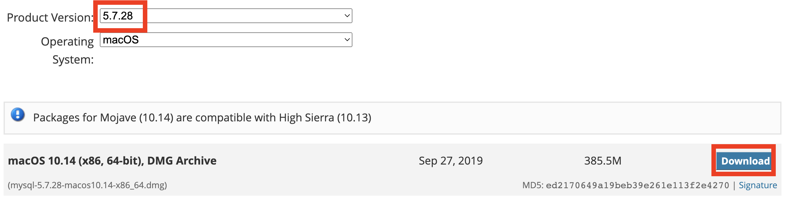

2. 运行 MySQL Server

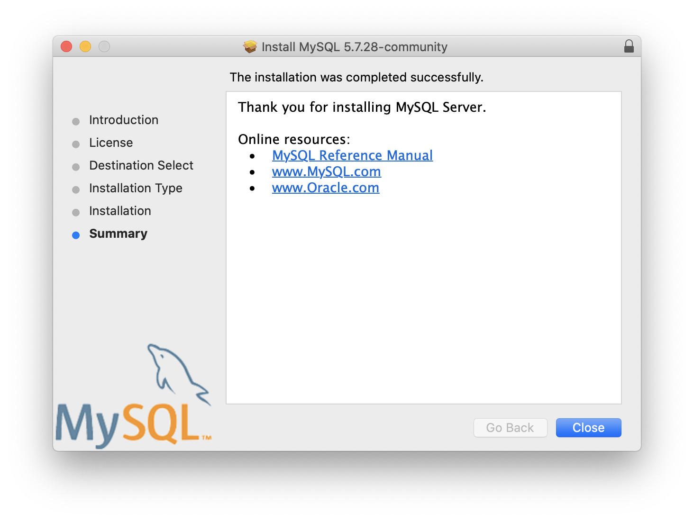

安装完成后，打开系统偏好设置，可以看到MySQL图标。点击图标，会打开MySQL的管理界面，可以看到MySQL Server为关闭状态，点击后面的`start mysql server`按钮，稍等片刻以后就能看到MySQL的状态变成了running状态。

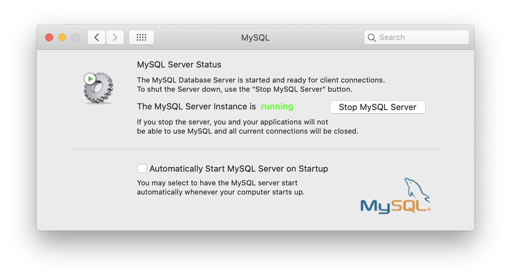

### 3.2 了解 DBMS 的用户管理

1. 设置环境变量，便于调用mysql命令

mysql的可执行命令在`/usr/local/mysql/bin`目录下，调用mysql时完整命令比较长，因此将该路径添加至环境变量中

```shell
PATH=/usr/local/mysql/bin:$PATH
```

2. 启动mysql，设置root账户密码

使用语句`mysql -u root -p`启动mysql，输入初始化密码，输入正确后即可打开mysql命令行界面。

因为初始化密码较为复杂，所以需要自定义密码。使用以下命令修改：

```shell
SET PASSWORD FOR 'root'@'localhost' = PASSWORD('mypassword');
FLUSH PRIVILEGES;
```

3. 验证密码修改成功，MySQL可以正常登录

再次输入`mysql -u root -p`，输入修改后的密码，出现如下界面，并有prompt `mysql>`，表明MySQL用户设置成功。

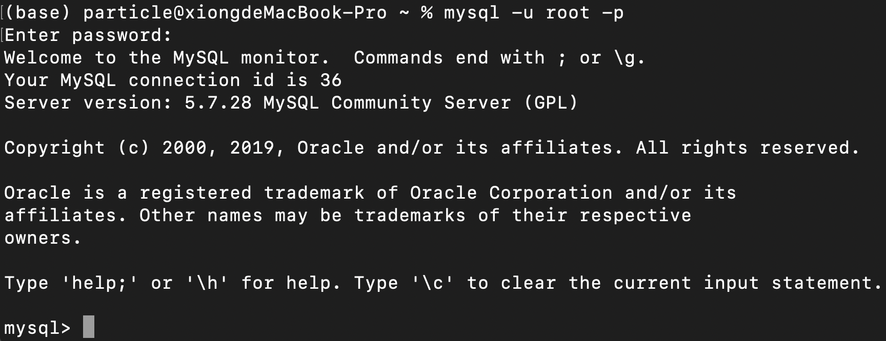


### 3.3 熟悉交互界面的基本交互命令

官方Tutorial [MySQL 5.7 Reference Manual / Tutorial](https://dev.mysql.com/doc/refman/5.7/en/tutorial.html) 中包括了创建和选择数据库、创建表、向表中添加数据、在表中检索数据等基本交互命令。

#### 3.3.1 Show, Create and Use Database

- `CREATE DATABASE database_name;`

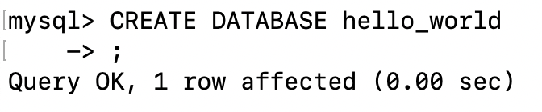

- `SHOW DATABASES;`

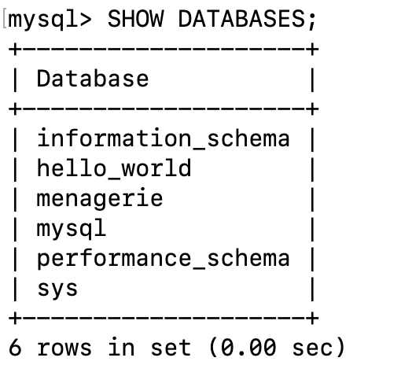

- `USE database_name;`

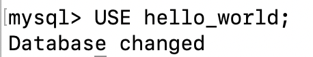


#### 3.3.2 Create and Describe a Table

- `CREATE TABLE table_schema() `创建表格的schema

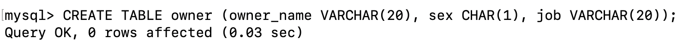

- `SHOW TABLES; `显示该database中的表格

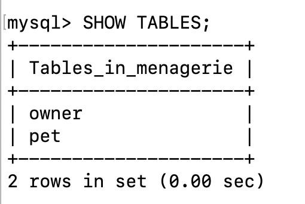

- `DESRIBE table_name;`显示表格的schema

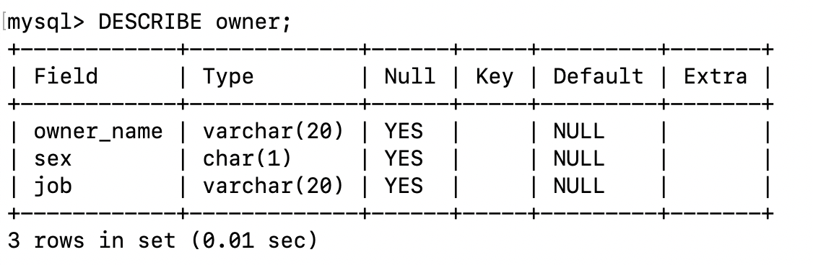


#### 3.3.3 Load and Retrieve Data from Table

以下是两个非常基础的插入数据和检索数据的命令：

- `INSERT INTO table VALUES (...);`

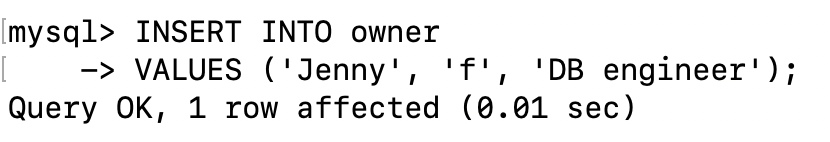

- `SELECT * FROM table;` 查看整个表格


### 3.4 熟悉图形界面的功能和操作

1. 下载MySQL Workbench 6.3.10版本

我的电脑操作系统为MacOS 10.15.7，经过实践验证发现8.0及以后的版本闪退，所以只能下载6.3版本。在[MySQL Workbench (Archived Versions)](https://downloads.mysql.com/archives/workbench/)选择6.3.10版本，操作系统为MacOS，下载DMG Archive。

2. 连接至MySQL Server

双击红框部分，即可进入Visual Editor界面。

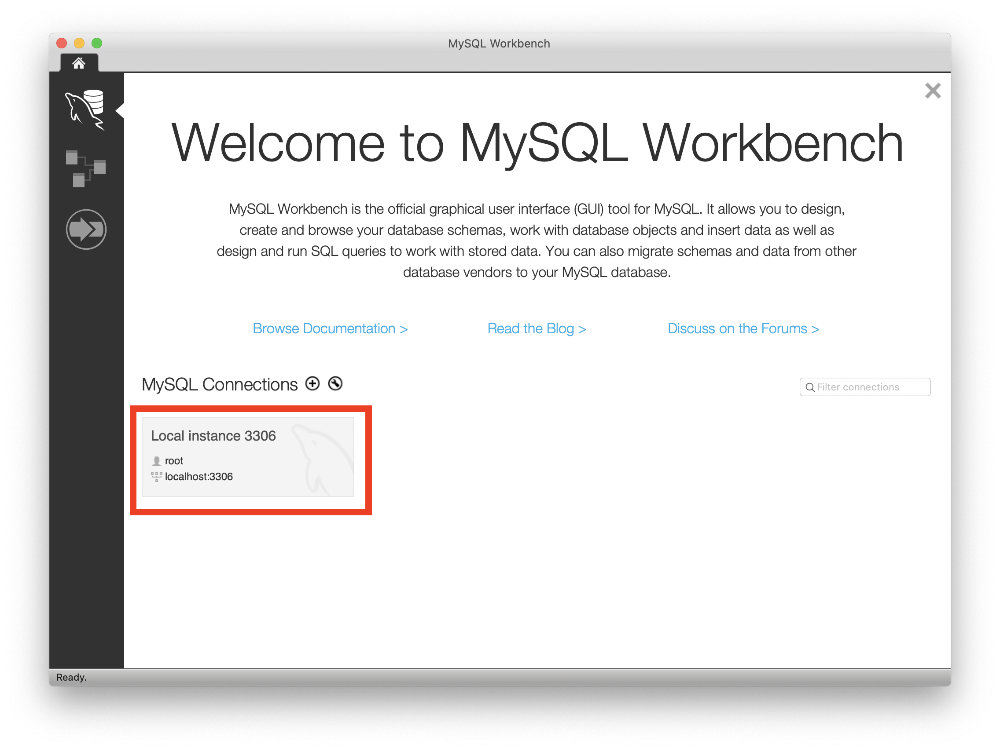

3. 熟悉MySQL Workbench的操作界面

下图是我编写了4行SQL语句（3.3节学习的几个语句），执行后显示`pet`表格查询结果的界面。

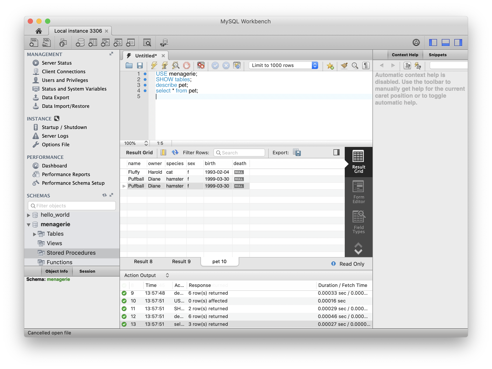

[MySQL Workbench Manual](https://dev.mysql.com/doc/workbench/en/)的8.1 Visual SQL Editor部分有非常详细的界面操作指南。以下图片来自该网站。

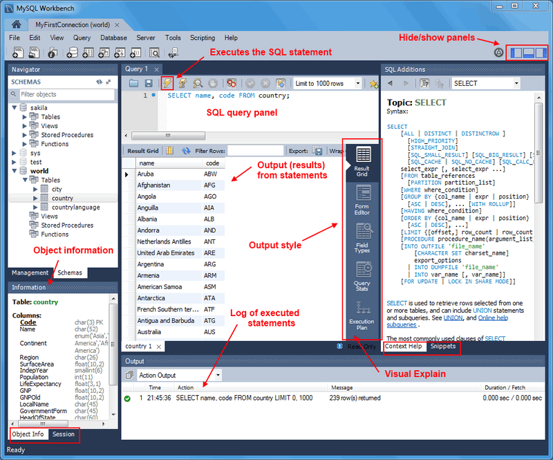

比较基础的操作有： SQL Query Toolbar上的打开文件、保存脚本、运行整个脚本和运行光标所在行命令。比较重要的界面有SQL语句编辑页面，结果展示页面。


### 3.5 了解基本的 DBMS 管理功能和操作

这部分内容我在3.3节中已经学习过。更多的功能和指令参考[MySQL 5.7 Reference Manual / Tutorial](https://dev.mysql.com/doc/refman/5.7/en/tutorial.html)进行学习。


### 3.6熟悉在线帮助系统的使用

在[MySQL 5.7 Reference Manual](https://dev.mysql.com/doc/refman/5.7/en/)和[MySQL Workbench Manual](https://dev.mysql.com/doc/workbench/en/)两个官方参考手册上，可以查阅更多的MySQL相关内容。


## 4 实验心得

1. 安装环境。MySQL的安装教程，无论是官方文档还是非官方指南，都有很多。我主要参考的是国内某些论坛上针对MacOS安装MySQL的安装教程进行安装的。在安装和使用过程中，需要用到一些Shell的知识。还好在此之前我有所学习这方面知识，所以对我来说没有造成太大困难。还有安装版本的问题也需要小心。最新的Workbench版本在我的电脑上闪退，不得已使用较老的存档。而MySQL Server最新版本据说不是很稳定，所以我也选择了较老的存档。总体来说，我的安装过程还是较为顺利的。
2. SQL语句学习。在系统地在课堂上学习SQL语句之前，我利用官方文档的Tutorial部分学习了基本的语句。官方文档说明对新手友好，使用的英语也非常简单，让我在短时间内很快地了解了MySQL的基本使用方法。此外，第二周课程上讲解的Relational Model也为我理解SQL语句打下了代数基础。

