# 实验2 SQL数据定义和操作

> 熊子宇 3200105278

## 1 实验目的

1. 掌握关系数据库语言 SQL 的使用。
2. 面向某个应用定义数据模式和操作数据。

## 2 实验平台

1. 操作系统: MacOS
2. 数据库管理系统: MySQL 5.7.28
3. 数据库图形界面: MySQL Workbench 6.3.10

## 3 实验内容和要求

### 3.1 以图书管理系统为例，建立数据库

#### Show and Use Database

- `CREATE DATABASE Library;`

- `USE Library;`

### 3.2 数据定义

#### 3.2.1 表的建立/删除/修改

##### Create Table book

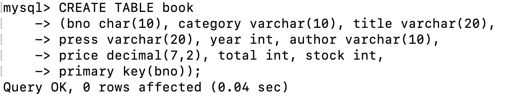

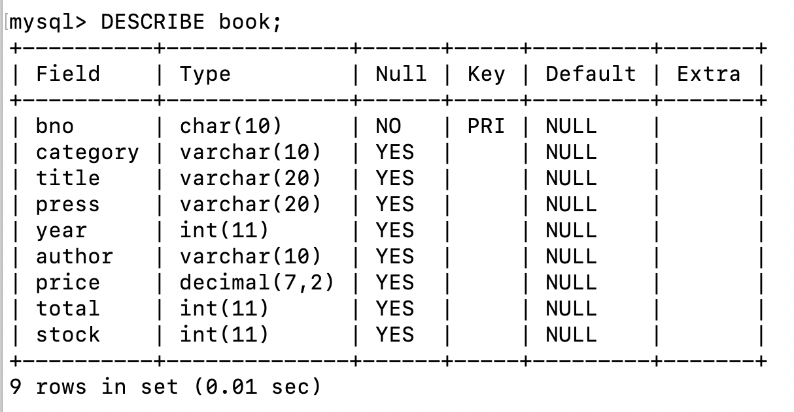

**Create Table card, and Alter**

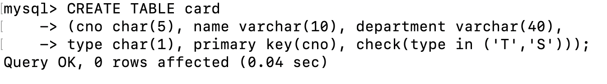

- `ALTER TABLE card ADD A D;`

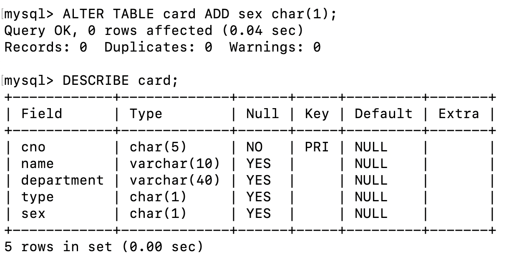

- `ALTER TABLE card DROP A;`

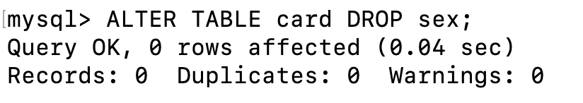

- `ALTER TABLE card MODIFY A D;`

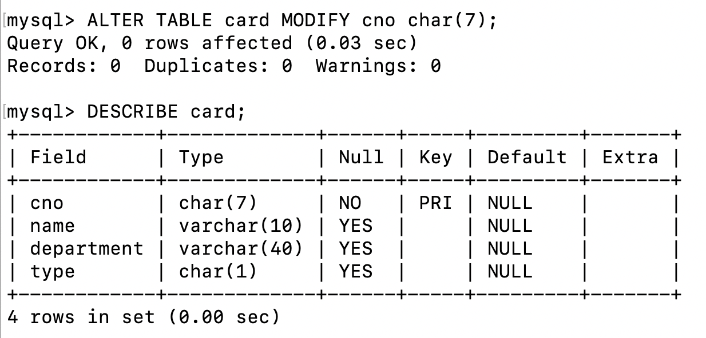

**Create and Delete Table borrow **

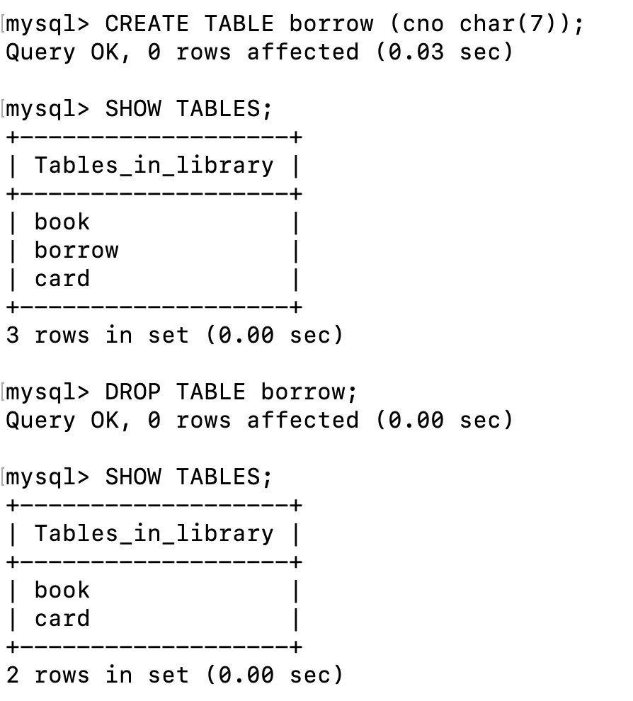

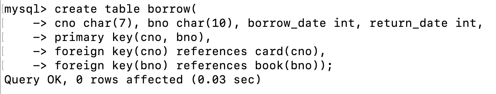

#### 3.2.2 索引的建立/删除

**Create Index**

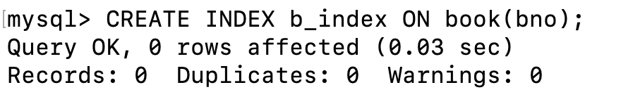

**Drop Index**

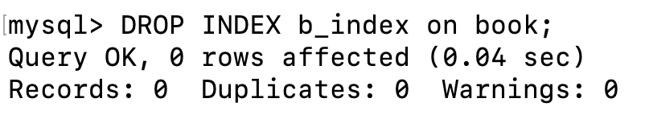

#### 3.2.3 视图的建立/删除

**Create View**

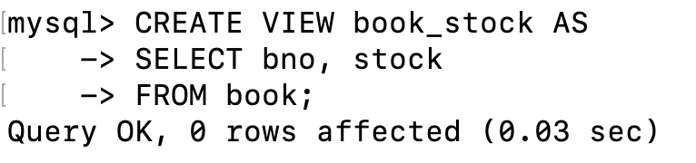

**Drop View**

### 3.3 数据更新

#### 3.3.1 插入表数据

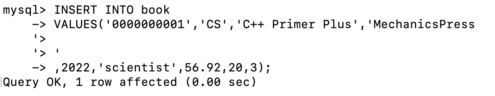

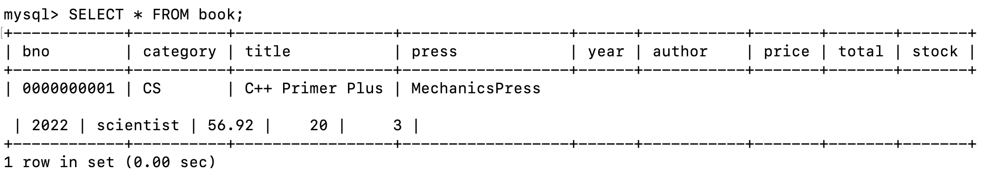

#### 3.3.2 修改表数据

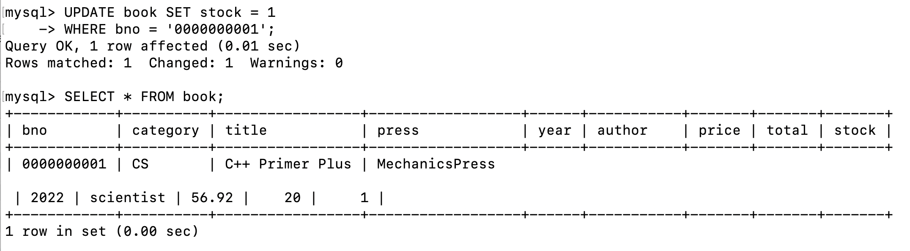

#### 3.3.3 删除表数据

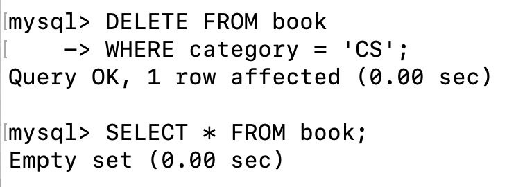

### 3.4 数据查询

#### 3.4.1 单表查询

先向Library数据库的三个表中用`insert`分别插入一些数据。用`select * from table`来查看表中目前的所有数据。

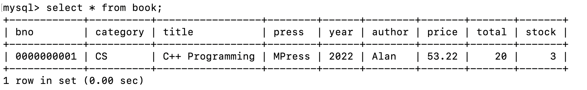

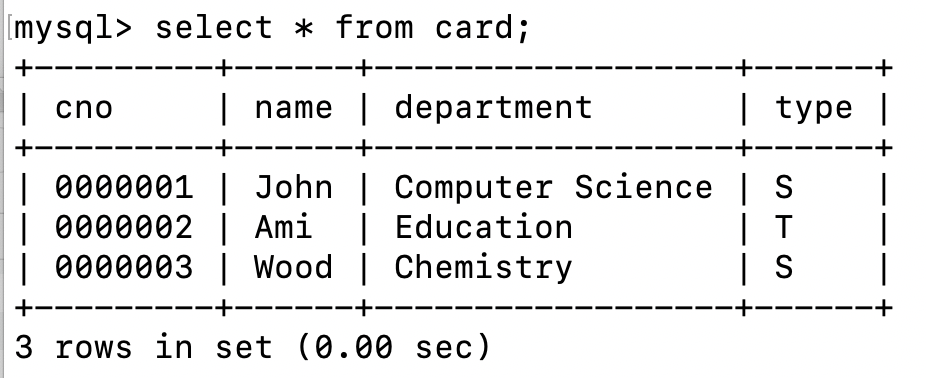

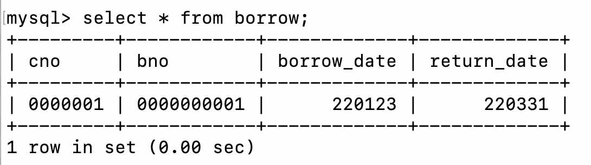

也可以用`where clause`来选择特定行，用`from clause`来选择特定列。

#### 3.4.2 多表查询

可以用同名属性手动连接两个表：

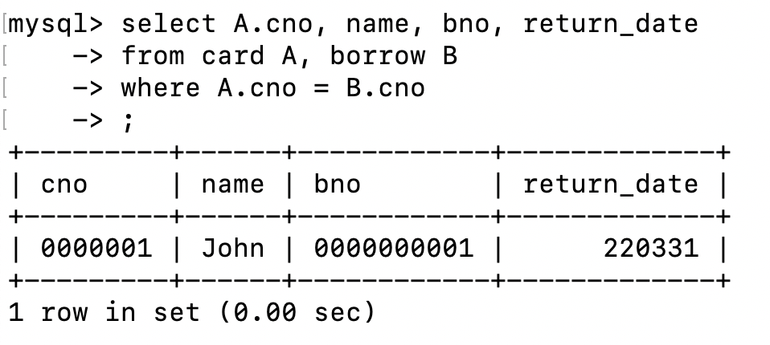

尝试使用`natural join`语句自然连接两个表：

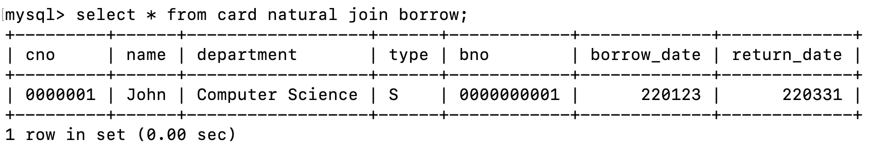

#### 3.4.3 嵌套子查询

由于数据有限，所以我以使用aggregate function为例，实现嵌套子查询：

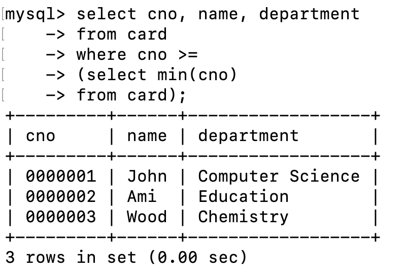

### 3.5 视图操作

#### 3.5.1 通过视图的数据查询

**创建并查询行列视图**

在使用book表中，我们可能首先想要关注的是book_number和stock，因此生成一张`book_stock`视图：

使用`select * from book_stock;`查询视图内容：

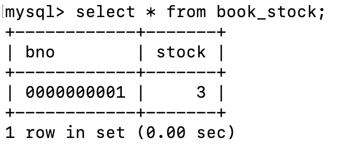

**创建并查询复合视图**

如果我们想要知道借书记录中借书者的名字和书名，需要生成一张`borrower_book`视图：

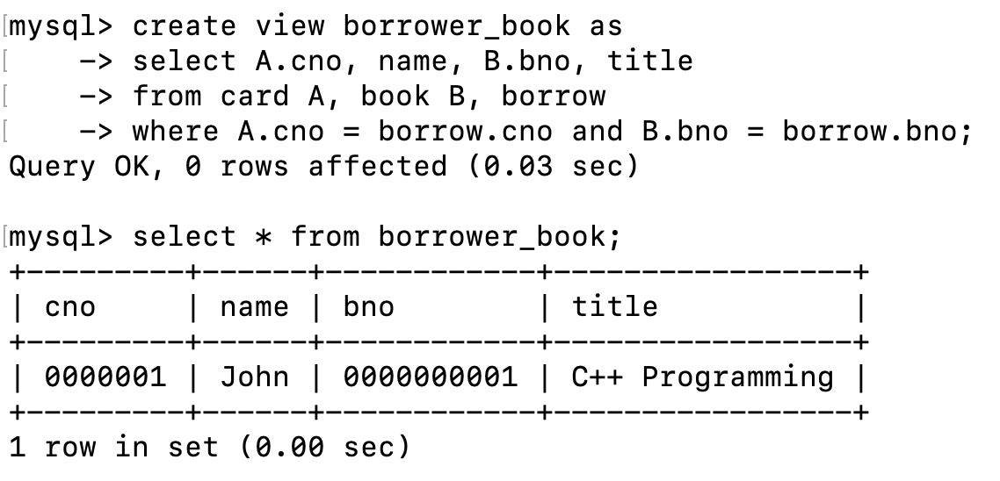

#### 3.5.2 通过视图的数据修改

**通过行列视图插入数据**

可以在行列视图中插入数据，会转化成对相应的表`book`操作，未填写的属性会赋值`NULL`。删除、更新同理，此处不再演示。

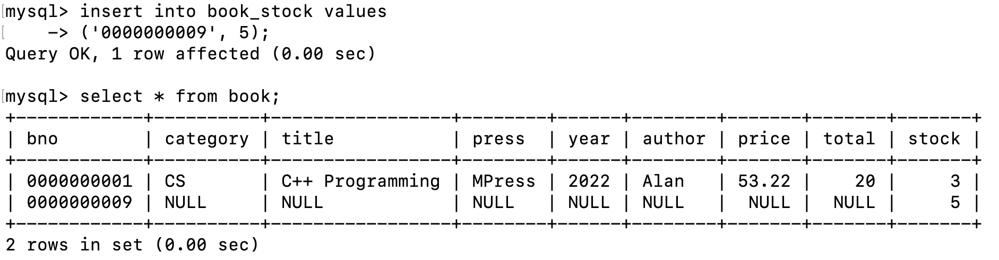

**对复合视图修改会报错**

若尝试对复合视图`borrower_book`进行修改，则会报错`Cannot insert into join view '...'`

## 4 实验心得

1. MySQL自带的`help`语句非常有用。课上讲解的语法可能和具体的DBMS实现有所出入，但只要记住关键词，用`help + <instruction>`就可以查询到MySQL中的用法。比如可以查询`help create index`，就会出现：

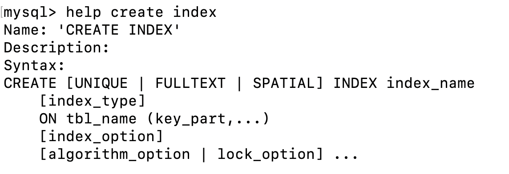

2. 表中数据需要手动编造，比较麻烦。手动编造效率比较低，很难一下生成几十条数据，因此没有办法构建复杂查询的环境。在本实验报告中，诸如嵌套子查询部分，我编写的都是没有什么实际用途的SQL语句，仅表示我学会了使用相应的语法。
3. 在创建表中若添加了foreign key的参照一致性约束，就没有办法修改外码的类型。但是我觉得有点奇怪，因为book中定义的`bno`的类型是`char(10)`，而borrow中定义的`bno`是`char(8)`，如果不修改的话，是否会因为类型不一致，而导致borrow中的`bno`始终无法满足参照一致性？

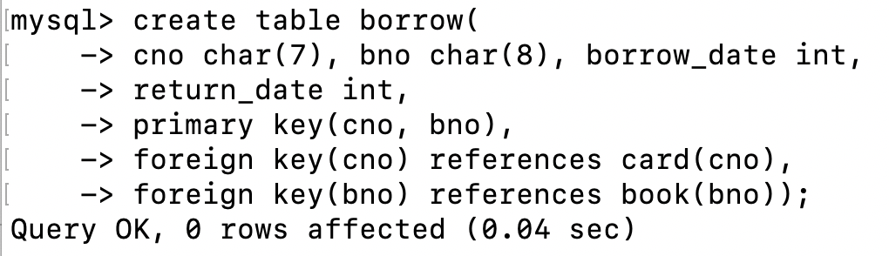

