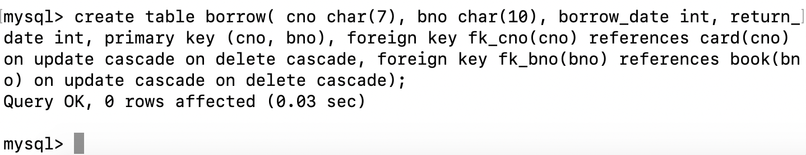
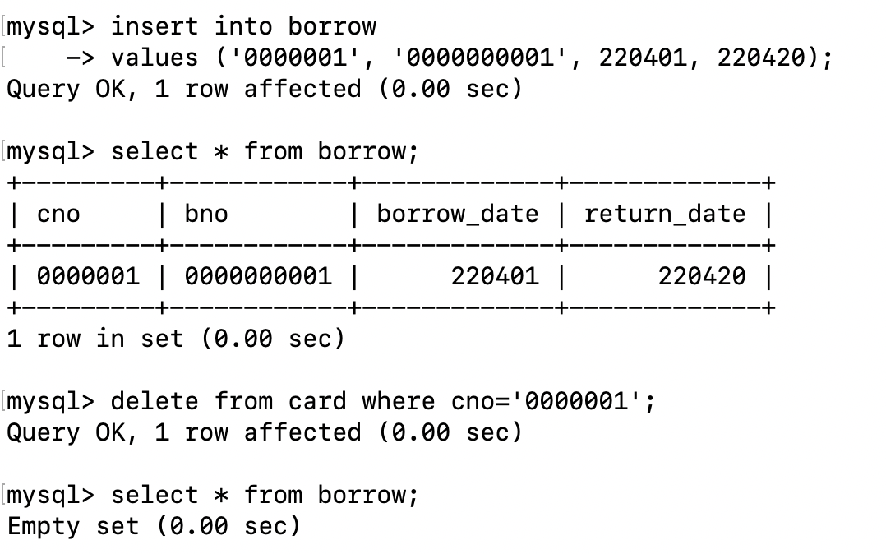
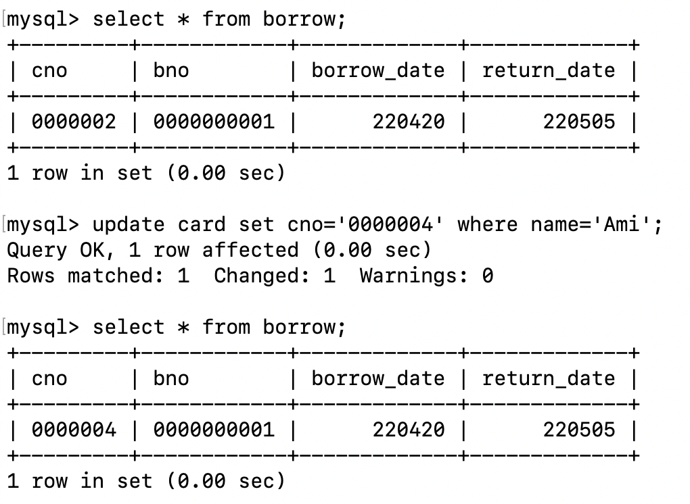
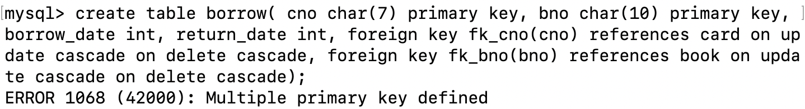

# 实验3 SQL数据完整性

> 熊子宇 3200105278

## 1 实验目的

熟悉通过 SQL 进行数据完整性控制的方法。

## 2 实验平台

1. 操作系统: MacOS
2. 数据库管理系统: MySQL 5.7.28
3. 数据库图形界面: MySQL Workbench 6.3.10

## 3 实验内容和要求

### 3.1 定义若干表，包括 primary key, foreign key 和 check

#### Primary Key

在`create table`语句中定义Primary Key

使用`describe table`语句查看Primary Key属性定义成功：

#### Foreign Key

在`create table`语句中定义Primary Key和Foreign Key

#### Check

使用`alter table <table_name> add check ()`，在已有的表中添加`check`的检验

也可以在`create table`语句中直接添加`check`检验。

### 3.2 表中插入数据，考察 primary key 如何控制实体完整性

目前`card`表中已有的数据如下：

当使用`insert into`语句向表中插入`cno = '0000001'`的记录时，将会报错`Duplicate entry '0000001' for key 'PRIMARY'`。

### 3.3 删除被引用表中的行，考察 foreign key 中 on delete 子句如何控制参照完整性

首先创建联系表`borrow`，在外键定义中增加`on update cascade` `on delete cascade`语句：

插入一条数据，然后在`card`中删除对应的`cno`，再查看`borrow`，此时`borrow`已经变为空集。

### 3.4 修改被引用表中的行的 primary key，考察 foreign key 中 on update 子句如何控制参照完整性

在表`borrow`插入一条新记录如下，然后修改referenced relation中的`cno`为`'0000004'`，可以看到`borrow`中对应的属性也发生变化。

### 3.5 修改或插入表中数据，考察 check 子句如何控制校验完整性

在3.1节中，我们定义了`card`的check子句`type in ('S', 'T')`，但是在尝试将`type = 'A'`的字段插入表中时，却显示插入成功。

经查阅资料得知，不同于SQL标准，在MySQL 5.7中，CHECK只是一段可调用但无意义的子句。MySQL会直接忽略。参见`CREATE TABLE`语法：接受这些子句但又忽略子句的原因是为了提高兼容性，以便更容易地从其它SQL服务器中导入代码，并运行应用程序，创建带参考数据的表。
如果想要实现类似`Check`子句的功能，有两种解决办法：

- 如果需要设置CHECK的字段范围小，并且比较容易列举全部的值，就可以考虑将该字段的类型设置为枚举类型 enum()或集合类型set()。比如将`type`属性改为`type enum('T', 'S')`

- 如果需要设置CHECK约束的字段范围大，且列举全部值比较困难，比如>0的值，那就只能使用触发器来代替约束。

### 3.6 定义一个 trigger, 并通过修改表中数据考察触发器如何起作用

设计trigger，希望实现如下功能：

- 向`borrow`表中插入一条新的借书记录时，`book`表中对应的书籍库存`stock`--。
- 向`borrow`表中删除一条借书记录（表明还书），`book`表中对应的书籍库存++。

操作之前的`book`表：

使用`insert into borrow values ('0000004', '0000000001', 220420, 220505);`插入一条新的借书记录后的`book`表：

使用`delete from borrow where cno='0000004';`删除该借书记录后的`book`表：

## 4 实验心得

1. 多对多关系中的primary key设置

在创建`borrow`这个联系集时，我发现我对primary key的理解有误。正确的理解如下：

- 每个表中primary key最多只有一个
- 多对多联系表中的primary key是被参照关系的primary key复合而成的。

比如在`borrow`中，primary key应该是`(bno, cno)`，而不是`bno`和`cno`。

2. MySQL中foreign key的设置语句

我在尝试`create table`中添加foreign key、`alter table add foreign key`语句，都会报错`ERROR 1215 (HY000) : Cannot add foreign key constraint`。我甚至尝试了修改database的引擎，都无法解决本问题。

搜索未果后，我想到在课上我们学到设置foreign key的语句是`foreign key cno references card`，cno会自动参照card表中的primary key。但是在MySQL中必须要指名被参照关系中的属性，也即`foreign key cno references card(cno)`！！

