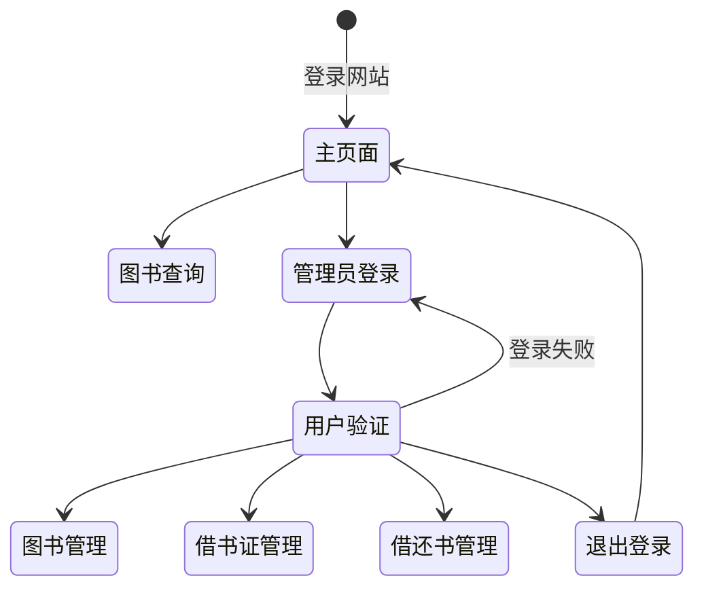

# 实验 5 数据库程序设计

> 熊子宇 3200105278

## 1 实验目的

1. 设计并实现一个精简的图书管理系统，具有入库、查询、借书、还书、借书证管理等基本功能。

2. 通过本次设计来加深对数据库的了解和使用，同时提高自身的系统编程能力。


## 2 实验平台

1. 操作系统: MacOS
2. 基于Python的Web框架：Flask 2.1.1
3. 后端数据库：关系型数据库管理系统（RDBMS）[SQLite](https://www.sqlite.org)
4. Python 数据库工具（ORM，即对象关系映射）SQLAlchemy 1.4.35，Flask-SQLAlchemy 2.5.1
5. Web前端：模版渲染引擎 [Jinja2](http://jinja.pocoo.org/docs/2.10/templates/) 3.1.1，HTML，CSS等
6. xlrd 2.0.1等其他Python模块


## 3 总体设计

### 3.1 总体功能设计

本系统主要包括图书查询、管理员登录、图书管理、借书证管理、借还书管理五大功能模块。系统处理基本流程如下：



各个功能模块说明如下：

| 模块名称   | 功能描述                                          |
| ---------- | ------------------------------------------------- |
| 图书查询   | 1. 根据书的各个属性进行精确查询                   |
|            | 2. 点击各个属性，以相应属性为依据进行升降序排序   |
| 管理员登录 | 根据预设好的管理员用户名和密码登录系统            |
| 图书管理   | 1. 单本入库，在网站上输入图书的属性添加书籍       |
|            | 2. 批量入库，从Excel文件中批量导入书籍            |
|            | 3. 单本删除                                       |
| 借书证管理 | 1. 输入Card ID, Name和Department，添加借书证      |
|            | 2. 删除借书证                                     |
|            | 3. 编辑借书证信息，包括Name, Department           |
| 借还书管理 | 1. 输入借书证卡号，显示该借书证的借书记录         |
|            | 2. 输入借书证卡号和书号，若该书有库存，则借书成功 |
|            | 3. 对某一条借书记录进行还书操作                   |

### 3.2 关系模式设计

我一共设计了四类表，分别是User, Book, Card和Borrow。

User表存储管理员的id, name, username和明文密码的hash值。因为把明文密码存储在数据库中是非常不安全的行为，所以为了提高数据的安全性，将哈希值存储在数据库中。

Book表存储了书籍的属性。id是主码。

Card表存储了借书证的属性。id是主码。

Borrow表存储了借书信息。`(card_id, book_id)`是主码，card_id参考Card表，是外键，book_id参考Book表，也是外键。

具体定义如下。我采用的是[SQLAlchemy](https://www.sqlalchemy.org)，Python中的ORM，即对象关系映射工具。借助 SQLAlchemy，通过定义 Python 类来表示数据库里的一张表（类属性表示表中的字段 / 列），通过对这个类进行各种操作来代替写 SQL 语句。

```python
class User(db.Model, UserMixin):
    id = db.Column(db.Integer, primary_key=True)
    name = db.Column(db.String(20))
    username = db.Column(db.String(20))
    password_hash = db.Column(db.String(128))

class Book(db.Model):
    id = db.Column(db.Integer, primary_key=True)
    title = db.Column(db.String(50), nullable=False)
    author = db.Column(db.String(20), nullable=False)
    price = db.Column(db.Float, nullable=False)
    total = db.Column(db.Integer, nullable=False)
    stock = db.Column(db.Integer, nullable=False)
    press = db.Column(db.String(30))
    year = db.Column(db.String(4))
    type = db.Column(db.String(20))

class Card(db.Model):
    id = db.Column(db.Integer, primary_key=True)
    name = db.Column(db.String(30), nullable=False)
    dept = db.Column(db.String(30))
    update_time = db.Column(db.DateTime, nullable=False)

class Borrow(db.Model):
    card_id = db.Column(db.Integer, db.ForeignKey('card.id'), nullable=False, primary_key=True)
    book_id = db.Column(db.Integer, db.ForeignKey('book.id'), nullable=False, primary_key=True)
    borrow_date = db.Column(db.DateTime, nullable=False)
    return_date = db.Column(db.DateTime, nullable=False)
```


### 3.3 主要开发技术简介

#### Flask —— Web框架

Flask 是一个使用 Python 语言编写的 Web 框架。Flask 是典型的微框架，作为 Web 框架来说，它仅保留了核心功能：**请求响应处理**和**模板渲染**。这两类功能分别由 Werkzeug（WSGI 工具库）完成和 Jinja（模板渲染库）完成。Flask 包装了这两个依赖。

Flask的核心函数之一是视图函数（view funciton）。使用 `app.route()` 装饰器来为这个函数绑定对应的 URL，当用户在浏览器访问`()`内部的 URL 时，就会触发这个函数，获取返回值，并把返回值显示到浏览器窗口：

```python
@app.route('/')
def hello():
    return 'Hello World!'
```

使用`url_for()`和`redirect()`函数可以实现URL的定向和重定向。

使用`render_template()`函数可以实现模版的渲染，如以下语句渲染`index.html`页面，且向模版传入`books`变量。

```python
render_template('index.html', books=books)
```

#### HTML, Jinja2, CSS  —— 模版、渲染和样式表

包含变量和运算逻辑的 HTML称为**模板**(template)，执行这些变量替换和逻辑计算工作的过程被称为**渲染**。

- HTML（超文本标记语言）是一种用于创建网页的标准标记语言。 HTML是一种基础技术，常与CSS、JavaScript一起被众多网站用于设计网页、网页应用程序以及移动应用程序的用户界面。

- Jinja2 是一个快速、富有表现力、可扩展的模板引擎。模板中的特殊占位符允许编写类似于 Python 语法的代码。然后向模板传递数据以呈现最终文档。
  - 在Jinja2中，提供了语法来标记变量和语句，以完成渲染功能。如`{{ ... }}` 用来标记变量，`` 用来标记语句，比如 if 语句，for 语句等。
  - Jinja2 提供了模板继承以解决模版复用的问题。定义基模板（base template），包含完整的 HTML 结构和导航栏、页首、页脚等通用部分。在子模板里，使用 `extends` 标签来声明继承自某个基模板。

- CSS 指层叠样式表 (Cascading Style Sheets)，样式定义如何显示 HTML 元素。

#### SQLite, SQLAlchemy —— 数据库与ORM

SQLite是关系型数据库管理系统（RDBMS）的一种。它基于文件，不需要单独启动数据库服务器，适合在开发时使用，或是在数据库操作简单、访问量低的程序中使用。由于本实验中只有三个表，也没有很多复杂的操作，因此为了简化操作，使用了SQLite作为底层的DBMS。

[SQLAlchemy](https://www.sqlalchemy.org)，Python中的ORM，即对象关系映射工具。借助 SQLAlchemy，通过定义 Python 类来表示数据库里的一张表，通过对这个类进行各种操作来代替写 SQL 语句。在Flask中，可以使用 [Flask-SQLAlchemy](http://flask-sqlalchemy.pocoo.org/2.3/) 的官方扩展来集成 SQLAlchemy。比如使用以下语句可以查询Book表中满足condition的元组：

```python
books = db.session.query(Book).filter(*conditions).all()
```

在Python中使用SQLite和SQLAlchemy首先要配置路径：

```python
# SQLite URI compatible
WIN = sys.platform.startswith('win')
if WIN:
    prefix = 'sqlite:///'
else:
    prefix = 'sqlite:////'

app = Flask(__name__)
# 注意更新这里的路径，把 app.root_path 添加到 os.path.dirname() 中，以便把文件定位到项目根目录
app.config['SQLALCHEMY_DATABASE_URI'] = prefix + os.path.join(os.path.dirname(app.root_path), os.getenv('DATABASE_FILE', 'data.db'))
app.config['SQLALCHEMY_TRACK_MODIFICATIONS'] = False
```


## 4 实现细节

### 4.1 Index主页面 —— 图书查询与排序

Index页面是网页的主页面，不需要登录管理员账户即可访问。

#### 前端页面


 如上图所示，主要有三个功能：

- 表格部分显示返回的查询结果。默认显示图书馆内所有在库书籍。

Jinja2+HTML的模版：

```jinja2
						
            <tr>
                <td>{{book.id}}</td>
                <td colspan="2">{{book.title}}</td>
                <td>{{book.author}}</td>
                <td>{{book.price}}</td>
                <td>{{book.total}}</td>
                <td>{{book.stock}}</td>
                <td>{{book.press}}</td>
                <td>{{book.year}}</td>
                <td>{{book.type}}</td>
            </tr>
            
```

- 查询表单。可以根据输入的条目进行单个或联合查询。
  - 当所有条目为空时，认为是无效查询。
  - Title, Author, Press, Type仅支持精确查询。
  - All和Have Stock选项默认为All，可以手动选择Have Stock。
- 升降排序按钮。点击向上的小三角形按钮会以当前列升序排序，点击向下的小三角形按钮会以当前列降序排序。
  - 用于排序的属性以及升降序会以参数的形式传递给url。如`/?sort_by=price&sort_way=desc`

#### 后端处理

```python
@app.route('/', methods=['GET', 'POST'])
def index(**sort_by):
  	# 接收url传递的关键字参数，处理排序属性和排序方式
    order = request.args.get('sort_by')
    sort_way = request.args.get('sort_way')
    if not sort_way:
        books = Book.query.order_by(desc(order)).all()
    else:
        books = Book.query.order_by(order).all()
        
    # 接收表单传递的post请求，处理查询
    if request.method == 'POST':
        title = request.form['title']
        author = request.form['author']
        price_low = request.form['price_low']
        price_high = request.form['price_high']
        have_stock = request.form['stock']
        press = request.form['press']
        year_start = request.form['year_start']
        year_end = request.form['year_end']
        type = request.form['type']
        
				# 当所有条目为空时，认为是无效查询，重定向回主页
        if not title and not author and not price_low and not price_high\
            and have_stock == '0' and not press and not year_start and not year_end and not type:
            flash('Invalid input.')
            return redirect(url_for('index'))
        
        conditions = []
        if title:
            conditions.append(Book.title == title)
        if author:
            conditions.append(Book.author == author)
        if price_low:
            conditions.append(Book.price >= price_low)
        if price_high:
            conditions.append(Book.price <= price_high)
        if press:
            conditions.append(Book.press == press)
        if year_start:
            conditions.append(Book.year >= year_start)
        if year_end:
            conditions.append(Book.year <= year_end)
        if type:
            conditions.append(Book.type == type)
        if have_stock == '1':
            conditions.append(Book.stock > 0)
				# 按输入的条目精确查询
        books = db.session.query(Book).filter(*conditions).all()
		# 返回并渲染查询结果
    return render_template('index.html', books=books)
```


### 4.2 Login页面 —— 用户登录与验证

#### 命令行注册

由于实验中仅设置了游客和管理员两种角色，而为了方便起见管理员的账号是已知的，所以没有设置注册页面，而是在命令行中注册。代码如下：

```python
@app.cli.command()
@click.option('--username', prompt=True, help='The username used to login.')
@click.option('--password', prompt=True, hide_input=True, confirmation_prompt=True, help='The password used to login.')
def admin(username, password):
    """Create user."""
    db.create_all()

    user = User.query.first()
    if user is not None:
        click.echo('Updating user...')
        user.username = username
        user.set_password(password)
    else:
        click.echo('Creating user...')
        user = User(username=username, name='Admin')
        user.set_password(password)
        db.session.add(user)

    db.session.commit()
    click.echo('Done.')
```

在本工程目录启动虚拟环境的情况下，输入`flask admin`即可注册或更新管理员信息。


#### 前端页面与后端处理

前端部分即是HTML表单。如下图所示。


点击Submit按钮，表单的数据将传递给后端。后端将输入的用户名和密码去User表中查询，如果查询成功则可以登录，失败则重定向到本页。值得注意的是在User表中存储的是明文密码的Hash值，因此要借助`werkzeug.security`包中的`generate_password_hash, check_password_hash`函数来进行密码的加密和解密。

```python
    # 获取明文密码的哈希值，用于在数据库中加密
    def set_password(self, password):
        self.password_hash = generate_password_hash(password)

    # 验证用户输入的明文密码是否与数据库中的哈希值相对应
    def validate_password(self, password):
        return check_password_hash(self.password_hash, password)
```

登录管理员账户成功后，可以访问Book Management, Card Management, Borrow & Return, Logout等特权界面。


### 4.3 Book Management页面 —— 导入与删除书籍

#### 前端页面


 如上图所示，主要有三个功能：

- 从`.xls`文件中批量导入书籍。
  - 每行的所有属性不为空，否则为无效输入。
  - Book ID不能与已存在条目重复，否则为无效输入。
  - Total和Stock必须是整数，且Stock <= Total。
  - 将定向至`/addExcel`
- 添加单本书籍。
  - 无效输入规则同上。
- 删除单本书籍。
  - 点击Delete按钮，会出现警告框，二次确认后将成功删除书籍。
  - 将定向至`/bookManage/delete/<int:book_id>`

#### 后端处理

```python
@app.route('/bookManage', methods=['GET', 'POST'])
def bookManage():
  	# 提交表单，处理单本书籍添加
    if request.method == 'POST':
        id = request.form['id']
        # 获取其他属性，此处省略 #

        if not id or not title or not author\
            or not price or not total or\
            not stock or not press\
            or not year or not type:
            flash('Invalid input. Every Attribute needs to be non-empty.')
            return redirect(url_for('bookManage'))
        total = int(total)
        stock = int(stock)
        if total < 0 or stock < 0:
            flash('Invalid input. Total and Stock must be positive integer.')
            return redirect(url_for('bookManage'))
        if total < stock:
            flash('Invalid input. Total must be equal or greater than Stock.')
            return redirect(url_for('bookManage'))
            
        checkID = db.session.query(Book).filter(Book.id == id).all()
        if checkID:
            flash('Invalid input. Book ID is duplicated.')
            return redirect(url_for('bookManage'))
        if len(year) != 4:
            flash('Invalid input. Length of Year should be 4.')
            return redirect(url_for('bookManage'))
        insertBook(id, title, author, price, total, stock, press, year, type)
        flash('Book added.')
        return redirect(url_for('bookManage'))

    books = Book.query.all()
    return render_template('bookManage.html', books=books)

# 处理单本书籍删除
@app.route('/bookManage/delete/<int:book_id>', methods=['GET'])
@login_required
def deleteBook(book_id):
    book = Book.query.get_or_404(book_id)
    borrow = db.session.query(Borrow).filter(Borrow.book_id == book_id).all()
    if borrow:
        for brow in borrow:
            db.session.delete(brow)
    db.session.delete(book)
    db.session.commit()
    flash('Book deleted.')
    return redirect(url_for('bookManage'))
```


使用xldr包中的`open_workbook()`函数来解析`.xls`文件。注意由于最新版xldr包的限制，此处不能上传`.xlsx`文件，否则将无法打开文件。

```python
# 处理从Excel表格中批量导入书籍
@app.route('/addExcel',methods = ['POST'])
def addExcel():
    if request.method == 'POST':
        file = request.files.get('file')
        f = file.read()
        if not f:
            flash('File cannot open. Please upload a .xls file.')
            return redirect('/bookManage')
        clinic_file = open_workbook(file_contents=f)
        # sheet1
        table = clinic_file.sheet_by_index(0)
        nrows = table.nrows
        for i in range(1, nrows):
            book = Book()
            row_date = table.row_values(i)
            if row_date[0]:
                book.id = int(row_date[0]);
            else:
                flash('Row %d: Invalid input. Book ID cannot be empty.' % i)
                continue
            # check conditions, omitted #
            db.session.add(book)
        db.session.commit()
        db.session.close()            
        return redirect('/bookManage')
```


### 4.4 Card Management页面 —— 添加、编辑与删除借书证

#### 前端页面


 如上图所示，主要有三个功能：

- 添加单个借书证。
  - CardID, Name和Department都不允许为空，否则为无效输入
  - Update Time为添加时的系统时间
- 修改借书证信息。
  - 可以修改Name和Department
  - 将定向至`/cardManage/edit/<int:card_id>`
- 删除单个借书证。
  - 点击Delete即可删除对应行的借书证
  - 将定向至`/cardManage/delete/<int:card_id>`

#### 后端处理

添加和删除单个借书证和Book Management中的后端处理相似，此处不做赘述。

修改借书证的方式是直接修改对象的属性。

```python
@app.route('/cardManage/edit/<int:card_id>', methods=['GET', 'POST'])
@login_required
def edit(card_id):
    card = Card.query.get_or_404(card_id)

    if request.method == 'POST':
        name = request.form['name']
        dept = request.form['dept']

        if not name or not dept:
            flash('Invalid input. Every Attribute needs to be non-empty.')
            return redirect(url_for('edit', card_id = card_id))
				# 修改card对象的name和dept属性
        if name:
            card.name = name
        if dept:
            card.dept = dept
        db.session.commit()
        flash('Card Information updated.')
        return redirect(url_for('cardManage'))
    return render_template('edit.html', card=card)
```


### 4.5 Borrow & Return —— 借书记录查询、借书与还书

#### 前端页面


 如上图所示，主要有三个功能：

- 输入卡号，查阅对应卡号的借书记录
  - 如果卡号不存在，将会提示错误信息。
- 输入卡号和书号，借阅单本书籍
  - 卡号和书号都不为空，否则为无效输入。
  - 卡号和书号都必须存在，否则将提示不存在。
  - 书籍必须库存>0，否则将提示无库存。
  - 借阅成功后书籍库存减1。
- 还书
  - 点击Return即可还书。
  - 书籍库存加1。
  - 将定向至`/returnBook/<int:book_id>/<int:card_id>`

#### 后端处理

与图书管理和借书证管理部分的区别主要是需要对Book, Card和Borrow表进行join操作，语句如下：

```python
            borrows = db.session.query(Book.id.label('book_id'),Book.title,\
            Book.author, Borrow.card_id.label('card_id'), Borrow.borrow_date, \
            Borrow.return_date) \
            .join(Borrow, Book.id == Borrow.book_id) \
            .filter(Borrow.card_id == cid).all()
```

自动获取系统时间和计算还书时间的语句如下：

```python
						borrow_date = datetime.datetime.now()
            delta = datetime.timedelta(days=40)
            return_date = borrow_date + delta
```

其余与前面几节的方法基本类似，不再展开叙述。


## 5 实验成果

以下为部分实验成果展示。

### 5.1 Index页面

<table style="border:none;text-align:center;width:auto;margin: 0 auto;">
	<tbody>
		<tr>
			<td style="padding: 3px"></td>
		</tr>
        <tr><td><strong>图 1.1 按Price在40-50间查询 </strong></td></tr>
    <tr>
			<td style="padding: 3px"></td>
		</tr>
        <tr><td><strong>图 1.2 按Price降序排序</strong></td></tr>
	</tbody>
</table>


### 5.2 Book Management页面

<table style="border:none;text-align:center;width:auto;margin: 0 auto;">
	<tbody>
		<tr>
			<td style="padding: 3px"></td>
		</tr>
        <tr><td><strong>图 2.1 添加单本书籍 </strong></td></tr>
    <tr>
			<td style="padding: 3px"></td>
		</tr>
        <tr><td><strong>图 2.2 删除单本书籍</strong></td></tr>
    <tr>
			<td style="padding: 3px"></td>
		</tr>
        <tr><td><strong>图 2.3 从.xls文件批量导入书籍后的提示信息</strong></td></tr>
	</tbody>
</table>


### 5.3 Card Management页面

<table style="border:none;text-align:center;width:auto;margin: 0 auto;">
	<tbody>
		<tr>
			<td style="padding: 3px"></td>
		</tr>
        <tr><td><strong>图 3.1 添加借书证不成功，卡号重复 </strong></td></tr>
    <tr>
			<td style="padding: 3px"></td>
		</tr>
        <tr><td><strong>图 3.2 编辑借书证</strong></td></tr>
	</tbody>
</table>


### 5.4 Borrow & Return页面

<table style="border:none;text-align:center;width:auto;margin: 0 auto;">
	<tbody>
		<tr>
			<td style="padding: 3px"></td>
		</tr>
        <tr><td><strong>图 4.1 借书成功 </strong></td></tr>
    <tr>
			<td style="padding: 3px"></td>
		</tr>
        <tr><td><strong>图 4.2 还书成功 </strong></td></tr>
    <tr>
			<td style="padding: 3px"></td>
		</tr>
        <tr><td><strong>图 4.3 删除Card ID=3记录后的级联删除 </strong></td></tr>
	</tbody>
</table>


## 6 实验心得

1. 在使用python和Flask之前，我首先尝试了C++通过ODBC连接MySQL，大约写了100+行，也成功实现了后端功能。如下图。

   

   对比Python的SQLAlchemy和ODBC，会发现ORM比ODBC方便许多，为编程人员带来极大便利。

   没有继续使用ODBC的原因是C++写图形化界面比较麻烦，而我原先掌握了Web前端的一些技术，所以改用Python+Web完成实验。

2. 本实验极大地锻炼了我前后端编程的能力。我学会了在Web程序中调用数据库，而且换成了ORM技术实现。补充了我实验1-4单独使用MySQL的欠缺能力。

3. 我还学习了如何将本地的Web程序部署到网站上。网址是http://bearzy.pythonanywhere.com/，管理员用户名`admin`，密码`123456`。

4. 本实验还有很多不完善之处，比如：

   - 逻辑上来说，应该设置游客、普通用户和管理员三个身份，而且应该有注册功能。普通用户和注册页面我尚未实现，但是原理是相似的。
   - 触发器、外键约束等理应是数据库本身的设定，而不应该在数据库以外的软件部分实现。当遇到断电等意外情况时，无法满足事务的原子化要求。
   - 对于更加复杂的数据库，应当使用MySQL等较为复杂的DBMS作为支撑，替换SQLite。
   - 对于查询功能，应当支持模糊匹配或关键字查询等类似于搜索引擎的功能。不过这部分实现可能较为复杂，因此没有实现。

