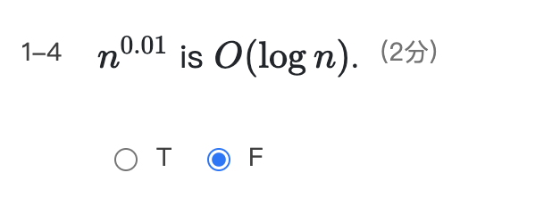
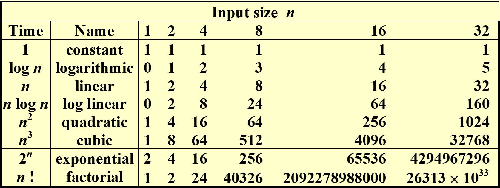
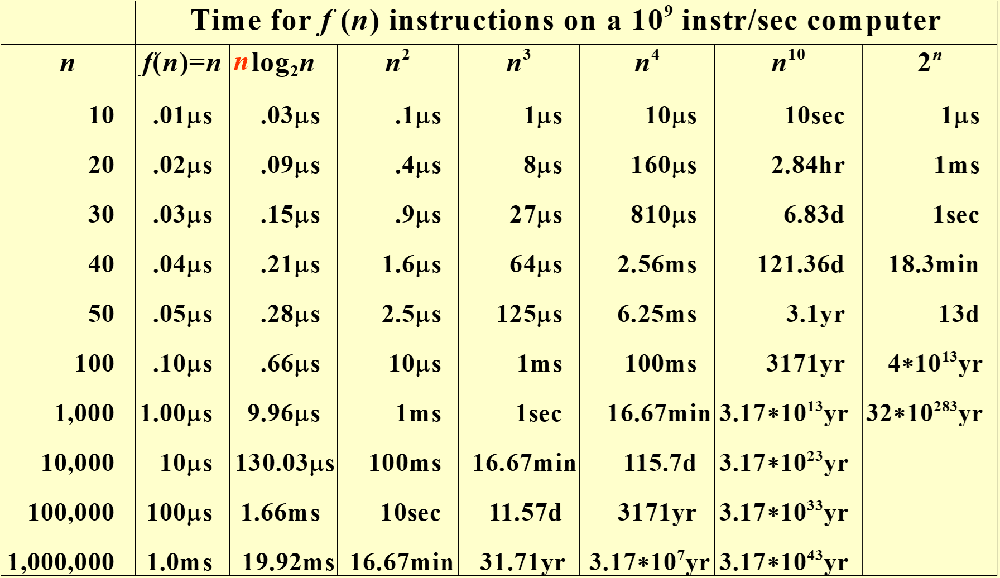
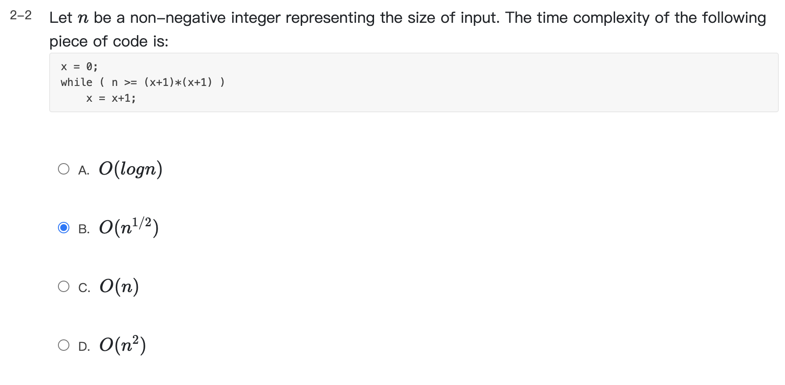
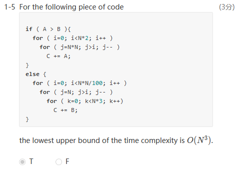
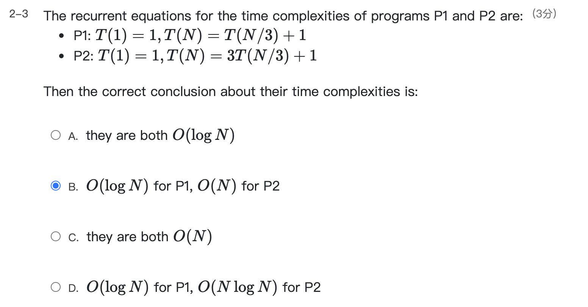
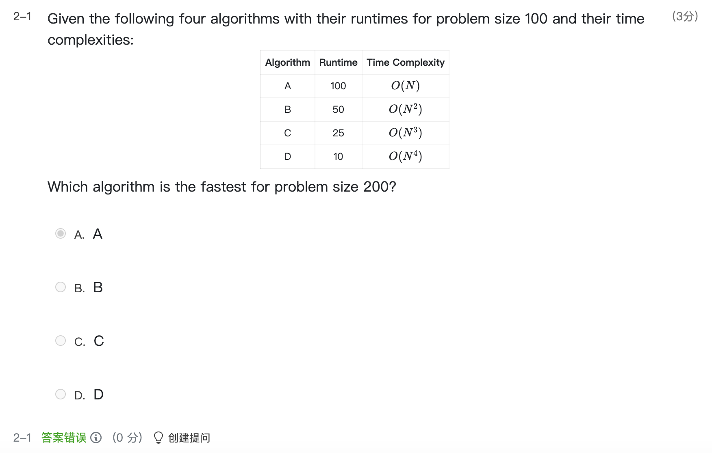

# DS1 Algorithm Analysis

[TOC]

------

### 1.1 Algorithm

#### [Definition] Algorithm

> An *algorithm* is a finite set of instructions that, if followed, accomplishes a particular task.
>
>  In addition, all algorithms must satisfy the following criteria.

1. **Input** : There are zero or more quantities that are externally supplied.

2. **Output** : At least one quantity is produced.

3. **Definiteness** : Each instruction is clear and unambiguous.

4. **Finiteness** : the algorithm terminates after finite number of steps

5. **Effectiveness** : basic enough to be carried out ; feasible

-  A program does not have to be finite. (eg. an operation system)

- An algorithm can be described by *human languages, flow charts, some programming languages, or pseudocode*.

#### [Example] pseudo-code

> Selection Sort: Sort a set of $n\geq1$ integers in increasing order

```pseudocode
for (i = 0; i < n; i++){
	Examine list[i] to list[n-1] and suppose that the smallest integer is at list[min];
	Interchange list[i] and list[min];
}
```

***

### 1.2 Time and Space Complexity

- Machine and compiler-dependent run times.

- **Time and space complexities** : machine and compiler **in**dependent.

  - Assumptions:

  >1. instructions are executed sequentially 顺序执行
  >
  >2. each instruction is simple, and takes exactly **one time unit**
  >3. integer size is fixed and we have infinite memory

  - $T_{avg}(N)\,  and\, T_{worst}(N)$ : the average and worst case time complexities as functions of input size $N$
    - $T_{worst}(N)$ 比较容易分析

#### [Example] Count the number of instructions

**Matrix addition** 

```c
void add(int a[][MAX_SIZE],
         int b[][MAX_SIZE],
         int c[][MAX_SIZE],
         int rows, int cols) 
{
	int i, j;
	for (i=0; i<rows; i++)/*rows+1*/
		for (j=0;j<cols;j++)/*rows(cols+1)*/
			c[i][j] = a[i][j]+b[i][j];/*rows*cols*/
}
```

$$
T(rows, cols) = 2rows\times cols + 2rows+1
$$

- 不对称性(rows与cols交换)

**Iterative function for summing a list of numbers**

```c
float sum (float list[], int n)
{  /*add a list of numbers*/
	float tempsum = 0; /*count = 1*/
	int i;
	for (i=0; i<n; i++)
        /*count++*/
		tempsum  += list[i]; /*count++*/
    /*count++ for last excutaion of for*/
   return tempsum; /*count++*/
}
```

$$
T_{sum}(n)=2n+3
$$

**Recursive function for summing a list of numbers**

```c
float rsum (float list[], int n)
{/*add a list of numbers*/
	if (n) /*count++*/
		return rsum(list, n-1) + list[n-1];
		/*count++*/
    return 0; /*count++*/
}
```

$$
T_{rsum}(n)=2n+2
$$

But it takes more time to compute each step.

***

### 1.3 Asymptotic Notation($O,\Omega,\Theta,o$) 

* predict the growth ; compare the time complexities of two programs ; asymptotic(渐进的) behavior

#### [Definition] $T(N)=O(f(N))$ 

> if there are positive constants $c$ and $n_0$ such that $T(N)\leq c\cdot f(N)$ for all $N\geq n_0$. (*上界, upper bound*)

#### [Definition] $T(N)=\Omega(g(N))$ 

> if there are positive constants $c$ and $n_0$ such that $T(N)\geq c\cdot f(N)$ for all $N\geq n_0$.(*下界, lower bound*) 

#### [Definition] $T(N)=\Theta(h(N))$ 

> if and only if $T(N)=O(h(N))$ and $T(N)=\Omega(h(N))$. (T(N)和h(N)复杂度等价，证明为充分性和必要性)

#### [Definition] $T(N)=o(p(N))$

>  if $T(n)=O(p(N))$ and $T(N)\neq\Theta(p(N))$. T(N)复杂度严格小于p(N)

**Note:**

- $2N+3=O(N)=O(N^{k\geq1})=O(2^N)=\ldots$ take the **smallest** $f(N)$

- $2^N+N^2=\Omega(2^N)=\Omega(N^2)=\Omega(N)=\Omega(1)=\ldots$ take the **largest** $g(N)$
- N需要充分大，才有意义

> **联想**: 这几种标记严格定义，应当是数学上的极限问题。
>
> 如 $T(N)=O(f(N))$ 即为${\lim_{n \to +\infty}}T(N)/f(N) = c(cons.)$ 实质上是同阶无穷大的问题。


#### Rules of Asymptotic Notation

1. If $T_1(N)=O(f(N))$ and $T_2=O(g(N))$, then

   (1) $T_1(N)+T_2(N)=max(O(f(N)),O(g(N)))$

   > 注意：该加法法则应该只适用于有限项相加
   >
   > $O(1)+O(2)+...+O(N) == O(1+2+3+...N) = O(N^2)$
   >
   > $O(f(N))+O(g(N)) = O(f(N) + g(N))$

   (2) $T_1(N)*T_2(N)=O(f(N)*g(N))$

2. 若$T(N)$是一个$k$次多项式，则$T(N)=\Theta(N^k)$

3. $log_kN=O(N^m)$ for any constant $k$ and any non-negative $m$ (由洛必达法则容易得证)







#### [Revisited] Matrix addition 

```C
void add(int a[][MAX_SIZE],
         int b[][MAX_SIZE],
         int c[][MAX_SIZE],
         int rows, int cols) 
{
	int i, j;
	for (i=0; i<rows; i++)
		for (j=0;j<cols;j++)
			c[i][j] = a[i][j]+b[i][j];
}
```

$$
T(rows,cols)=\Theta(rows\cdot cols)
$$

### 1.4 How to calculate complexity

#### (1)基本方法：计算各条instruction执行的次数，然后相加

（可以用O标记简化）



#### (2)循环、顺序、条件语句的套路

- **For loops** : 循环次数x循环体语句复杂度

- **Nested for loops** : 各循环次数之积x最内层语句复杂度

- **Consecutive statements** : 各部分之和（即取Max）

- **If/else** : For the fragment
  		if ( Condition )  S1;
    		else  S2;

  $T(Condition) + max(T(S1), T(S2))$

  > 
  	>
  	> 审题： **lowest upper bound**

#### (3)递归：递推公式&数学工具

- **Recursions** : 

  **[Example] Fibonacci number**
  $$
  Fib(0)=Fib(1)=1, Fib(n)=Fib(n-1)+Fib(n-2)
  $$

  ```c
  lont int Fib (int N) /*T(N)*/
  {
  	if (N<=1) /*O(1)*/
  		return 1; /*O(1)*/
  	else
  		return Fib(N-1)+Fib(N-2);
  }      /*O(1)*//*T(N-1)*//*T(N-2)*/
  ```

  $$
  T(N)=T(N-1)+T(N-2)+2\geq Fib(N)\\
  \left(\frac{3}{2} \right)^n\leq Fib(N)\leq\left(\frac{5}{3}\right)^n
  $$

  时间复杂度：$O(2^N)$      $T(N)$ grows **exponentially**

  ==空间复杂度：$O(N)$ *递归的最大深度？把每一个递归的According看作单位空间*==







> Runtime，运行时间，不是运行次数


See more quizzes: [ZJU-FDS-cx2021-HW1](https://pintia.cn/problem-sets/1434711003331432448)


### 1.5 Compare the Algorithms

#### [Example] 最大子列和

> **举例目的**
>
> - 体会三种算法复杂度的差异
> - 体会分治法的思想，能快速正确地写出递归代码
> - **掌握递归（尤其是分治法）时间复杂度的计算**
> - 针对本问题，了解在线处理法的思想

**Algorithm 1**

```c
int  MaxSubsequenceSum ( const int A[ ],  int  N ) 
{ 
	int ThisSum, MaxSum, i, j, k; 
 	MaxSum = 0;   /* initialize the maximum sum */
 	for( i = 0; i < N; i++ )  /* start from A[ i ] */
 	    for( j = i; j < N; j++ ) {   /* end at A[ j ] */
 			ThisSum = 0; 
 			for( k = i; k <= j; k++ ) 
 		    	ThisSum += A[ k ];  /* sum from A[ i ] to A[ j ] */
 			if ( ThisSum > MaxSum ) 
 		      	MaxSum = ThisSum;  /* update max sum */
	    }  /* end for-j and for-i */
 	return MaxSum; 
}
```

$$
T(N)=O(N^3)
$$

**Algotithm 2-优化版本**

```c
int  MaxSubsequenceSum ( const int A[ ],  int  N ) 
{ 
	int ThisSum, MaxSum, i, j; 
 	MaxSum = 0;   /* initialize the maximum sum */
 	for( i = 0; i < N; i++ ) {   /* start from A[ i ] */
 	    ThisSum = 0; 
 	    for( j = i; j < N; j++ ) {   /* end at A[ j ] */
 			ThisSum += A[ j ];  /* sum from A[ i ] to A[ j ] */
 			if ( ThisSum > MaxSum ) 
 		      	MaxSum = ThisSum;  /* update max sum */
	    }  /* end for-j */
	}  /* end for-i */
 	return MaxSum; 
} 
```

$$
T(N)=O(N^2)
$$

> $O(N^2)$  是否能优化成$ O(NlogN)$ ?

**Algorithm 3 Divide and Conquer**  分治法

```c
static int MaxSubSum(const int A[ ], int Left, int Right)
{
    int MaxLeftSum, MaxRightSum;
    int MaxLeftBorderSum, MaxRightBorderSum;
    int LeftBorderSum, RightBorderSum;
    int Center, i;
    
    if (Left == Right)
        if (A[Left] > 0)
            return A[Left];
    	else
            return 0;
    
    Center = (Left + Right) / 2;
    MaxLeftSum = MaxSubSum(A, Left, Center);
    MaxRightSum = MaxSubSum(A, Center + 1, Right);
    
    MaxLeftBorderSum = 0;
    LeftBorderSum = 0;
    for (i = Center; i >= Left; i--)
    {
        LeftBorderSum += A[i];
        if (LeftBorderSum > MaxLeftBorderSum)
            MaxLeftBorderSum = LeftBorderSum;
    }
    
    MaxRightBorderSum = 0;
    RightBorderSum = 0;
    for (i = Center+1; i <= Right; i++)
    {
        RightBorderSum += A[i];
        if (RightBorderSum > MaxRightBorderSum)
            MaxRightBorderSum = RightBorderSum;
    }
    
    return Max3(MaxLeftSum, MaxRightSum, MaxLeftBorderSum + MaxRightBorderSum);
}

int MaxSubsequenceSum(const int A[ ], int N)
{
    return MaxSubSum(A, 0, N - 1);
}
```


$$
\because T(N)=2T(\frac N2)+cN,\quad T(1)=O(1)\\
T(\frac N2)=2T(\frac N {2^2})+c\frac N2\\
\cdots\\
\therefore T(N)=2^kT(\frac N{2^k})+kcN=N\cdot O(1)+cN\log N \quad(N/{2^k} = 1)\\\\
then\quad T(N) = O(NlogN)
$$

**Algorithm 4 On-line Algorithm**  在线算法

```c
int MaxSubsequenceSum( const int  A[ ],  int  N ) 
{ 
	int ThisSum, MaxSum, j; 
 	ThisSum = MaxSum = 0; 
 	for ( j = 0; j < N; j++ ) { 
 	    ThisSum += A[ j ]; 
 	    if ( ThisSum > MaxSum ) 
 			MaxSum = ThisSum; 
 	    else if ( ThisSum < 0 ) 
 			ThisSum = 0;
	}  /* end for-j */
 	return MaxSum; 
} 
```

$$
T(N)=O(N)
$$

- A[ ] is scanned **once** only. 扫描一次，无需存储（处理streaming data）
- 在**任意时刻**，算法都能对它已经读入的数据给出子序列问题的正确答案(其他算法不具有这个特性)


****

### 1.6 Logrithms in the Running Time

> Logrithm, 对数算法

- 如果一个算法用常数时间将问题的大小削减为其一部分(通常是1/2)，那么该算法就是$O(logN)$的

#### [Example] Binary Search

> 较为适用的条件：static and ordered

```c
int BinarySearch ( const ElementType A[ ], ElementType X, int N ) 
{ 
	int  Low, Mid, High; 
 	Low = 0;  High = N - 1; 
 	while ( Low <= High ) { 
 	    Mid = ( Low + High ) / 2; 
 	    if ( A[ Mid ] < X ) 
 			Low = Mid + 1; 
	    else 
 			if ( A[ Mid ] > X ) 
 		    	High = Mid - 1; 
			else 
 		    	return  Mid; /* Found */ 
	}  /* end while */
 	return  NotFound; /* NotFound is defined as -1 */ 
} 
```

$$
T_{worst}(N)=O(\log N)
$$

#### [Example] Euclid’s Algorithm

==取余为什么是O(logN)?==

```c
int Gcd(int M, int N)
{
	int Rem;
	while (N > 0)
	{
		Rem = M % N;
		M = N;
		N = Rem;
	}
	return M;
}
```

#### [Example] Efficient exponentiation

```c
long int Pow(long int X, int N)
{
	if (N == 0) return 1;
	if (N == 1) return X;
	if (IsEven(N)) return Pow(X*X, N/2);/*return Pow(X, N/2)*Pow(X, N/2) affects the efficiency*/
	else return Pow(X*X, N/2)*X; /*return Pow(X, N-1)*X is the same*/
}
```

****

### 1.7 Checking Your Analysis

#### Method 1

When $T(N)=O(N)$, check if $T(2N)/T(N)\approx2$

When $T(N)=O(N^2)$, check if $T(2N)/T(N)\approx4$

When $T(N)=O(N^3)$, check if $T(2N)/T(N)\approx8$

#### Method 2

When $T(N)=O(f(N))$, check if $\lim\limits_{N\rightarrow\infty}\frac{T(N)}{f(N)}\approx C $

