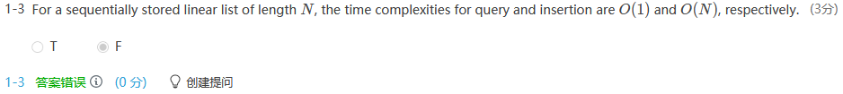
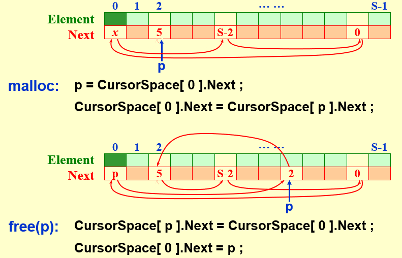

# DS2 线性结构

[TOC]

## 2.1 Abstract Data Type(ADT)  抽象数据类型

### [Definition] Data Type 

= {Objects} and {Operations}

### [Definition] Abstract Data Type(ADT) 

a data type that is organized in such a way that the ***specification*** on the objects and ***specification*** of the operations on the objects are **separated** from the ***representation*** of the objects and the ***implementation*** on the operations.

****

## 2.2 List

### 2.2.1 ADT

- **Objects** : N items
- **Operations** -- 重要：查增删
  - **Finding**
  - **Inserting**
  - **Deleting**
  - etc.

### 2.2.2 Array implementation of Lists

Merits:

- Sequential mapping 连续存储，访问快
- Find_Kth take $O(1)$ time.

Demerits:

- MaxSize has to be estimated.

- Insertion and Deletion not only take $O(N)$ times, but also involve a lot of data movements which takes time.

  

  > Query 查询


### 2.2.3 Linked Lists

- Location of nodes may change on differrent runs.
- Insertion 先连后断
- Deletion 先连后释放
- 频繁malloc和free系统开销较大
- Finding take $O(N)$ times.


#### 基本链表类型

##### 单向单头链表

- 数据结构

```c
typedef struct _Node {
	int value;
	struct _Node *next; 
} Node;

typedef struct {
	Node *head;//仅有头指针
} List;

List list;
List *plist = &list;
```

- 头插法

```c
void insert_head (List *plist,int x) {
    Node *p = (Node *) malloc(sizeof(Node));
    p->value = x;
    p->next = plist->head;
    plist->head = p;
}
```

- 尾插法

```c
//appendtail:Boundary-空表
void append_tail (List *plist,int x) {
    Node *tail = (Node *)malloc(sizeof(struct _Node));
    tail->value = x;
    tail->next = NULL;
    if (plist->head) {
        Node *p = plist->head;
        for (;p->next;p=p->next) ;
        p->next = tail;
    }
    else {
        plist->head = tail;
    }
}
```

- 按值删除所有结点

```c
void list_remove(List *list, int value) {
  	Node *p=list->head,*q=list->head;
   	while(p) {
        if (p->value == value) {
            if (list->head == p) {//删除头结点
                list->head = q = p->next;
              	free(p);
                p = q;
            } else {//删除中间结点
                q->next = p->next;
                free(p);
                p = q->next;
            }
        } else {//不删除结点
            q = p;
            p = p->next;
        }
    }
}
```

- 遍历*iterate*

*查找实质是遍历*

```c
void list_iterate(List *list, void (*func)(int v)) {
    for (Node*p = list->head;p;p=p->next) {
        func(p->data);
    }
}
```

- 销毁

```c
void clear (List *plist) {
    for (Node *p = plist->head,*q = NULL;p;p = q) {
        q = p->next;
        free(p);
    }
}
```


##### 单向双头链表

- 数据结构

```c
typedef struct _node Node;
typedef struct {
    Node *head;
    Node *tail;//比单头链表多尾指针
} List;
```

- 创建链表（多尾指针）

```c
List list_create() {
    List list;
    list.head = list.tail = NULL; //头尾指针置为NULL
    return list;
}
```

- 尾插法（有尾指针，尾插方便许多）

```c
void list_append(List *list, int v) {
    Node *p = (Node *)malloc(sizeof(Node));
    p->data = v,p->next = NULL;//创建并初始化新结点
    if (list->tail) {//情况1:链表非空
        list->tail->next = p;//变更尾指针位置
        list->tail = p;
    } else {//情况2:空链表
        list->head = list->tail = p;//变更头尾指针位置
    }
}
```

- 头插法（空链表时多维护尾指针）

```c
void list_insert(List *list, int v) {
    Node *p = (Node *)malloc(sizeof(Node));
    p->data = v,p->next = NULL; //创建并初始化新结点
    if (list->head) {//情况1:链表非空
        p->next = list->head;//变更头指针位置
        list->head = p;
    } else {//情况2:空链表
        list->head = list->tail = p; //变更头尾指针位置
    }
}
```

- 按值删除某结点（多维护尾指针。分两大类，四小种）

```c
void list_remove(List *list, int v) {
if (list->head && list->head != list->tail) {//假定链表非空且至少有两个结点
/*以下这段代码实际上也可以放在for循环中，没必要单独讨论该情况*/
        if (list->head->data == v) {//情况1:如果要删除的结点是头结点
            Node *p = list->head;
            list->head = p->next;//改变头指针位置
            free(p);
            return;
        } 
        for (Node *p = list->head->next,*q = list->head;p;q = p,p = p->next) {
            if (p->data == v) {
                if (p == list->tail) {//情况2:如果要删除尾结点
                    list->tail = q;
                    q->next = NULL;//这里很重要，使尾结点后继为NULL
                    free(p);
                } else {
                    q->next = p->next;//情况3:中间结点
                    free(p);
                    p = q->next;
                }
                break;
            }
        }
    }
}
```

 

##### 单向有哨兵

- 创建哨兵链表（头结点）

  ```c
  void create_head(List *plist) {
      Node *p = (Node*)malloc(sizeof(Node));
      p->value=0,p->next=NULL;
      plist->head = p;
  }
  ```

- 头插法（实际的头指针是`head->next`）

  ```c
  void insert_head(List *plist,int x) {
      Node *p = (Node*) malloc(sizeof(Node));
      p->value = x,p->next = NULL;
      p->next = plist->head->next;
      plist->head->next = p;
      /*比较一下无头结点的写法
      p->next = plist->head;
      plist->head = p;
      */
  }
  ```

- 尾插法（不用考虑空表情况）

  ```c
  void append_tail(List *plist,int x) {
      Node *tail = (Node*)malloc(sizeof(Node));
      tail->value=x,tail->next=NULL;
      Node*p=plist->head;
      for (;p->next;p=p->next) ;
      p->next = tail;
      /*比较无头结点，空表头指针为空，需要单独考虑（而设置了哨兵后，即使是空表，头指针也不为空）
      if (plist->head) {
          Node *p = plist->head;
          for (;p->next;p=p->next) ;
          p->next = tail;
      }
      else {
          plist->head = tail;
      }
  ```

- 删除（不用单独考虑删除头指针情况）

```c
void remove(List *plist,int x) {
    for (Node*p = plist->head,*q = plist->head->next;p;q = p,p = p->next) {
        if (p->value == x) {
            q->next = p->next;
            free(p);
        }
    }
}
```


#### 基本操作及其复杂度

##### 创建链表 - O(1)

```c
List head;
head = NULL;
```

##### 头插法 - O(1)

```c
Node *p = (Node *)malloc(sizeof(struct Node));
p->data = val,p->next = NULL;//create a node

p->next = head;
head = p;
```

##### 尾插法 - 单头O(n),双头O(1)

```c
Node *p = (Node *)malloc(sizeof(struct Node));
p->data = val,p->next = NULL;

if (tail) {
  tail->next = p;
  tail = p;
} 
else {
  head = tail = p;
}
```

##### 按值删除所有结点 - O(n)

```c
void list_remove(List *list, int value) {
  	Node *p=list->head,*q=list->head;
   	while(p) {
        if (p->value == value) {
            if (list->head == p) {//删除头结点
                list->head = q = p->next;
              	free(p);
                p = q;
            } else {//删除中间结点
                q->next = p->next;
                free(p);
                p = q->next;
            }
        } else {//不删除结点
            q = p;
            p = p->next;
        }
    }
}
```

##### 按值/按位置搜索某一结点 (Linear) - O(n)

```c
int loc = 0;
for (Node *p=head;p;p = p->next) {
  if (p->data == x) {
    return loc;
  }
  loc++;
}
```

##### 销毁 - O(n)

```c
for (Node *p = head,*q;p;p = q){
  q = p->next;
  free(p);
}
```

- 注意`->`左边不能是`NULL`

#### 简单程序及其复杂度

##### 奇偶结点重组

- 要求重排后`1-3-5-2-4`

- 要求空间复杂度为`O(1)`，即利用原有结点，至多创建了一个哨兵结点
- 已知`CreateNode(int data)`

```c
Linklist Rearrange(Linklist head) {
  ListNode* current = head;
  Linklist even = CreateNode(0);
  ListNode* even_tail = even;
  ListNode* odd_tail = NULL;
  int even = 0;
  while (cur) {
    if (!even) //current指向奇数
    {
      odd_tail = current;
    }
    else {
      even_tail->next = current;
      even_tail = current;//尾插法
      odd_tail->next = current->next;
    }
    current = current->next;
    even = 1 - even;
  }
  even_tail->next = NULL;
  current->next = even->next;//不是even--相当于一个哨兵结点
  return head;
}
```

##### 分离奇偶值结点

- 空间复杂度O(1)，利用原结点
- 十分类似于上题

```c
struct ListNode *getodd( struct ListNode **L ) {
    Node *odd = (Node*)malloc(sizeof(struct ListNode));
    odd->data = 0,odd->next = NULL;
    Node *odd_tail = odd;
    Node *cur = *L;
    Node *even_tail = NULL;
    while (cur) {
        if (cur->data%2) {
            odd_tail->next = cur;
            odd_tail = cur;
            if (cur == *L) {//判断第一个是否为奇数
                *L = (*L)->next;
            }
            else {
                even_tail->next = cur->next;
            }
        }
        else {
            even_tail = cur;
        }
        cur = cur->next;
    }
    return odd->next;//odd本身是哨兵结点
}
```

##### 链表实现Merge - 时间O(n)，空间O(1)

- 数组merge，空间复杂度O(n),必须要新开辟`b[n]`
- 与数组显著不同的是，链表实现利用原结点，只新建了哨兵结点

```c
typedef struct Node Node;
List Merge( List L1, List L2 ) {
  	List merge = (List)malloc(sizeof(Node));
    merge->Data = 0,merge->Next = NULL;
  	Node *merge_tail = merge;
  	Node *tail1 = L1->Next,*tail2 = L2->Next;
    while (tail1 && tail2) {
        if (tail1->Data < tail2->Data) {
            merge_tail->Next = tail1;
            merge_tail = tail1;//尾插法
            tail1 = tail1->Next;
        } else {
            merge_tail->Next = tail2;
            merge_tail = tail2;//尾插法
            tail2 = tail2->Next;
        }
    }
    merge_tail->Next = tail1 ? tail1 : tail2;
    L1->Next = NULL,L2->Next = NULL;
    return merge;
}
```

##### 链表逆置 - O(n)

- 利用头插法

```c
typedef struct ListNode Node;
void insert_head(Node **head,int x) {
    Node *p = (Node*)malloc(sizeof(Node));
    p->data=x,p->next=NULL;
    p->next=*head;
    *head = p;
}
struct ListNode *reverse( struct ListNode *head ){
    Node *head2 = NULL;
    for (Node*p = head;p;p=p->next) {
        insert_head(&head2,p->data);
    }
    return head2;
}
```

- 不开辟新节点，空间O(1)

> 应该有更好的算法，忘记怎么做了

```c
List Reverse( List L )
{
    if (L->Next && L->Next->Next) {
        Position prev = NULL, current = L->Next, next = current;
        while (current) {
            next = current->Next;
            current->Next = prev;
            prev = current;
            current = next;
        }
        L->Next = prev;
    }
    return L;
}
```


##### 在递增链表中插入新结点 - O(n)

- 插入排序的一趟，链表实现

```c
List Insert( List L, ElementType X ) {
//思路：先定位最后一个比X小的结点q（while循环）即q->Data<X && q->Next->Data>X，然后把X插在该结点后面
    List p = (List) malloc(sizeof(struct Node));
    p->Data = X,p->Next = NULL;//创建新结点
    List q = L;
    if (L) {
        while (q->Next && q->Next->Data < X) q = q->Next;
        p->Next = q->Next;//在链表中间插入一结点
        q->Next = p;
    } else {
        L = p;//特殊情况
    }
    return L;
}
```

##### 用单向链表完成多项式计算

- 因式分解

```c
struct node {
  int coe;
  int exp;
  struct node *next;
} ;
typedef struct node node;
int polynomial(node *h,int x) {
  if (h == NULL) return 0;
	int result = 0;
  int last = h->exp,cur;
  for (node *p = h;p;last = cur,p = p->next)
    cur = p->exp;
    for (int i=last;i>cur;i--) result *= x;
    result += p->coe;
  }
	for (int i=last;i>0;i--) result *= x;
	return result;
}
```

##### 循环链表之猴子选大王

- 与单向链表差别在`tail->next = head`

```c
linklist *CreateCircle( int n ) {
    linklist *head = NULL,*last = NULL;
    for (int i=1;i<=n;i++) {
        linklist * p = (linklist*) malloc(sizeof(linklist));
        p->number = i,p->next = NULL;
        scanf("%d",&(p->mydata));
   
        if (head) {
            last->next = p;
            last = p;
        } else {
            head = last = p;
        }
    }
    last->next = head;
    return head;
}

int KingOfMonkey(int n,linklist *head) {
        linklist *p = head,*q = head;
        int cnt = 0;
        for (int i=0;i<n-1;i++) {
            q = q->next;//找到尾结点
        }
        int d = q->mydata;
   
        while (p->next != p) //循环退出条件,链表中只剩一个元素
        {
        		cnt++;
            if (cnt == d) {
            		d = p->mydata;
                cnt = 0;
                printf("Delete No:%d\n",p->number);
                q->next = p->next;
                free(p);
              	p = q->next;
            }
         		else {
              	q = p;
                p = p->next;
            }    
        }
        return p->number;
}
```


#### Cursor Implementation of Linked Lists(no pointer)

> 链表的下标实现，即静态链表

目的：申请内存池，避免频繁的malloc/free开销



---


> malloc = 把链表中的某一元素删除
>
> free = 头插法

*Reading: Figures 3.31-3.35*


# WEEK 3

## 2.3 Stack

### 2.3.1 The Stack ADT

- Last-In-First-Out (LIFO)
- **Objects** : A finite ordered list with zero or more elements.
- **Operations** :
  -  IsEmpty
  -  CreatStack
  -  DisposeStack
  -  MakeEmpty
  -  **Push**
  -  **Top**
  -  **Pop**
- **Limiting Cases**
  - A Pop(or Top) on an empty stack in an error *in the stack ADT*.
  - Push on a full stack is an implementation error ***but not*** an ADT error.


### 2.3.2 Linked List Implementation (with a dummy head)

> ⚠️链表头应该作为栈顶，避免查找链表尾操作花费的开销
>
> PUSH: 头插法, `Temp->Next = S->Next, S->Next = Temp;`
>
> TOP: `return S->Next;`
>
> POP: `ptr = S->Next; S = ptr->Next; free(ptr);`


- ==The calls to malloc and free are expensive. Simply keep another stack as a recycle bin.==

  ```c
  int IsEmpty(Stack S)
  {
  	return S->Next == NULL;
  }
  ```

  ```c
  Stack CreateStack(void)
  {
  	Stack S;
  	S = malloc(sizeof(struct Node));
  	if (S == NULL)
  		Fatal Error("Out of space!");
  	S->Next == NULL;
  	MakeEmpty(S);
  	return S;
  }
  
  void MakeEmpty(Stack S)
  {
  	if (S == NULL)
  		Error("Must use CreateStack first");
  	else
  		while(!IsEmpty(S)) Pop(S);
  }
  ```

  ```c
  void Push(ElementType X, Stack S)
  {
  	PtrToNode TmpCell;
  	TmpCell = malloc(sizeof(struct Node));
  	if (TmpCell == NULL)
  		Fatal Error("Out of space!") ;
  	else
  	{
  		TmpCell->Element = X;
  		TmpCe11->Next = S->Next;
  		S->Next = TmpCell;
  	}
  }
  ```

  ```c
  ElementType Top(Stack S)
  {
  	if(!IsEmpty(S))
  		return S->Next->Element;
  	Error("Empty stack") ;
  	return O; /* Return value used to avoid warning*/
  }
  ```

  ```c
  void Pop(Stack s)
  {
  	PtrToNode FirstCell;
  	if(IsEmpty(S))
  		Error("Empty stack") ;
  	else
  	{
  		FirstCe11 = S->Next;
  		S->Next = S->Next->Next;
  		free(FirstCe11);
  	}
  }
  ```


#### Array Implementation of Stacks

```c
struct StackRecord {
	int Capacity;          /* size of stack */
	int TopOfStack;        /* the top pointer */
	/* ++ for push, -- for pop, -1 for empty stack */
	ElementType *Array;    /* array for stack elements */
}; 
```

- The stack model must be well **encapsulated(封装)**.  That is, no part of your code, except for the stack routines, can attempt to access the Array or TopOfStack variable.

- Error check must be done before Push or Pop (Top).

  ```c
  Stack CreateStack(int MaxElements)
  {
  	Stack S;
  	if(MaxElements < MinStackSize)
  	Error("Stack size is too small") ;
  	S = malloc(sizeof(struct StackRecord));
  	if (S == NULL)
  		Fatal Error("Out of space!!!") ;
  
  	S->Array = malloc(sizeof(ElementType) * MaxElements) ;
  	if(S->Array = NULL)
  		Fatal Error("Out of space!!!");
  	S->Capacity = MaxElements;
  	MakeEmpty(S) ;
  	return S;
  }
  ```

  ```c
  void DisposeStack(Stack S)
  {
  	if(S != NULL)
  	{
  		free(S->Array);
  		free(S);
  	}
  }
  ```

  ```c
  int IsEmpty(Stack S)
  {
  	return S->TopOfStack == EmptyTOS;
  }
  ```

  ```c
  void MakeEmpty(Stack S)
  {
  	S->TopOfStack = EmptyTOS;
  }
  ```

  ```c
  void Push(ElementType X, Stack S)
  {
  	if (IsFull(S))
  		Error("Full stack");
  	else
  		S->Array[ ++S->TopOfStack ] = X;
  }
  ```

  ```c
  ElementType Top(Stack S)
  {
  	if(! IsEmpty(S))
  		return S->Array[ S->TopOfStack ];
  	Error("Empty stack") ;
  	return O; /* Return value used to avoid warning*/
  }
  ```

  ```c
  void Pop(Stack S)
  {
  	if(IsEmpty(S))
  		Error("Empty stack") ;
  	else
  		S->TopOfStack--;
  }
  ```

  ```c
  ElementType TopAndPop(Stack S)
  {
  	if(!Is Empty(S))
  		return S->Array[ S->TopOfStack-- ];
  	Error("Empty stack");
  	return O; /* Return value used to avoid warnin */
  }
  ```


#### Applications

1. Balancing Symbols

   符号配对：检查括号是否平衡

   > 情况:
   >
   > - `[()]` 具有对称性，使用stack
   >
   > - `[  `读完所有字符串后，stack不为空
   > - `]`POP时stack为空
   > - `[)`不匹配

   ```pseudocode
   Algorithm  {
       Make an empty stack S;
       while (read in a character c) {
           if (c is an opening symbol)
               Push(c, S);
           else if (c is a closing symbol) {
               if (S is empty)  { ERROR; exit; }
               else  {  /* stack is okay */
                   if  (Top(S) doesn’t match c)  { ERROR, exit; }
                   else  Pop(S);
               }  /* end else-stack is okay */
           }  /* end else-if-closing symbol */
       } /* end while-loop */ 
       if (S is not empty)  ERROR;
   }
   ```

   $O(N)$, online algorithm


2. Postfix Evaluation 后缀表达式的计算

> Prefix，前缀（又称波兰表达式，因为是波兰科学家发明的）
>
> Infix，中缀
>
> Postfix，后缀（又称逆波兰表达式）

联系：所谓前、中、后缀，其实是表达式树前序、中序、后序遍历的结果

算法：

- 读到operand入栈

- 读到operator，pop出栈顶的两个operand做计算，并把结果push回去
- 读完字符串，push出栈里唯一一个元素即计算结果

==这边缺代码==


3. ==Infix to Postfix Conversion==

> 联系：已知中序遍历结果，求后序遍历结果

- 读到operand直接输出

- 读到一个操作符时，检查栈顶元素。如果栈顶元素的优先级比当前元素低，或者相等，则不断pop，**直到栈顶元素优先级严格小于当前元素优先级**，把当前元素入栈

  > 优先级: `* /`>`+ -`

- 如果读到`(`，直接入栈；如果读到`)`，一直pop到`(`为止

- Exponentiation associates **right to left**.

  > 2 ^ 2 ^ 3 右结合 a - b - c 左结合


示例：https://blog.csdn.net/sgbfblog/article/details/8001651

> 错误解析：当遇到第二个`+`时，栈中的`*`和`+`都会弹出。
>
> **相同优先级的操作符也会弹出**


1. Function Calls (System Stack)

   

   > Note : Recursion can always be **completely removed**. Non recursive programs are generally **faster** than equivalent recursive programs. However, recursive programs are in general much **simpler and easier to understand**.

***

### 2.4 The Queue ADT

- First-In-First-Out (FIFO)
- **Objects** : A finite ordered list with zero or more elements.
- **Operations** : 
  - IsEmpty
  - CreatQueue
  - DisposeQueue
  - MakeEmpty
  - Enqueue
  - Front
  - Dequeue

#### Array Implementation of Queues

```c
struct QueueRecord {
	int Capacity ;       /* max size of queue */
	int Front;           /* the front pointer */
	int Rear;            /* the rear pointer */
	int Size;            /* Optional - the current size of queue */
	ElementType *Array;  /* array for queue elements */
 }; 
```

**Circular Queue** :


- The maximum capacity of this queue is 5.

> Note : Adding a **Size** field can avoid wasting one empty space to distinguish “full” from “empty”.  

---

