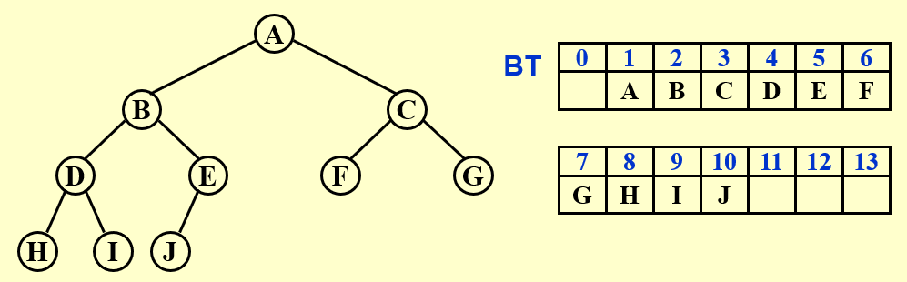
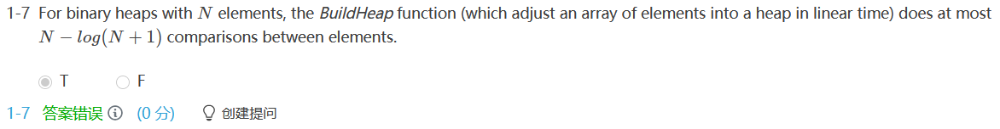
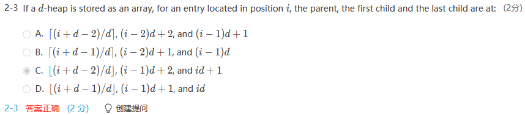
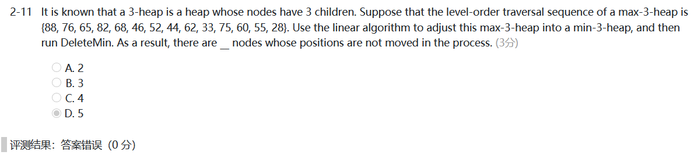

# DS5-堆

[TOC]

## 4 Priority Queues (Heaps)

### 4.1 ADT Model

- **Objects** :A finite ordered list with zero or more elements.
- **Operations** :
  - PriorityQueue  Initialize( int MaxElements ); 
  - void  Insert( ElementType X, PriorityQueue H ); 
  - ElementType  DeleteMin( PriorityQueue H ); 
  - ElementType  FindMin( PriorityQueue H ); 

---

### 4.2 Implementations

#### Array

- Insertion — add one item at the end ~$\Theta(1)$

- Deletion — find the largest / smallest key ~$\Theta(n)$

  ​                     remove the item and shift array ~$O(n)$

#### Linked List 

- Insertion — add to the front of the chain ~$\Theta(1)$

-  Deletion — find the largest / smallest key ~$\Theta(n)$

  ​                      remove the item ~$\Theta(1)$

- **Never more deletions than insertions**

#### Ordered Array

- Insertion — find the proper position ~$O(\log n)$

  ​                      shift array and add the item  ~$O(n)$

- Deletion — remove the first / last item ~$\Theta(1)$

#### Ordered Linked List

- Insertion — find the proper position ~$O(n)$

  ​                      add the item  ~$\Theta(1)$

- Deletion — remove the first / last item ~$\Theta(1)$

#### Binary Search Tree

- Both insertion and deletion will take $O(\log N)$ only.
- Only delete the the minimum element, always delete from the left subtrees.
- Keep a balanced tree 
- But there are many operations related to AVL tree that we don't really need for a priority queue.

---

### 4.3 Binary Heap

#### Structure Property

**[Definition]** A binary tree with $n$ nodes and height $h$ is **complete**  if  its nodes correspond to the nodes numbered from $1$ to $n$ in the perfect binary tree of height $h$.

- ==A complete binary tree of height $h$ has nodes $N$ between $2^h$ and $2^{h+1}-1$ nodes.==

- $h=\lfloor\log N\rfloor$

- Array Representation : BT[n + 1]  (BT[0] is not used)

  

**[Lemma]** 

1. $index\,of\,parent(i)=\left\{
   \begin{array}{rcl}
   \lfloor i/2\rfloor && {i\neq1}\\
   None && {i=1}\\
   \end{array} \right.$
2. $index\,of\,left\_child(i)=\left\{
   \begin{array}{rcl}
   2i && {2i\leq n}\\
   None && {2i>n}\\
   \end{array} \right.$
3. $index\,of\,right\_child(i)=\left\{
   \begin{array}{rcl}
   2i+1 && {2i+1\leq n}\\
   None && {2i+1>n}\\
   \end{array} \right.$

```c
PriorityQueue Initialize( int MaxElements ) 
{ 
    PriorityQueue H; 
    if ( MaxElements < MinPQSize ) 
		return Error( "Priority queue size is too small" ); 
    H = malloc(sizeof( struct HeapStruct )); 
    if ( H == NULL ) 
		return FatalError( "Out of space!!!" ); 
    /* Allocate the array plus one extra for sentinel */ 
    H->Elements = malloc(( MaxElements + 1 ) * sizeof( ElementType )); 
    if ( H->Elements == NULL ) 
		return FatalError( "Out of space!!!" ); 
    H->Capacity = MaxElements; 
    H->Size = 0; 
    H->Elements[0] = MinData;  /* set the sentinel */
    return H; 
}
```

#### Heap Order Property

**[Definition]** A **min tree** is a tree in which the key value in each node is no larger than the key values in its children (if any).  A **min heap** is a **complete** binary tree that is also a min tree.

- We can declare a **max** heap by changing the heap order property.

#### Basic Heap Operations

1. Insertion

   ```c
   /*H->Element[ 0 ] is a sentinel that is no larger than the minimum element in the heap.*/ 
   void Insert( ElementType X, PriorityQueue H ) 
   { 
   	int i; 
       if ( IsFull( H )) 
       { 
   		Error( "Priority queue is full" ); 
   		return; 
       } 
       for ( i = ++H->Size; H->Elements[ i/2 ] > X; i /= 2 ) 
   				H->Elements[ i ] = H->Elements[ i/2 ]; /*Percolate up, faster than swap*/
       H->Elements[ i ] = X; 
   }
   ```

   $$
   T(N)=O(\log N)
   $$

2. DeleteMin

   ```c
   ElementType DeleteMin( PriorityQueue H ) 
   { 
       int i, Child; 
       ElementType MinElement, LastElement; 
       if ( IsEmpty( H ) ) 
       { 
           Error( "Priority queue is empty" ); 
           return H->Elements[ 0 ];   
       } 
       MinElement = H->Elements[ 1 ];  /*Save the min element*/
       LastElement = H->Elements[ H->Size-- ];  /*Take last and reset size*/
       for ( i = 1; i * 2 <= H->Size; i = Child )  /*Find smaller child*/ 
       {
           Child = i * 2; 
           if (Child != H->Size && H->Elements[Child+1] < H->Elements[Child]) 
      	    	Child++;     
           if ( LastElement > H->Elements[ Child ] )   /*Percolate one level*/ 
      	     	H->Elements[ i ] = H->Elements[ Child ]; 
           else     
           	break;   /*Find the proper position*/
       } 
       H->Elements[ i ] = LastElement; 
       return MinElement; 
   }
   ```
$$
T(N)=O(\log N)
$$

#### Other Heap Operations 

- 查找除最小值之外的值需要对整个堆进行线性扫描

1. DecreaseKey — Percolate up

2. IncreaseKey — Percolate down

3. Delete

4. BuildHeap

   将N 个关键字以任意顺序放入树中，保持结构特性，再执行下滤

   ```c
   /*----------- 建造最大堆 -----------*/
   void PercDown( MaxHeap H, int p )
   { /* 下滤：将H中以H->Data[p]为根的子堆调整为最大堆 */
       int Parent, Child;
       ElementType X;
   
       X = H->Data[p]; /* 取出根结点存放的值 */
       for( Parent=p; Parent*2<=H->Size; Parent=Child ) {
           Child = Parent * 2;
           if( (Child!=H->Size) && (H->Data[Child]<H->Data[Child+1]) )
               Child++;  /* Child指向左右子结点的较大者 */
           if( X >= H->Data[Child] ) break; /* 找到了合适位置 */
           else  /* 下滤X */
               H->Data[Parent] = H->Data[Child];
       }
       H->Data[Parent] = X;
   }
   
   void BuildHeap( MaxHeap H )
   { /* 调整H->Data[]中的元素，使满足最大堆的有序性  */
     /* 这里假设所有H->Size个元素已经存在H->Data[]中 */
   
       int i;
   
       /* 从最后一个结点的父节点开始，到根结点1 */
       for( i = H->Size/2; i>0; i-- )
           PercDown( H, i );
   }
   ```
   
   $$
   T(N)=O(N)
   $$
   
   ==**[Theorem]** For the perfect binary tree of height $h$ containing $2^{h+1}-1$ nodes, the sum of the heights of the nodes is $2^{h+1}-1-(h+1)$.==
   
   


==注意这道题==




### 4.4 Applications of Priority Queues

#### Heap Sort

#### ==查找一个序列中第k小的元素==

The function is to find the `K`-th smallest element in a list `A` of `N` elements.  The function `BuildMaxHeap(H, K)` is to arrange elements `H[1]` ... `H[K]` into a max-heap.  

```c
ElementType FindKthSmallest ( int A[], int N, int K )
{   /* it is assumed that K<=N */
    ElementType *H;
    int i, next, child;

    H = (ElementType*)malloc((K+1)*sizeof(ElementType));
    for ( i = 1; i <= K; i++ ) H[i] = A[i-1];
    BuildMaxHeap(H, K);

    for ( next = K; next < N; next++ ) {
        H[0] = A[next];
        if ( H[0] < H[1] ) {
            for ( i = 1; i*2 <= K; i = child ) {
                child = i*2;
                if ( child != K && H[child+1] > H[child] ) child++;
                if ( H[0] < H[child] )
                    H[i] = H[child];
                else break;
            }
            H[i] = H[0];
        }
    }
    return H[1];
}
```

---

### 4.5 $d$-Heaps — All nodes have $d$ children


**Note** :

> - `DeleteMin` 下滤时每层会做$d-1$次比较找到最小孩子结点；共有$log_d N$ Hence the total time complexity would be $O(d \log_d N)$.
>
> - *2 or /2 is merely **a bit shift**, but *d or /d is not.
> - When the priority queue is too large to fit entirely in main memory, a d-heap will become interesting.





==正确答案是4，注意“in the process”？？==

