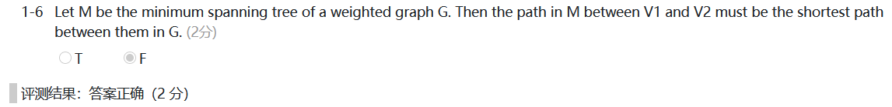
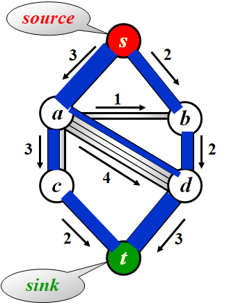

# DS-图2

[TOC]

## 5 Minimum Spanning Tree

#### 5.1 最小生成树的定义

[Definition] A *spanning tree* of a graph $G$ is a tree which consists of $V(G)$ and a subset of $E(G)$

> Note :
>
> - It is a **tree** since it is **acyclic**, **the number of edges is $|V|-1$**
> - It is **minimum** for the **total cost of edges is minimized.**
> - It is **spanning** because it **covers every vertex.**
> - A minimum spanning tree exists if $G$ is **connected.**（必要条件）
> - Adding a non-tree edge to a spanning tree, we obtain a cycle.

#### 5.2 寻找最小生成树的算法

> Greedy Method
>
> Make the best decision for each stage, under the following constrains :
>
> - we must use only edges within the graph
> - we must use exactly $|V|-1$ edges
> - we may not use edges that would produce a cycle


##### Prim’s Algorithm

> 非常类似于Dijkstra算法。不过dist定义为到树的“距离”。
>
> - dist=0表示已经被收录进树中，（所以也不需要collected数组作为标记了）
> - dist=c表示还没有被收录，但是与树中的结点邻接
> - dist=∞表示与树不联通

- 在算法的任一时刻，都可以看到一个已经添加到树上的顶点集，而其余顶点尚未加到这棵树中
- 算法在每一阶段都可以通过选择边$(u, v)$，使得$(u,v)$的值是所有$u$ 在树上但$v$不在树上的边的值中的最小者，而找出一个新的顶点并把它添加到这棵树中

```c
/* 邻接矩阵存储 - Prim最小生成树算法 */

Vertex FindMinDist( MGraph Graph, WeightType dist[] )
{ /* 返回未被收录顶点中dist最小者 */
    Vertex MinV, V;
    WeightType MinDist = INFINITY;

    for (V=0; V<Graph->Nv; V++) {
        if ( dist[V]!=0 && dist[V]<MinDist) {
            /* 若V未被收录，且dist[V]更小 */
            MinDist = dist[V]; /* 更新最小距离 */
            MinV = V; /* 更新对应顶点 */
        }
    }
    if (MinDist < INFINITY) /* 若找到最小dist */
        return MinV; /* 返回对应的顶点下标 */
    else return ERROR;  /* 若这样的顶点不存在，返回-1作为标记 */
}

int Prim( MGraph Graph, LGraph MST )
{ /* 将最小生成树保存为邻接表存储的图MST，返回最小权重和 */
    WeightType dist[MaxVertexNum], TotalWeight;
    Vertex parent[MaxVertexNum], V, W;
    int VCount;
    Edge E;
    
    /* 初始化。默认初始点下标是0 */
       for (V=0; V<Graph->Nv; V++) {
        /* 这里假设若V到W没有直接的边，则Graph->G[V][W]定义为INFINITY */
           dist[V] = Graph->G[0][V];
           parent[V] = 0; /* 暂且定义所有顶点的父结点都是初始点0 */ 
    }
    TotalWeight = 0; /* 初始化权重和     */
    VCount = 0;      /* 初始化收录的顶点数 */
    /* 创建包含所有顶点但没有边的图。注意用邻接表版本 */
    MST = CreateGraph(Graph->Nv);
    E = (Edge)malloc( sizeof(struct ENode) ); /* 建立空的边结点 */
           
    /* 将初始点0收录进MST */
    dist[0] = 0;
    VCount ++;
    parent[0] = -1; /* 当前树根是0 */

    while (1) {
        V = FindMinDist( Graph, dist );
        /* V = 未被收录顶点中dist最小者 */
        if ( V==ERROR ) /* 若这样的V不存在 */
            break;   /* 算法结束 */
            
        /* 将V及相应的边<parent[V], V>收录进MST */
        E->V1 = parent[V];
        E->V2 = V;
        E->Weight = dist[V];
        InsertEdge( MST, E );
        TotalWeight += dist[V];
        dist[V] = 0;
        VCount++;
        
        for( W=0; W<Graph->Nv; W++ ) /* 对图中的每个顶点W */
            if ( dist[W]!=0 && Graph->G[V][W]<INFINITY ) {
            /* 若W是V的邻接点并且未被收录 */
                if ( Graph->G[V][W] < dist[W] ) {
                /* 若收录V使得dist[W]变小 */
                    dist[W] = Graph->G[V][W]; /* 更新dist[W] */
                    parent[W] = V; /* 更新树 */
                }
            }
    } /* while结束*/
    if ( VCount < Graph->Nv ) /* MST中收的顶点不到|V|个 */
       TotalWeight = ERROR;
    return TotalWeight;   /* 算法执行完毕，返回最小权重和或错误标记 */
}
```

时间复杂度和Dijkstra算法类似，取决于找最小dist的方法。如果是遍历，则$T = O(|V|^2)$；如果是最小堆，则$T=O(|E|log|V|)$


##### Kruskal’s Algorithm——$O(ElogE)$

连续地按照最小的权选择边,，并且当所选的边不产生环时就把它作为取定的边


```c
/* 邻接表存储 - Kruskal最小生成树算法 */

/*-------------------- 顶点并查集定义 --------------------*/
typedef Vertex ElementType; /* 默认元素可以用非负整数表示 */
typedef Vertex SetName;     /* 默认用根结点的下标作为集合名称 */
typedef ElementType SetType[MaxVertexNum]; /* 假设集合元素下标从0开始 */

void InitializeVSet( SetType S, int N )
{ /* 初始化并查集 */
    ElementType X;

    for ( X=0; X<N; X++ ) S[X] = -1;
}

void Union( SetType S, SetName Root1, SetName Root2 )
{ /* 这里默认Root1和Root2是不同集合的根结点 */
    /* 保证小集合并入大集合 */
    if ( S[Root2] < S[Root1] ) { /* 如果集合2比较大 */
        S[Root2] += S[Root1];     /* 集合1并入集合2  */
        S[Root1] = Root2;
    }
    else {                         /* 如果集合1比较大 */
        S[Root1] += S[Root2];     /* 集合2并入集合1  */
        S[Root2] = Root1;
    }
}

SetName Find( SetType S, ElementType X )
{ /* 默认集合元素全部初始化为-1 */
    if ( S[X] < 0 ) /* 找到集合的根 */
        return X;
    else
        return S[X] = Find( S, S[X] ); /* 路径压缩 */
}

bool CheckCycle( SetType VSet, Vertex V1, Vertex V2 )
{ /* 检查连接V1和V2的边是否在现有的最小生成树子集中构成回路 */
    Vertex Root1, Root2;

    Root1 = Find( VSet, V1 ); /* 得到V1所属的连通集名称 */
    Root2 = Find( VSet, V2 ); /* 得到V2所属的连通集名称 */

    if( Root1==Root2 ) /* 若V1和V2已经连通，则该边不能要 */
        return false;
    else { /* 否则该边可以被收集，同时将V1和V2并入同一连通集 */
        Union( VSet, Root1, Root2 );
        return true;
    }
}
/*-------------------- 并查集定义结束 --------------------*/

/*-------------------- 边的最小堆定义 --------------------*/
void PercDown( Edge ESet, int p, int N )
{ /* 改编代码4.24的PercDown( MaxHeap H, int p )    */
  /* 将N个元素的边数组中以ESet[p]为根的子堆调整为关于Weight的最小堆 */
    int Parent, Child;
    struct ENode X;

    X = ESet[p]; /* 取出根结点存放的值 */
    for( Parent=p; (Parent*2+1)<N; Parent=Child ) {
        Child = Parent * 2 + 1;
        if( (Child!=N-1) && (ESet[Child].Weight>ESet[Child+1].Weight) )
            Child++;  /* Child指向左右子结点的较小者 */
        if( X.Weight <= ESet[Child].Weight ) break; /* 找到了合适位置 */
        else  /* 下滤X */
            ESet[Parent] = ESet[Child];
    }
    ESet[Parent] = X;
}

void InitializeESet( LGraph Graph, Edge ESet )
{ /* 将图的边存入数组ESet，并且初始化为最小堆 */
    Vertex V;
    PtrToAdjVNode W;
    int ECount;

    /* 将图的边存入数组ESet */
    ECount = 0;
    for ( V=0; V<Graph->Nv; V++ )
        for ( W=Graph->G[V].FirstEdge; W; W=W->Next )
            if ( V < W->AdjV ) { /* 避免重复录入无向图的边，只收V1<V2的边 */
                ESet[ECount].V1 = V;
                ESet[ECount].V2 = W->AdjV;
                ESet[ECount++].Weight = W->Weight;
            }
    /* 初始化为最小堆 */
    for ( ECount=Graph->Ne/2; ECount>=0; ECount-- )
        PercDown( ESet, ECount, Graph->Ne );
}

int GetEdge( Edge ESet, int CurrentSize )
{ /* 给定当前堆的大小CurrentSize，将当前最小边位置弹出并调整堆 */

    /* 将最小边与当前堆的最后一个位置的边交换 */
    Swap( &ESet[0], &ESet[CurrentSize-1]);
    /* 将剩下的边继续调整成最小堆 */
    PercDown( ESet, 0, CurrentSize-1 );

    return CurrentSize-1; /* 返回最小边所在位置 */
}
/*-------------------- 最小堆定义结束 --------------------*/


int Kruskal( LGraph Graph, LGraph MST )
{ /* 将最小生成树保存为邻接表存储的图MST，返回最小权重和 */
    WeightType TotalWeight;
    int ECount, NextEdge;
    SetType VSet; /* 顶点数组 */
    Edge ESet;    /* 边数组 */

    InitializeVSet( VSet, Graph->Nv ); /* 初始化顶点并查集 */
    ESet = (Edge)malloc( sizeof(struct ENode)*Graph->Ne );
    InitializeESet( Graph, ESet ); /* 初始化边的最小堆 */
    /* 创建包含所有顶点但没有边的图。注意用邻接表版本 */
    MST = CreateGraph(Graph->Nv);
    TotalWeight = 0; /* 初始化权重和     */
    ECount = 0;      /* 初始化收录的边数 */

    NextEdge = Graph->Ne; /* 原始边集的规模 */
    while ( ECount < Graph->Nv-1 ) {  /* 当收集的边不足以构成树时 */
        NextEdge = GetEdge( ESet, NextEdge ); /* 从边集中得到最小边的位置 */
        if (NextEdge < 0) /* 边集已空 */
            break;
        /* 如果该边的加入不构成回路，即两端结点不属于同一连通集 */
        if ( CheckCycle( VSet, ESet[NextEdge].V1, ESet[NextEdge].V2 )==true ) {
            /* 将该边插入MST */
            InsertEdge( MST, ESet+NextEdge );
            TotalWeight += ESet[NextEdge].Weight; /* 累计权重 */
            ECount++; /* 生成树中边数加1 */
        }
    }
    if ( ECount < Graph->Nv-1 )
        TotalWeight = -1; /* 设置错误标记，表示生成树不存在 */

    return TotalWeight;
}
```

$$
T=O(|E|\log|E|)
$$



---


#### 5.3 判断最小生成树是否唯一

```c
#include <stdio.h>
#include <stdlib.h>

typedef int Vertex;
typedef Vertex SetName;
typedef Vertex* Set;
typedef Vertex Element;
typedef long WeightType;

typedef struct ENode* PtrToEdge;
struct ENode {
    Vertex V1, V2;
    WeightType Weight;
};
int isUnique = 1;

SetName Find(Set S, Element X) {
    if (S[X] < 0) return X;
    else return S[X] = Find(S, S[X]);
}

void Union(Set S, Element c1, Element c2) 
{
    SetName r1,r2;
    r1 = Find(S,c1);
    r2 = Find(S,c2);
    if (r1 == r2) return;
    if (S[r1] < S[r2]) {
        S[r1] += S[r2];
        S[r2] = r1;
    }
    else {
        S[r2] += S[r1];
        S[r1] = r2;
    }
}

/*a是目标数组，b是临时数组*/
/*Version1*/
void merge(PtrToEdge a, int begin, int mid, int end, PtrToEdge b)
{
    /*mid是前一半的末尾，后一半的开始*/
    int i = begin, j = mid, k = begin;
    while (i < mid && j < end)
    {
        if (a[i].Weight < a[j].Weight)
            b[k++] = a[i++];
        else
            b[k++] = a[j++];
    }
    while (i < mid)
        b[k++] = a[i++];
    while (j < end)
        b[k++] = a[j++];
    //merge完以后b要重新放回a里，否则白排了!!!
    for (int i = begin;i<end;i++) {
        a[i] = b[i];
    }
}

/*begin is inclusive, end is exclusive*/
void mergeSort(PtrToEdge a, int begin, int end, PtrToEdge b)
{
    //base case
    if (end - begin < 2) return;
    int mid = (begin + end) / 2;
    mergeSort(a, begin, mid, b);
    mergeSort(a, mid, end, b);
    merge(a, begin, mid, end, b); //合二为一
}

void Sort(PtrToEdge Edge,int Ne)
{
    PtrToEdge temp = (PtrToEdge)malloc(sizeof(struct ENode)*Ne);
    mergeSort(Edge,0,Ne,temp);
    free(temp);
}

WeightType Kruskal(Set S,PtrToEdge Edge,int Ne)
{
    WeightType totalWeight = 0;
    SetName r1, r2, r3, r4;
    int i,j;
    for (i=0;i<Ne;i++) {
        r1 = Find(S,Edge[i].V1);
        r2 = Find(S,Edge[i].V2);
        if (r1!=r2) {
            for (j=i+1;j<Ne && Edge[j].Weight == Edge[i].Weight;j++) {
                r3 = Find(S,Edge[j].V1);
                r4 = Find(S,Edge[j].V2);
                if ((r1==r3&&r2==r4)||(r1==r4&&r2==r3)) isUnique = 0;
            }
        Union(S,r1,r2);
        totalWeight += Edge[i].Weight;
        }
    }
    return totalWeight;
}


int main() {
    int Nv,Ne;
    scanf("%d %d",&Nv,&Ne);
    PtrToEdge Edge = (PtrToEdge)malloc(sizeof(struct ENode)*Ne);
    for (int i=0;i<Ne;i++) {
        scanf("%d %d %ld",&(Edge[i].V1),&(Edge[i].V2),&(Edge[i].Weight));
    }
    Sort(Edge,Ne);
    Set S = (Set)malloc(sizeof(Vertex)*(Nv+1));
    for (int i=1;i<=Nv;i++) {
        S[i] = -1;
    }
    WeightType total = Kruskal(S,Edge,Ne);
    int SetNum = 0;
    for (int i=1;i<=Nv;i++) {
        if (S[i] < 0) SetNum++;
    }
    if (SetNum > 1) printf("No MST\n%d",SetNum);
    else {
        printf("%ld\n%s",total,isUnique == 1?"Yes":"No");
    }
    return 0;
}

```


## 6 图的遍历的应用

### 6.1 最大流问题 *Maxflow*

#### 问题描述

运水问题：从S运水到T。边表示管道，权重是运水容量。

中转站不能储存水。进水量=出水量

问题：求S运到T的最大水量

源点：只有流出去的点
汇点：只有流进来的点
流量：一条边上流过的流量
容量：一条边上可供流过的最大流量
残量：一条边上的容量-流量



#### 三个基本性质

- 对于任何一条流，总有流量<=容量

- 一个点（除源点和汇点）的入流和出流相等

- ==对于任何一条有向边(u,v)，总有$k[u][v]=-k[v][u]$==
  - 其中$k[i][j]$表示i到j的流量
  - 这条性质非常重要，找到增广路以后，增加反向边的依据就是这个


#### 基于增广路的Ford-Fulkerson方法

> 如下图，演示的是手动找最大流的方法


网络流的所有算法都是基于一种增广路的思想，其基本步骤如下：

> 1. 找到一条从源点到汇点的路径，使得路径上任意一条边的**残量>0**（注意是大于而不是大于等于，这意味着这条边还可以分配流量），这条路径便称为**增广路**
> 2. 找到这条路径上最小的$F[u][v]$（我们设$F[u][v]$表示u->v这条边上的**残量**即剩余流量），下面记为flow
> 3. 将这条路径上的每一条有向边u->v的残量**减去**flow，同时对于起反向边v->u的残量**加上**flow
> 4. 重复上述过程，直到找不出增广路，此时我们就找到了最大流

这个算法是基于**增广路定理**(Augmenting Path Theorem): 网络达到最大流当且仅当残差图中没有增广路


反向边的作用：给了反悔的机会（Undo）。在寻找增广路的过程中，如果我们没有建反边，那么有时候会发现找出来的路径与实际上的最大流不同，我们建这个反边是为了将原先得到的流推回去，从而得到新的流，就是给了我们反悔的机会。


##### 使用dfs随便找一条增广路


$T_{worst}=O(f|E|)$ where $f$ is the maximum flow.


##### ==每次找流量最大的增广路==

- 对Dijkstra算法进行单线(single-line)修改来寻找增长通路
- $cap_{max}$为最大边容量
- 每次用Dijkstra算法找一条增广路需要$O(|E|\log|V|)$，增广路总数为$O(|E|\log cap_{max})$

$$
T=T_{augmentation}\times T_{find\_a\_path}\\
=O(|E|\log cap_{max})\times O(|E|\log|V|)\\
=O(|E|^2\log|V|\log cap_{max})
$$


##### 每次找长度最短的增广路

- 使用无权最短路算法(bfs)来寻找增长路径

$$
T=T_{augmentation}\times T_{find\_a\_path}\\
=O(|E||V|)\times O(|E|)\\
=O(|E|^2|V|)
$$


#### ==Dinic算法==——先用bfs分层，再用dfs找增广路

为Dinic算法引入了一个叫做**分层图**的概念。具体就是对于每一个点，我们根据从源点开始的bfs序列，为每一个点分配一个深度，然后我们进行若干遍dfs寻找增广路，每一次由u推出v必须保证v的深度必须是u的深度+1。

> 1、首先进行bfs分层网络
>
> 2、进行dfs多路增广，并且记录残量网络和流量。
>
> 3、重复上述过程直到不存在从s到t的路径为止。将所有dfs的结果累加起来就是答案。将每一次的增广路效果叠加起来就是图上每条边的流量。

```c
#include <stdlib.h>
#include <stdio.h>
#include <string.h>
#define MaxVertexNum 1000
#define MaxEdgeNum 1000
#define INIFITY 1e10

int cnt;//边的数量，从0编号
//类似于邻接表，每个顶点串起它的边
int FirstEdge[MaxVertexNum];//每个顶点对应的第一条边
int NextEdge[MaxEdgeNum];//每条边的下一条边
typedef struct ENode* PtrToEdge;
struct ENode{
    int toV;//每条边指向的顶点编号
    int Re;//每条边的残量
} Edge[MaxEdgeNum];

int Depth[MaxVertexNum];//每个顶点在分层图中的标记深度
int cur[MaxVertexNum];//记录在bfs过程中某个顶点对应循环到了的边的序号
int s,t;//s是源点，t是汇点

int Nv;
char Vertex[MaxVertexNum][4];

void Insert(int V1, int V2, int re)
{
    cnt++;
    NextEdge[cnt] = FirstEdge[V1];
    FirstEdge[V1] = cnt;
    Edge[cnt].toV = V2;
    Edge[cnt].Re = re;
}
void InsertEdge(int V1, int V2, int re)
{
    Insert(V1, V2, re);
    Insert(V2, V1, 0);
}

int bfs() {
    Queue Q = CreateQueue(MaxVertexNum);
    for (int i=0;i<Nv;i++) {
        Depth[i] = -1;
    }
    Depth[s] = 0;
    Enqueue(Q,s);
    while (!isEmpty(Q)) {
        int v;
        Dequeue(Q,&v);
        for (int i = FirstEdge[v];i!=-1;i=NextEdge[i]) {
            if (Depth[Edge[i].toV]==-1 && Edge[i].Re > 0) {
                Depth[Edge[i].toV] = Depth[v]+1;//写成Depth[i]了。。两处都写错了导致无限循环
                Enqueue(Q,Edge[i].toV);
            }
        }
    }
    if (Depth[t] == -1) return 0;
    else return 1;
}

int dfs(int v,int flow) {
    if (v==t) return flow;
    for (int i=cur[v];i!=-1;cur[v]=i=NextEdge[i])
    {
        if (Depth[Edge[i].toV] == Depth[v]+1 &&//同样的Depth[i]错误。。。
        Edge[i].Re > 0) {
            int dis = dfs(Edge[i].toV, flow<Edge[i].Re ? flow:Edge[i].Re);
            if (dis > 0) {
                Edge[i].Re -= dis;
                Edge[i^1].Re += dis;
                //i^1是i与1异或。
                return dis;
            }
        } 
    }
    return 0;
}

int Dinic() {
    int maxflow = 0;
    while (bfs()) {
        // printf("bfs works\n");
        for (int i=0;i<Nv;i++) cur[i] = FirstEdge[i];
        maxflow+=dfs(s,INIFITY);
    }
    return maxflow;
}
int main() {
    cnt = -1;
    int i;
    for (i=0;i<MaxVertexNum;i++) {
        FirstEdge[i] = -1;
    }
    for (i=0;i<MaxEdgeNum;i++) {
        NextEdge[i] = -1;
    }

    int Ne,capacity;
    char src[4],des[4];
    scanf("%s %s %d",Vertex[0],Vertex[1],&Ne);
    Nv = 2, s = 0, t = 1;
    for (i=0;i<Ne;i++) {
        scanf("%s %s %d",src,des,&capacity);
        int V1, V2;
        V1 = getVertexIndex(src);
        V2 = getVertexIndex(des);
        InsertEdge(V1,V2,capacity);
    }
    int maxflow = Dinic();
    printf("%d",maxflow);
    return 0;
}
```


#### ==其他结论==

- 增广路算法 works for $G$ with **cycles** as well.
- If the edge capabilities are *rational numbers*, this algorithm always terminate with a maximum flow.
- If every $v \notin \{ s, t \}$ has either a single incoming edge of capacity 1 or a single outgoing edge of capacity 1, then time bound is reduced to $O( |E| |V|^{1/2} )$.
- The **min-cost flow** problem is to find, among all maximum flows, the one flow of minimum cost provided that each edge has a cost per unit of flow.


### 6.2 Biconnectivity

#### 枢轴点、二联通图和二联通分量

- $v$ is an **articulation point** if $G'=DeleteVertex(G, v)$ has **at least 2** connected components.
- $G$ is a **biconnected graph** if $G$ is connected and has no articulation points.
- A **biconnected component** is a maximal biconnected subgraph.


> Note: $E(G)$ is partitioned by the biconnected components of $G$.

#### 找出无向联通图的二联通分量(枢轴点)

> 找二联通分量，等价于找枢轴点

- Use **depth first search** to obtain a spanning tree of $G$

  - Back edges(背向边) = $(u,v)\notin$ tree and $u$ is an ancestor of $v$.

  - $Num(u)$ : dfs遍历的序号

  - $Low(u)$ : 对于dfs生成树上的每一个顶点$u$，计算编号最低的顶点
    $$
    Low(u)=\min\{Num(u),\min\{Low(w)|w\,is\,a\,child\,of\,u\},\min\{Num(w)|(u,w)\,is\,a\,back\,edge\}\}
    $$

  > Note : If $u$ is an ancestor of $v$, then $Num(u)<Num(v)$.


- Find the articulation points in $G$，分两种情况：

  - The **root** has **at least 2 children**.
  - Any other vertex $u$ is an articulation point iff $u$ has at least 1 child, and it is impossible to move down at least 1 step and then jump up to $u$‘s ancestor, i.e. $Low(child) >= Num(u)$


##### ==代码实现==

```pseudocode
/*Assign Num and compute Parents*/
void AssignNum(Vertex V)
{
	Vertex W;
	Num[V] = Counter++;
	Visited[V] = True;
	for each W adjacent to V
		if(!Visited[W])
		{
			Parent[W] = V;
			AssignNum(W);
		}
}
```

```pseudocode
/*Assign Low; also check for articulation points*/
void AssignLow(Vertex V)
{
	Vertex W;
	Low[V] = Num[V]; /*Rule 1*/
	for each W adjacent to V
	{
		if(Num[W] > Num[V]) /*Forward edge*/
		{
			Assignlow(W);
			if(Low[W] >= Num[V])
				printf("%v is an articulation point\n", v);
			Low[V] = Min(Low[V], Low[W]); /*Rule 3*/
		}
		else
			if (Parent[V] != W) /*Back edge*/
				Low[V] ＝ Min(Low[V], Num[W]); /*Rule 2*/
	}
}
```

```pseudocode
void FindArt(Vertex V)
{
	Vertex W;
	Visited[V] = True;
	Low[V] = Num[V] = Counter++; /*Rule 1*/
	for each W adjacent to V
	{
		if(!Visited[W]) /*Forward edge*/
		{
			Parent[W] = V;
			FindArt(W);
			if(Low[W] >= Num[V])
				printf("%v is an articulation point\n", v);
			Low[V] = Min(Low[V], Low[W]); /*Rule 3*/
		}
		else
			if(Parent[ V ] != W) /*Back edge*/
				Low[V] = Min(Low[V], Num[W]); /*Rule 2*/
	}
}
```


#### 找出有向图的强连通分量

```c
/*kosaraju算法*/
Vertex stack[MaxVertices];
int sp = -1;
void DFS1(Graph G,Vertex V,int* Visited)
{
    Visited[V] = 1;
    PtrToVNode W;
    for (W=G->Array[V];W;W=W->Next) {
        if (!Visited[W->Vert]) {
            DFS1(G,W->Vert,Visited);
        }
    }
    stack[++sp] = V;//入栈的时机是？应该在循环内还是循环外？
}

void DFS2(Graph G,Vertex V,int* Visited, void (*visit)(Vertex V))
{
    Visited[V] = 1;
    printf("%d ",V);
    PtrToVNode W;
    for (W=G->Array[V];W;W=W->Next) {
        if (!Visited[W->Vert]) {
            DFS2(G,W->Vert,Visited,visit);
        }
    }
}
void StronglyConnectedComponents( Graph G, void (*visit)(Vertex V) )
{
    /*首先构造转置图Gt*/
    Graph Gt = (Graph)malloc(sizeof(struct GNode));
    Gt->NumOfVertices = G->NumOfVertices;
    Gt->NumOfEdges = G->NumOfEdges;
    Gt->Array = (PtrToVNode*)malloc(sizeof(PtrToVNode)*Gt->NumOfVertices);
    int i;
    PtrToVNode W;
    for (i=0;i<Gt->NumOfVertices;i++) {
        Gt->Array[i] = NULL;
    }
    for (i=0;i<G->NumOfVertices;i++) {
        for (W=G->Array[i];W;W=W->Next) {
            PtrToVNode NewNode = (PtrToVNode)malloc(sizeof(struct VNode));
            NewNode->Vert = i;
            NewNode->Next = Gt->Array[W->Vert];
            Gt->Array[W->Vert] = NewNode;
        }
    }

    /*原图dfs，
    并且按搜索完成时间从小到大的顺序将结点压入栈中*/
    int* Visited = (int*)malloc(sizeof(int)*G->NumOfVertices);
    for (i=0;i<G->NumOfVertices;i++) {
        if (!Visited[i]) DFS1(G,i,Visited);
    }
    
    for (i=0;i<G->NumOfVertices;i++) {
        Visited[i] = 0;
    }
    /*转置图，从栈中弹出结点一个个dfs，获得强连通分量*/
    while (sp!=-1) {
        Vertex V = stack[sp--];
        if (!Visited[V]) {
            DFS2(Gt,V,Visited,visit);
            printf("\n");
        }
    }
}
```


## 7 Topological Sort

### 7.1 AOV Network

> *Activity on Vertex*,顶点代表一个活动。活动之间有先后顺序

- digraph $G$ in which $V( G )$ represents activities and $E( G )$ represents precedence relations 
- Feasible AOV network must be a directed acyclic graph(**DAG**)
- $i$  is a **predecessor** of $j$ = there is a path from $i$  to $j$
- $i$  is an **immediate predecessor** of  $j$ = $< i,  j > \in E( G )$. Then $j$ is called a **successor**(**immediate successor**) of $i$


### 7.2 Partial Order

- 偏序关系：irreflexive, transitive
  - ==和离散里说的偏序关系不是同一个？离散里的偏序指自反、反对称和传递==

> Partial Order的要求导致AOV Network必然是DAG

> Note : If the precedence relation is reflexive, then there must be an $i$ such that $i$ is a predecessor of $i$.  That is, $i$ must be done before $i$ is started. Therefore if a project is **feasible**, it must be **irreflexive**.


### 7.3 拓扑排序

A *topological order* is a linear ordering of the vertices of a graph such that, for any two vertices, $i$, $j$, if $i$ is a predecessor of $j$ in the network then $i$ precedes $j$ in the linear ordering.

> Note : The topological orders may **not be unique** for a network.

```c
/*Test an AOV for feasibility, and generate a topological order if possible*/
void Topsort( Graph G )
{   
		int Counter;
    Vertex V, W;
    for ( Counter = 0; Counter < NumVertex; Counter++ ) 
    {
      V = FindNewVertexOfDegreeZero( );
      if ( V == NotAVertex ) 
          {
          Error ( “Graph has a cycle” );   
              break;  
          }
      TopNum[ V ] = Counter; /* or output V */
      for ( each W adjacent to V )
          Indegree[ W ]––;//放松操作
    }
}
```

$$
T=O(|V|^2)
$$

> 拓扑排序借助于队列存放入度为0的结点。
>
> 整个过程和dfs比较类似，不过是在dfs上加了`入度为0`的约束条件。

```c
/*Improvment:Keep all the unassigned vertices of degree 0 in a special box (queue or stack)*/
void Topsort( Graph G )
{   
		Queue Q;
    int Counter = 0;
    Vertex V, W;
    Q = CreateQueue( NumVertex );  
    MakeEmpty( Q );
    for ( each vertex V )
			if ( Indegree[ V ] == 0 ) Enqueue( V, Q );
    while ( !IsEmpty( Q ) ) 
    {
        V = Dequeue( Q );
        TopNum[ V ] = ++Counter; /* assign next */
        for ( each W adjacent to V )
            if (--Indegree[ W ] == 0 ) Enqueue( W, Q );
    }  /* end-while */
    if ( Counter != NumVertex )
			Error( “Graph has a cycle” );
    DisposeQueue( Q ); /* free memory */
}
```

$$
T=O(|V|+|E|)
$$

#### 判断给定序列是否为拓扑排序

```c
bool IsTopSeq( LGraph Graph, Vertex Seq[] )
{
    int* a = malloc(sizeof(int)*(Graph->Nv));
    int i;
    for (i=0;i<Graph->Nv;i++) {
        a[Seq[i]-1] = i;
    }
    for (i=0;i<Graph->Nv;i++) {
        PtrToAdjVNode p = Graph->G[i].FirstEdge;
        for (;p;p = p->Next) {
            if (a[i] > a[p->AdjV]) { //对每一个表头，它出度的结点出现在序列中的序号必然比表头要大。
                return false;
            }
        }
    }
    return true;
}
```


### ==7.4 DAG的最短路问题==

DAG（有向无环图）的最短路径在拓扑排序过程中已经确定。

- If the graph is acyclic, vertices may be selected in **topological order** since when a vertex is selected, its distance can no longer be lowered without any incoming edges from unknown nodes.
- $T=O(|E|+|V|)$ and no priority queue is needed.（使用拓扑排序即可）


### ==7.5 AOE(Activity on Edge) Networks==

> Vertex是里程碑事件，标志着进入边上所有活动的结束


## 8 Euler Circuits

### 8.1 Euler Circuit

[Proposition] An Euler circuit is possible only if the graph is ==connected== and each vertex has an *even* degree.

### 8.2 Euler Tour

[Proposition] An Euler tour is possible if there are exactly *two* vertices having odd degree.  One must start at one of the odd-degree vertices.

> Note:
>
> - The path should be maintained as a linked list.
> - For each adjacency list, maintain a pointer to the last edge scanned.
> - $T=O(|E|+|V|)$

---

