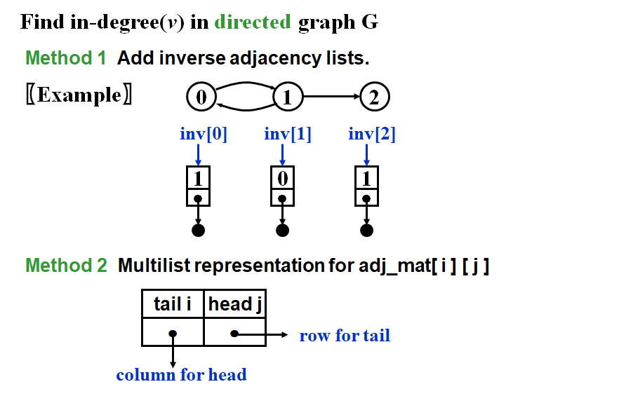
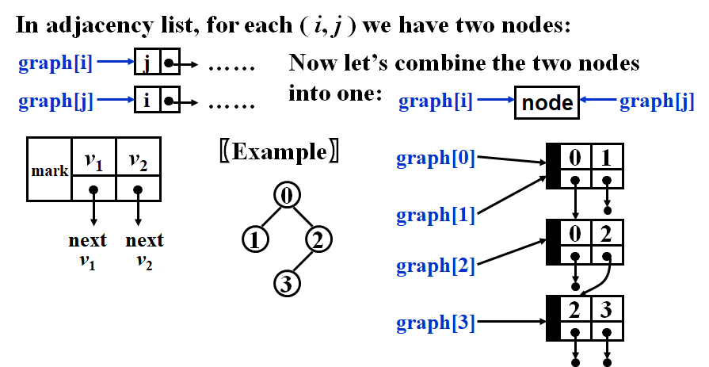

# DS6-图的概念、表示、遍历及最短路问题

[TOC]

## 1 图的概念

### 1.1 图的定义

$G( V, E )$ 

- $G$ = graph, 
- $V = V( G )$ = finite nonempty set of vertices（顶点）
- and $E = E( G )$ = finite set of edges（边）

> 本课程考虑Simple Graph，不考虑重边(Multigraph)和自回路(Self Loop)


### 1.2 图的术语

> 把概念和图形相结合


#### **有向图和无向图**

*Undirected graph*

- $( v_i , v_j ) = ( v_j , v_i )$ = the same edge.

*Directed graph(diagraph)*


#### 完全图，邻接点，子图，度

**Complete graph** **完全图**

A graph that has the maximum number of edges.


**Adjacent 邻接点**

> 两个顶点有边直接相连


**Subgraph**
$$
G'\subset G=V(G')\subseteq V(G) \&\& E(G')\subseteq E(G)
$$

**Degree**

- number of edges incident to v

- For a directed G, we have **in-degree** and **out-degree**.

- **握手定理**：Given G with $n$ vertices and $e$ edges, then
  $$
  e=(\sum_{i=0}^{n-1}d_i)/2\quad where\quad d_i=degree(v_i)
  $$


#### 路径相关的概念

**Path**

Path($\subset G$) from $v_p$ to $v_q$ = $\{v_p,v_{i1},v_{i2},\cdots,v_{in},v_q\}$ such that $(v_p,v_{i1}),(v_{i1},v_{i2}),\cdots,(v_{in},v_q)$ belong to $E(G)$

**Length of a path**

number of **edges** on the path

**Simple path**

除了起点和终点可以相同以外，路径上任意两点都不相同

**Cycle**

simple path with $v_p=v_q$


#### 图的连通性

**Connected 无向图的联通**

- $v_i$ and $v_j$ in an undirected $G$ are connected if there is a path from $v_i$ to $v_j$ (and hence there is also a path from $v_j$ to $v_i$)
- An undirected graph $G$ is connected if every pair of distinct $v_i$ and $v_j$ are connected

**Connected Component 无向图的联通分量**

- the *maximal* connected subgraph


**有向图的强连通和弱联通**

- **Strongly connected** For every pair of $v_i$ and $v_j$ in $V( G )$, there exist directed paths from $v_i$ to $v_j$ and from $v_j$ to $v_i$.  
- **Weakly connected** 把有向边换成无向边，对应的无向图是连通的

**Strongly connected component 有向图的强连通分量**

- the *maximal* subgraph that is strongly connected


#### 特殊的图——树和DAG

**Tree**

无向、无环、连通图

**DAG 有向无环图**

Directed Acyclic Graph

> 比如AOV Network就是DAG


### 1.3 练习巩固

1. In a connected graph, the number of edges must be greater than the number of vertices minus 1.

最小的连通图是树，即E=v-1


2. If graph G is NOT connected and has 35 edges, then it must have at least ____ vertices.

> 考察完全图顶点和边的关系。


#### 欧拉公式及其推广

3. A graph with 90 vertices and 20 edges must have at least __ connected component(s).

> 补充知识：欧拉图论定理
> 若一个平面连通图G 有V个顶点，E条边，F个区域（包括最外面的区域），则V − E + F = 2。
>
> 
>
> 证明：不妨尝试用归纳法。
> 只有一个点，即V = 1 , E = 0 , F = 1 ，满足V − E + F = 2；
> 加入一条边，连接上一个新点和一个原有的点，即( V + 1 ) − ( E + 1 ) + F = 2；
> 加入一条边连接原有的两个点，即V − ( E + 1 ) + ( F + 1 ) =2。
> 至此，结论得证。

根据欧拉公式，对于一个联通图有 $V-E+F=2$。将一个图的一个联通分量看作一个联通图，假如有k个联通分量，求和可以得到$V - E + F = 2k$。但是注意到所有联通分量中最外部的那个区域被计算了k次，其实只需计算一次，因此$V-E+F = 2k - (k-1) = k+1$  
$$
V-E+F = k+1
$$
其中V为任意一个图的顶点数，E为边数，F为区域数，k为该图的联通分量数

代入可得：$k = F+69$，为了让联通分量最小，取F=1,即k=70


4. Given an undirected graph G with 16 edges, where 3 vertices are of degree 4, 4 vertices are of degree 3, and all the other vertices are of degrees less than 3. Then G must have at least __ vertices.

> 根据2e=sum(degree)，32=12+12+d*(v-7)，其中d<3，因此8<=2(v-7)，v>=11


## 2 图的表示

### 2.1 邻接矩阵 Adjacency Matrix

#### (1) 邻接矩阵是什么


特点：对角线元素为0。无向图为对称矩阵


**线性结构存储无向图的下三角矩阵** 


**网络（带权重的图）**

只要把G[i] [j]的值定义为边**<v ,v >**的权重即可

> Q: v~i~和v~j~之间若没有边该怎么表示？


#### (2) 优点

- 直观、简单、好理解
- 方便检查任意一对顶点间是否存在边
- 方便找任一顶点的所有邻接点
- 方便计算任一顶点的度
  - 无向图：对应行（或列）非 0 元素的个数
  - 有向图：对应行非 0 元素的个数是出度；对应列非 0 元素的个数是入度


#### (3) 缺点

- 浪费空间——存稀疏图

- 浪费时间——统计稀疏图的边

  - To find out whether or not $G$ is connected, we’ll have to examine all edges. ==In this case $T$ and $S$ are both $O( n^2 )$.==


#### (4) 代码实现

```c
/* 图的邻接矩阵表示法 */

#define MaxVertexNum 100    /* 最大顶点数设为100 */
#define INFINITY 65535        /* ∞设为双字节无符号整数的最大值65535*/
typedef int Vertex;         /* 用顶点下标表示顶点,为整型 */
typedef int WeightType;        /* 边的权值设为整型 */
typedef char DataType;        /* 顶点存储的数据类型设为字符型 */

/* 边的定义 */
typedef struct ENode *PtrToENode;
struct ENode{
    Vertex V1, V2;      /* 有向边<V1, V2> */
    WeightType Weight;  /* 权重 */
};
typedef PtrToENode Edge;
       
/* 图结点的定义 */
typedef struct GNode *PtrToGNode;
struct GNode{
    int Nv;  /* 顶点数 */
    int Ne;  /* 边数   */
    WeightType G[MaxVertexNum][MaxVertexNum]; /* 邻接矩阵 */
    DataType Data[MaxVertexNum];      /* 存顶点的数据 */
    /* 注意：很多情况下，顶点无数据，此时Data[]可以不用出现 */
};
typedef PtrToGNode MGraph; /* 以邻接矩阵存储的图类型 */


MGraph CreateGraph( int VertexNum )
{ /* 初始化一个有VertexNum个顶点但没有边的图 */
    Vertex V, W;
    MGraph Graph;
    
    Graph = (MGraph)malloc(sizeof(struct GNode)); /* 建立图 */
    Graph->Nv = VertexNum;
    Graph->Ne = 0;
    /* 初始化邻接矩阵 */
    /* 注意：这里默认顶点编号从0开始，到(Graph->Nv - 1) */
    for (V=0; V<Graph->Nv; V++)
        for (W=0; W<Graph->Nv; W++)  
            Graph->G[V][W] = INFINITY;
            
    return Graph; 
}
       
void InsertEdge( MGraph Graph, Edge E )
{
     /* 插入边 <V1, V2> */
     Graph->G[E->V1][E->V2] = E->Weight;    
     /* 若是无向图，还要插入边<V2, V1> */
     Graph->G[E->V2][E->V1] = E->Weight;
}

MGraph BuildGraph()
{
    MGraph Graph;
    Edge E;
    Vertex V;
    int Nv, i;
    
    scanf("%d", &Nv);   /* 读入顶点个数 */
    Graph = CreateGraph(Nv); /* 初始化有Nv个顶点但没有边的图 */ 
    
    scanf("%d", &(Graph->Ne));   /* 读入边数 */
    if ( Graph->Ne != 0 ) { /* 如果有边 */ 
        E = (Edge)malloc(sizeof(struct ENode)); /* 建立边结点 */ 
        /* 读入边，格式为"起点 终点 权重"，插入邻接矩阵 */
        for (i=0; i<Graph->Ne; i++) {
            scanf("%d %d %d", &E->V1, &E->V2, &E->Weight); 
            /* 注意：如果权重不是整型，Weight的读入格式要改 */
            InsertEdge( Graph, E );
        }
    } 

    /* 如果顶点有数据的话，读入数据 */
    for (V=0; V<Graph->Nv; V++) 
        scanf(" %c", &(Graph->Data[V]));

    return Graph;
}
```


### 2.2 邻接链表 Adjacency List

#### (1) 邻接表是什么

> 相当于按行存储邻接矩阵


> 注意：每一行的元素顺序是不重要的

#### (2) 特点

> 实质上存储了每一个顶点的出度。
>
> 对于无向图而言，信息已经完备，甚至冗余（因为每一条边都存储了两遍）
>
> 对于有向图而言，入度信息缺失，要么再按列构造一个邻接链表，要么构造十字链表


- 方便找任意一个顶点的所有邻接点（邻接矩阵的一行）

- 存储稀疏图的空间 $S$ = $v$ heads + $2e$ nodes  = $(v+2e)$ ptrs + $2e$ ints

  > 2e是因为存的是度数，而度数=2*边数

- 无向图的度 Degree(i) = number of nodes in $G[i]$

- 计算图的边数 $T$ = $O(n+e)$ 

  > 解释：head有G[0] ~ G[n-1]，链表边数共有2e条
  >
  > 注意：当e很少（即稀疏图）时，用邻接链表才合算。
  >
  > 如果是完全图， $e = O(n^2)$，实际上时间复杂度和邻接矩阵是相似的。

#### (3) 代码实现

```c
/* 图的邻接表表示法 */

#define MaxVertexNum 100    /* 最大顶点数设为100 */
typedef int Vertex;         /* 用顶点下标表示顶点,为整型 */
typedef int WeightType;        /* 边的权值设为整型 */
typedef char DataType;        /* 顶点存储的数据类型设为字符型 */

/* 边的定义 */
typedef struct ENode *PtrToENode;
struct ENode{
    Vertex V1, V2;      /* 有向边<V1, V2> */
    WeightType Weight;  /* 权重 */
};
typedef PtrToENode Edge;

/* 邻接点的定义 */
typedef struct AdjVNode *PtrToAdjVNode; 
struct AdjVNode{
    Vertex AdjV;        /* 邻接点下标 */
    WeightType Weight;  /* 边权重 */
    PtrToAdjVNode Next;    /* 指向下一个邻接点的指针 */
};

/* 顶点表头结点的定义 */
typedef struct Vnode{
    PtrToAdjVNode FirstEdge;/* 边表头指针 */
    DataType Data;            /* 存顶点的数据 */
    /* 注意：很多情况下，顶点无数据，此时Data可以不用出现 */
} AdjList[MaxVertexNum];    /* AdjList是邻接表类型 */

/* 图结点的定义 */
typedef struct GNode *PtrToGNode;
struct GNode{  
    int Nv;     /* 顶点数 */
    int Ne;     /* 边数   */
    AdjList G;  /* 邻接表 */
};
typedef PtrToGNode LGraph; /* 以邻接表方式存储的图类型 */


LGraph CreateGraph( int VertexNum )
{ /* 初始化一个有VertexNum个顶点但没有边的图 */
    Vertex V;
    LGraph Graph;
    
    Graph = (LGraph)malloc( sizeof(struct GNode) ); /* 建立图 */
    Graph->Nv = VertexNum;
    Graph->Ne = 0;
    /* 初始化邻接表头指针 */
    /* 注意：这里默认顶点编号从0开始，到(Graph->Nv - 1) */
       for (V=0; V<Graph->Nv; V++)
        Graph->G[V].FirstEdge = NULL;
            
    return Graph; 
}
       
void InsertEdge( LGraph Graph, Edge E )
{
    PtrToAdjVNode NewNode;
    
    /* 插入边 <V1, V2> */
    /* 为V2建立新的邻接点 */
    NewNode = (PtrToAdjVNode)malloc(sizeof(struct AdjVNode));
    NewNode->AdjV = E->V2;
    NewNode->Weight = E->Weight;
    /* 将V2插入V1的表头 */
    NewNode->Next = Graph->G[E->V1].FirstEdge;
    Graph->G[E->V1].FirstEdge = NewNode;
        
    /* 若是无向图，还要插入边 <V2, V1> */
    /* 为V1建立新的邻接点 */
    NewNode = (PtrToAdjVNode)malloc(sizeof(struct AdjVNode));
    NewNode->AdjV = E->V1;
    NewNode->Weight = E->Weight;
    /* 将V1插入V2的表头 */
    NewNode->Next = Graph->G[E->V2].FirstEdge;
    Graph->G[E->V2].FirstEdge = NewNode;
}
```


### ==2.3 有向图的十字链表==

> 补充有向图的入度信息


| 表示方法     | 某顶点的邻接点 | 某顶点的出度 | 某顶点的入度 | 计算边数     | 空间复杂度  | 适用对象     |
| ------------ | -------------- | ------------ | ------------ | ------------ | ----------- | ------------ |
| 邻接矩阵     | 一行/一列      | 一行         | 一列         | $T=O(n^2)$   | $O(n^2)$    | 边比较多的图 |
| 邻接链表     | 一行的链表     | 一行         | 缺失         | $T =O( n+e)$ | $O(n + 2e)$ | 稀疏图       |
| 邻接十字链表 |                |              |              |              |             | 稀疏有向图   |




### 2.4 无向图的关联矩阵 Incident Matrix

> 用邻接链表（结点是顶点）会存储两次边信息，冗余
>
> 现在结点是无向边


**关联链表**



- Sometimes we need to ==mark== the edge after examine it, and then find the next edge.


```c
/*关联矩阵*/
int cnt;//边的数量，从0编号。
//<v1,v2>和<v2,v1>视作两条不同的边，因此每条边的前驱后继是唯一的
int FirstEdge[MaxVertexNum];//结点的表头
struct ENode {
    int toV;//每条边指向的顶点编号
    int weight;//边的权值
    int NextEdge;//指向的下一条边的编号，类似于指针域
} Edge[MaxEdgeNum];

int Vertex[MaxVertexNum];

void InsertEdge(int V1, int V2, int Weight)
{
    cnt++;
    Edge[cnt].NextEdge = FirstEdge[V1];
    Edge[cnt].toV = V2;
    Edge[cnt].weight = Weight;
    FirstEdge[V1] = cnt;
}

void InitializeGraph() {
    int cnt = -1;
    int i;
    for (i=0;i<MaxVertexNum;i++) FirstEdge[i] = -1;
    for (i=0;i<MaxEdgeNum;i++) Edge[i].NextEdge = -1;
    int V1,V2,Weight,Ne;
    scanf("%d",&Ne);
    for (i=0;i<Ne;i++) {
        scanf("%d %d %d",&V1,&V2,&Weight);
        InsertEdge(V1,V2,Weight);
    }
}
```


------

## 3 图的遍历

### 3.1 深度优先搜索(DFS)

> Depth First Search
>
> 类似于树的先序遍历，对于每个顶点，访问其没有访问过的邻接点。
>
> 不同于树的是，树的结构是非对称的，而图（无向图）的结构是对称的。需要加入`Visit`标记。

#### (1) 算法描述及复杂度


复杂度取决于图的表示方法

- 邻接矩阵，$O(|V|^2)$
- 邻接表，$O(|V|+|E|)$


#### (2) 代码实现

```c
/* Visited[]为全局变量，已经初始化为false */
void DFS( LGraph Graph, Vertex V, void (*Visit)(Vertex) )
{   /* 以V为出发点对邻接表存储的图Graph进行DFS搜索 */
    PtrToAdjVNode W;
    
    Visit( V ); /* 访问第V个顶点 */
    Visited[V] = true; /* 标记V已访问 */

    for( W=Graph->G[V].FirstEdge; W; W=W->Next ) /* 对V的每个邻接点W->AdjV */
        if ( !Visited[W->AdjV] )    /* 若W->AdjV未被访问 */
            DFS( Graph, W->AdjV, Visit );    /* 则递归访问之 */
}
```


#### (3) 非连通图的改进


对每一个顶点调用DFS/BFS时，就把它所在的连通分量遍历了一遍。


### 6.3.2 广度优先搜索(BFS)

> Breadth Fisrt Search
>
> 树的层次遍历的推广。利用队列，一圈一圈向外搜索

#### (1) 算法描述及复杂度


复杂度取决于图的表示方法

- 邻接矩阵，$O(|V|^2)$
- 邻接表，$O(|V|+|E|)$

#### (2) 代码实现


## 4 图的最短路问题

### 4.1 Single-Source Shortest-Path Problem

Given as input a weighted graph, $G = ( V, E )$, and a distinguished vertex $s$, find the shortest weighted path from $s$ to every other vertex in $G$.

> Note: If there is no negative-cost cycle, the shortest path from $s$ to $s$ is defined to be zero.

#### 4.1.1 Unweighted Shortest Path

> 与BFS非常类似。从源点S开始，一圈一圈向外纳入邻接点。
>
> 区别在于要标记顶点是否Visited。


##### 按路径递增顺序收录——$O(|V|^2)$

- Table[ i ].Dist ::= distance from $s$ to $v_i$  /* initialized to be $\infin$ except for $s$ */
- Table[ i ].Known ::= 1 if $v_i$ is checked; or 0 if not
- Table[ i ].Path ::= for tracking the path   /* initialized to be 0 */

```c
void Unweighted( Table T )
{   
    int CurrDist;
    Vertex V, W;
    for ( CurrDist = 0; CurrDist < NumVertex; CurrDist++ ) 
    {
        for ( each vertex V )
			if ( !T[ V ].Known && T[ V ].Dist == CurrDist ) 
            {
	    		T[ V ].Known = true;
	    		for ( each W adjacent to V )
	        		if ( T[ W ].Dist == Infinity ) 
                    {
						T[ W ].Dist = CurrDist + 1;
						T[ W ].Path = V;
	        		} /* end-if Dist == Infinity */
			} /* end-if !Known && Dist == CurrDist */
    }  /* end-for CurrDist */
}
```

The worst case : 


$$
T(N)=O(|V|^2)
$$

##### BFS, 一圈圈收录邻接点——$O(|V|+|E|)$

```c
void Unweighted( Table T )
{   
    /* T is initialized with the source vertex S given */
    Queue Q;
    Vertex V, W;
    Q = CreateQueue( NumVertex );
    MakeEmpty( Q );
    Enqueue( S, Q ); /* Enqueue the source vertex */
    while ( !IsEmpty( Q ) ) 
    {
        V = Dequeue( Q );
        for ( each W adjacent to V )
			if ( T[ W ].Dist == Infinity ) {
	    		T[ W ].Dist = T[ V ].Dist + 1;
	    		T[ W ].Path = V;
	    		Enqueue( W, Q );
			} /* end-if Dist == Infinity */
    } /* end-while */
    DisposeQueue( Q ); /* free memory */
}
```

对于邻接表表示的图：
$$
T=O(|V|+|E|)
$$


#### 4.1.2 Weighted Shorted Path

##### Dijkstra’s Algorithm

- Let S = { $s$ and $v_i$’s whose shortest paths have been found }
- For any $u\notin S$,  define distance [ u ] = minimal length of path { $s\rightarrow(v_i\in S)\rightarrow u$ }.  If the paths are generated in non-decreasing order, then :
  - the shortest path must go through **only** $v_i\in S$
  - **Greedy Method** : $u$ is chosen so that distance[ u ] = min{ $w \notin S$ | distance[ w ] }  (If $u$ is not unique, then we may select any of them)
  - if distance[$u_1$] < distance[$u_2$] and add $u_1$ into $S$, then distance [ $u_2$ ] may change.  If so, a shorter path from $s$ to $u_2$ must go through $u_1$ and distance [ $u_2$ ] = distance [ $u_1$ ] + length(< $u_1$, $u_2$>).


```c
Vertex FindMinDist(LGraph Graph,int* dist,int* collected) {
    Vertex MinV,V;
    int Min = INIFITY;
    for (V=1;V<=Graph->Nv;V++) {
        if (!collected[V] && dist[V] < Min) {
            MinV = V;
            Min = dist[V];
        }
    }
    if (Min < INIFITY) return MinV;
    else return -1;
}

void Dijkstra(LGraph Graph,Vertex S,int* dist,int* path)
{
    /*Initialize to INIFITY*/
    int collected[MaxVertexNum];
    Vertex V;
    for (V=1;V<=Graph->Nv;V++) {
        dist[V] = INIFITY;
        path[V] = -1;
        collected[V] = 0;
    }
    /*Initialize S's adjacent nodes*/
    PtrToAdjVNode W;
    for (W=Graph->G[S].FirstEdge;W;W=W->Next) {
        dist[W->AdjV] = W->Weight;
        path[W->AdjV] = S;
    }
    /*first collect S*/
    dist[S] = 0;
    collected[S] = 1;

    while(1) {
        /*Find the vertex which is not collected and has the minimum distance*/
        V = FindMinDist(Graph, dist, collected);
        /*If not found, the algorithm is end*/
        if (V == -1) break;
        collected[V] = 1;
        /*Update the shortest path of V's adjacent nodes*/
        for (W=Graph->G[V].FirstEdge;W;W=W->Next) {
            if (!collected[W->AdjV])
            && dist[V]+W->Weight < dist[W->AdjV])
            {
                dist[W->AdjV] = dist[V] + W->Weight;
                path[W->AdjV] = V;
            }
        }
    }
}

void PrintPath(Vertex A,DataType path[],int Ns)
{
    Vertex V;
    for (V=A;V!=-1;V = path[V]) {
        if (V!=A) printf(" ");
        if (V > Ns) printf("A-%d",V-Ns);
        else printf("%d",V);
    }
}
```


##### 算法复杂度——找最小值的算法

> 主要取决于每次找未收录的dist最小的顶点的算法。
>
> - 遍历所有顶点，找到min
> - 利用最小堆, `DeleteMin`和`DecreaseKey`操作

###### 遍历所有顶点 $T=O(|V|^2+|E|)$

- 适用于稠密图
- 容易理解，实现简单


###### 最小堆 $T = O(|E|\log|V|)$

- Keep distances in a priority queue and call `DeleteMin` to find the smallest unknown distance vertex.——$O(\log|V|)$

- 更新的处理方法

  - **Method 1** : `DecreaseKey`——$O(\log|V|)$

    $T=O(|V|\log|V|+|E|\log|V|)=O(|E|\log|V|)$

    > 最开始要建一个堆，所有结点key是INFINITY，O(V)
    >
    > deleteMin V次，decreaseKey E次
    >
    > 对于一般堆，O(V + VlogV + ElogV) 
    >
    > 对于fib堆，decreaseKey O(1)， 所以复杂度变成O(V + VlogV + E)

  - **Method 2** : insert W with updated Dist into the priority queue

    Must keep doing `DeleteMin` until an unknown vertex emerges

    $T=O(|E|\log|E|)$ but requires $|E|$ `DeleteMin` with `|E|` space
    
    > insert E 次， DeleteMin E次
    >
    > 对于一般的堆，O(ElogE + ElogE)
    >
    > 对于fib堆，insert O(1)，所以复杂度变成O(E + ElogE)

- Good if the graph is sparse


#### 4.1.3 Graphs with Negative Edge Costs

> 就是简单的dfs+更新路径判断
>
> 记录每个顶点出队次数，来判断负值圈

```c
void WeightedNegative( Table T )
{
    Queue Q;
    Vertex V, W;
    Q = CreateQueue (NumVertex );  
    MakeEmpty( Q );
    Enqueue( S, Q ); /*Enqueue the source vertex*/
    while ( !IsEmpty( Q ) ) 
    {
        V = Dequeue( Q );//每一个顶点最多出队|V|次（见算法导论），可以判定negative cost cycle，退出程序
        for ( each W adjacent to V )
		if ( T[ V ].Dist + Cvw < T[ W ].Dist ) 
        {
	    	T[ W ].Dist = T[ V ].Dist + Cvw;
	    	T[ W ].Path = V;
	    	if ( W is not already in Q )
	        	Enqueue( W, Q );
		} /*end-if update*/
    } /*end-while */
    DisposeQueue( Q ); /*free memory*/
}
```

> 最多循环$|V|$次。每一次循环要遍历邻接点，为$|E|$

$$
T=O(|V|\times|E|)
$$


### 4.2 All-Pairs Shortest Path Problem

- For all pairs of $v_i$ and $v_j$ ( $i\neq j$ ), find the shortest path between.

#### (1) 多次调用单源最短路算法

- 调用Dijkstra算法 for $|V|$ times.
- $T=O(|V|^3)$, works fast on sparse graph.

#### (2) Floyd算法

- 动态规划
- $T=O(|V|^3)$，works faster on dense graphs.

```c
/*Floyd Algorithm
Input:  Gragh, a weighted undirected graph.
Output: D[i][j], storing the shortest path from i to j in the end. i,j is abitrary.
        Path[i][j], storing the last intermediate vertex along the path.

Main idea: 
        1. Initialize D[][] and path[][]
            D[i][j] = Graph->G[i][j].
            If i and j is adjacent, the data represents the weight of the edge.
            If not, the data is INIFITY.
            path[i][j] = -1, representing no internal vertex at beginning.
        2.  Update D[][] by considering 1,2,...,k as intermediate vertex until k == N
            D[i][j] is the shortest path from i to j, which can only pass vertice in {1,2,...,k}
            k is increasing from 1 to N

            When we pick vertex number k as an intermediate vertex, 
            we already have considered vertices {0, 1, 2, .. k-1} as intermediate vertices. 

            For every pair (i, j), there are two possible cases. 
            1) k is not an intermediate vertex in shortest path from i to j. 
            We keep the value of D[i][j] as it is. 
            2) k is an intermediate vertex in shortest path from i to j. 
            We update D[i][j] as D[i][k] + D[k][j] if D[i][j] > D[i][k] + D[k][j]
*/
void Floyd(MGraph Graph,WeightType D[][MaxVertexNum],
DataType path[][MaxVertexNum])
{
    Vertex i,j,k;
    for (i=1;i<=Graph->Nv;i++) {
        for (j=1;j<=Graph->Nv;j++) {
            D[i][j] = Graph->G[i][j];
            path[i][j] = -1;
        }
    }

    for (k=1;k<=Graph->Nv;k++) 
        for (i=1;i<=Graph->Nv;i++) 
            for (j=1;j<=Graph->Nv;j++) 
                if (D[i][j] > D[i][k]+D[k][j]) {
                    D[i][j] = D[i][k]+D[k][j];
                    path[i][j] = k;
                }
}
```


