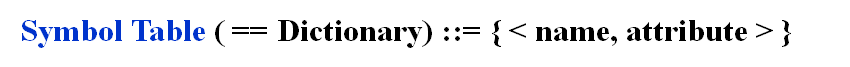
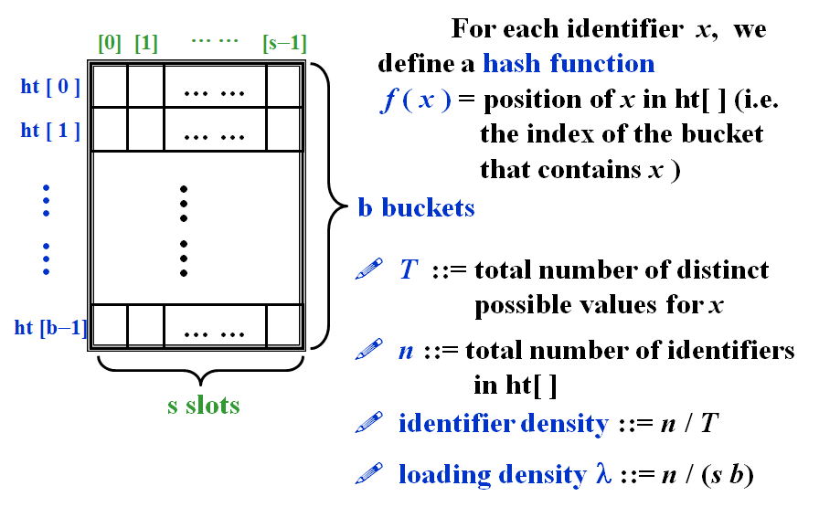

# DS8-Hashing

[TOC]

## 1 General Idea

### 1.1 Symbol Table ADT




- **Objects** : A set of name-attribute pairs, where the names are unique
- **Operations** :
  -  SymTab Create(TableSize) 
  -  Boolean IsIn(symtab, name)
  -  Attribute  Find(symtab, name) 
  -  SymTab  Insert(symtab, name, attr)
  -  SymTab  Delete(symtab, name) 


### 1.2 Hash Tables

> 核心：哈希函数$f(x)$
>
> 考虑$f(x)$为一一映射，即键值$x$和桶的序号一一对应。
>
> - 插入操作：给定$x$，计算出$f(x)$，即为插入位置。$T=O(1)$
> - 查找操作，给出位置$p$，计算出$f^{-1}(p)$，即为键值。$T=O(1)$
>
> 如果情况坏一些，不是一一对应，允许每个桶的深度>1，则插入、查找、删除复杂度也会坏一些。
>
> 但是总体上都是$O(1)$的复杂度（开放地址），$T_{insert} = T_{find} = T_{delete} = O(1)$
>
> ==注：链式的哈希表，复杂度不一定为$O(1)$==



**术语**

- $T$ 键值不同取值的总数
- $n$ 插入数据量
- ==loading density 装填因子 $\lambda$  = 插入数据量/表的总规模（整个矩阵而非仅仅是表头）==


**可能存在的问题**

- A **collision** occurs when we hash two nonidentical identifiers into the same bucket.
  - 要尽量减少collision，即桶越浅越好，尽量是一一对应
- An **overflow** occurs when we hash a new identifier into a full bucket.


### 1.3 对哈希函数的要求

-  $f(x)$ must be **easy** to compute and **minimize** the number of **collisions**.
-  $f(x)$ should be **unbiased**（无偏）. For any $x$ and any $i$, we have that $Probability(f(x)=i)=\frac{1}{b}$. Such kind of a hash function is called a **uniform hash function**.

---

## 2 解决"Collision"的几种策略

### 2.1 Separate Chaining *链表实现*

#### (1) 代码实现

> 每一个桶用链表实现即可。哈希表结构定义为链表的表头

- keep a list of all keys that hash to the same **value**

```c
struct ListNode; 
typedef struct ListNode *Position; 
struct HashTbl; 
typedef struct HashTbl *HashTable; 
struct ListNode { 
	ElementType Element; 
	Position Next; 
}; 
typedef Position List; 
/* List *TheList will be an array of lists, allocated later */ 
/* The lists use headers (for simplicity), */ 
/* though this wastes space */ 
struct HashTbl { 
	int TableSize; 
	List *TheLists; 
}; 
```

**Create an empty table**

```c
HashTable InitializeTable( int TableSize ) 
{   
    HashTable H; 
    int i; 
    if ( TableSize < MinTableSize ) 
    { 
	    Error( "Table size too small" );  
        return NULL;  
    } 
    H = malloc( sizeof( struct HashTbl ) );  /*Allocate table*/
    if ( H == NULL ) FatalError( "Out of space!!!" ); 
    H->TableSize = NextPrime( TableSize );  /*Better be prime*/
    H->TheLists = malloc( sizeof( List )* H->TableSize );  /*Array of lists*/
    if ( H->TheLists == NULL ) FatalError( "Out of space!!!" );
    H->TheList = malloc(H->TableSize*sizeof(struct ListNode));
    for( i = 0; i < H->TableSize; i++ ) 
    {   /*Allocate list headers*/
		//H->TheLists[ i ] = malloc( sizeof( struct ListNode ) ); /* Slow! */
		if ( H->TheLists[ i ] == NULL ) FatalError( "Out of space!!!" ); 
		else H->TheLists[ i ]->Next = NULL;
    } 
    return H; 
} 
```

**Find a key from a hash table**

> ==这里的查找操作复杂度不一定为$O(1)$，取决于链表的长度==

```c
Position Find ( ElementType Key, HashTable H ) 
{ 
    Position P; 
    List L; 
    L = H->TheLists[ Hash( Key, H->TableSize ) ]; 
    P = L->Next; 
    while( P != NULL && P->Element != Key )  /*Probably need strcmp*/ 
		P = P->Next; 
    return P; 
} 
```

**Insert a key into a hash table**

```c
void Insert ( ElementType Key, HashTable H ) 
{ 
    Position Pos, NewCell; 
    List L; 
    Pos = Find( Key, H ); 
    if ( Pos == NULL ) 
    {   /*Key is not found, then insert*/
		NewCell = malloc( sizeof( struct ListNode ) ); 
		if ( NewCell == NULL ) FatalError( "Out of space!!!" ); 
		else 
		{ 
	     	L = H->TheLists[ Hash( Key, H->TableSize ) ]; /*Compute again is bad*/
	     	NewCell->Next = L->Next; 
	     	NewCell->Element = Key; /*Probably need strcpy!*/ 
	     	L->Next = NewCell; 
		} 
    } 
} 
```

#### (2) 特点分析

- 尽可能使 loading density factor $\lambda\approx 1$

**缺点**

- 离散的地址，对cache不友好
- 指针的额外开销


### 2.2 Open Addressing *开放地址*

#### (1) 基本思路

> 基本思想：桶深度为1。当用哈希函数直接找到的位置已经被插入时，使用偏移量函数找附近的位置插入，从而解决冲突问题
>
> $hash(key)+f(i)$

```pseudocode
Algorithm: insert key into an array of hash table
{
    index = hash(key);
    initialize i = 0 ------ the counter of probing;
    while (collision at index) 
    {
		index = (hash(key)+f(i))%TableSize; /*f(i) is collision resolving function*/
		if (table is full) break;
		else i++;
    }
    if (table is full) ERROR (“No space left”);
    else insert key at index;
}
```

> Note : 
>
> - $F(0) = 0$，即第一次找的位置一定是哈希函数算出的位置
>
> - Generally $\lambda<0.5$，即哈希表至少有一半的空位。


#### (2) Linear Probing

- $F(i)$ is a linear function of $i$, such as ==$F(i)=i$==.
- 逐个探测每个单元(必要时可以绕回)以查找出一个空单元
- ==使用线性探测的预期探测次数对于插入和不成功的查找来说大约是$\frac{1}{2}(1+\frac{1}{(1-\lambda)^2})$，对于成功的查找来说是$\frac{1}{2}(1+\frac{1}{1-\lambda})$==
- Cause **primary clustering**（聚团效应）: any key that hashes into the cluster will add to the cluster after several attempts to resolve the collision.


#### (3) Quadratic Probing

> 使用$\pm i^2$作为二次探测的探测函数。即index为$h(x)\pm i^2$

- $F(i)$ is a quadratic function of $i$, such as $F(i)=i^2$.

==如果TableSize为质数，且表至少有一半空位，那么使用二次探测的方法一定可以成功插入==

证明：


==Note : If the table size is a prime of the form $4k + 3$, then the quadratic probing  $f(i) = \pm i^2$ can probe the entire table.==

```c
HashTable InitializeTable(int TableSize)
{
	HashTable H;
	int i;
	if(TableSize < MinTableSize)
	{
		Error("Table size too small");
		return NULL;
    }
	/*Allocate table*/
	H = malloc(sizeof(struct HashTbl));
	if(H == NULL)
		Fatal Error("Out of space!!!");
	H->TableSize = NextPrime(TableSize);//==用户友好操作，找到用户指定的size的下一个质数作为TableSize==
	
    /*Allocate array of Cells*/
	H->TheCells = malloc(sizeof(Cell)*H->TableSize);
	if(H->TheCells == NULL)
		FatalError("Out of space!!!");

    for(i = 0; i < H->TableSize; i++)
		H->TheCells[ i ].Info = Empty;
  /*	注意Cell.Info共有三种状态：
  		Empty, Legimate(有合法元素), Deleted（已删除）
  		必须要引入Deleted状态。否则如果删除一个元素时直接将Info重置为Empty，会导致再次查找元素时发生问题。
  */
	return H;
}
```

```c
Position Find(ElementType Key, HashTable H) 
{   
	Position CurrentPos; 
    int CollisionNum; 
    CollisionNum = 0; 
    CurrentPos = Hash(Key, H->TableSize); 
    while(H->TheCells[ CurrentPos ].Info != Empty && //两个语句不能互换，必须要先判断Info是否为Empty
          H->TheCells[ CurrentPos ].Element != Key) 
    { 
		CurrentPos += 2*++CollisionNum-1; //f(i) = f(i-1) + 2*i-1。哈希函数的复杂性要非常扣细节，越快越好
		if (CurrentPos >= H->TableSize)  
            CurrentPos -= H->TableSize;   /*Faster than mod*/
    } 
    return CurrentPos; 
} 
```

```c
void Insert(ElementType Key, HashTable H) 
{ 
    Position Pos; 
    Pos = Find(Key, H); 
    if (H->TheCells[ Pos ].Info != Legitimate)
    { /*OK to insert here*/ 
		H->TheCells[ Pos ].Info = Legitimate; 
		H->TheCells[ Pos ].Element = Key; /*Probably need strcpy*/ 
    } 
} 
```

Note :

- ==Insertion will be seriously slowed down if there are too many **deletions intermixed with insertions**.==
- Although primary clustering is solved, **secondary clustering** occurs, that is, keys that hash to the same position will probe the same alternative cells.


#### (4) Double Hashing

- $f(i)=i*hash_2(x)$
- $hash_2(x)\not\equiv 0$
- make sure that all cells can be probed
- ==$hash_2(x)=R-(x\%R)$ with $R$ a prime smaller than TableSize, will work well.==

> Note :
>
> - If double hashing is correctly implemented, simulations imply that the **expected** number of probes is almost the same as for a **random** collision resolution strategy.
> - Quadratic probing does not require the use of a second hash function and is thus likely to be **simpler and faster** in practice.


## 3 Rehashing

**Rehashing的三要素**

- 新table的大小：Build another table that is about **twice** as big.（注意选取质数，如扩容为20，则选23为新的tablesize）
- 原有的元素：Scan down the entire original hash table for non-deleted elements.
- 新的哈希函数：Use a **new function** to hash those elements into the new tab

**When to rehash**

- As soon as the table is *half full*
- When an *insertion fails*（必须要rehash）
- When the table *reaches a certain load factor*

> Note : Usually there should have been N/2 insertions before rehash, so O(N) rehash only adds a constant cost to each insertion. However, in an interactive system, the unfortunate user whose insertion caused a rehash could see a slowdown.

```c
HashTable Rehash(HashTable H)
{
	int i, OldSize;
	Cell *OldCells;
	OldCells = H->TheCells;
	OldSize = H->TableSize;
	
    /*Get a new, empty table*/
	H = InitializeTable(2*OldSize);
	/*Scan through old table, reinserting into new*/
	for(i = 0; i < OldSize; i++)
		if(OldCells[i].Info == Legitimate)
			Insert(OldCells[i].Element, H);
	free(OldCells);
	
    return H;
}
```

