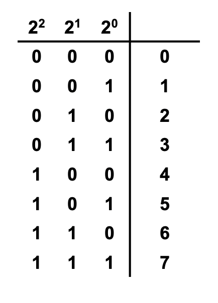
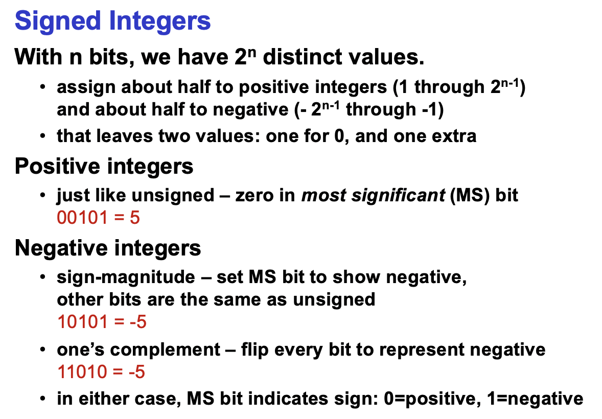
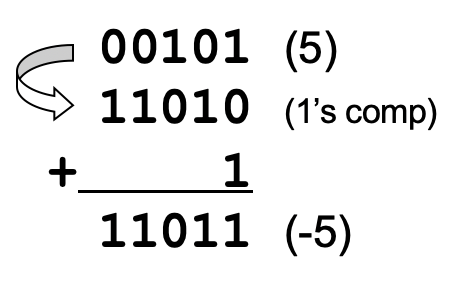
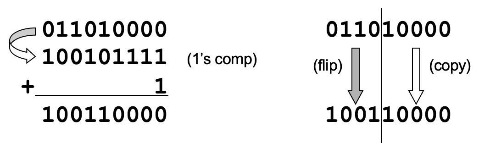
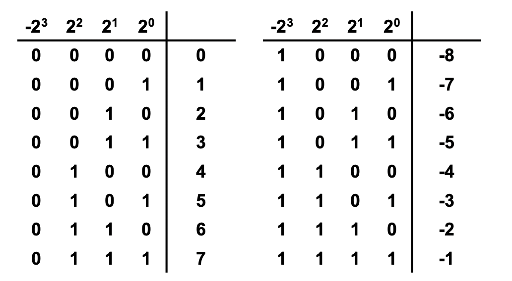
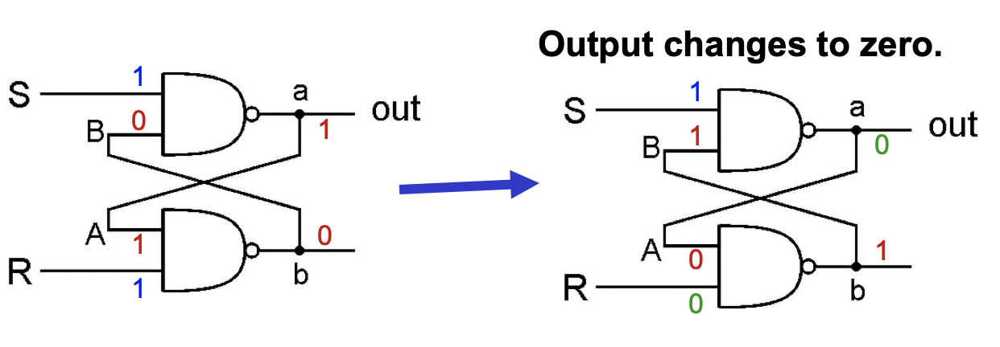
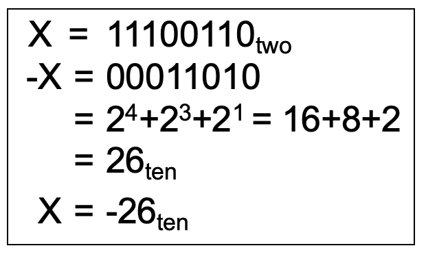
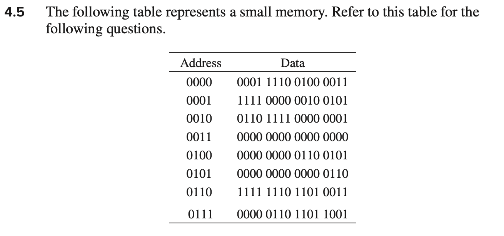
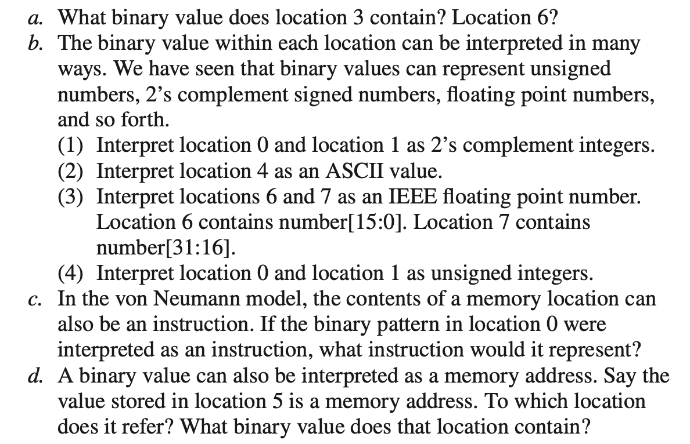
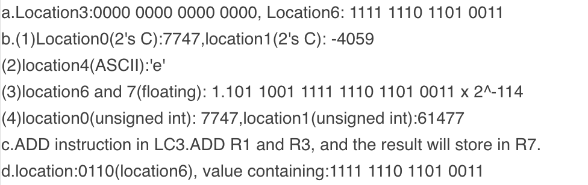

# Patt-Ch2 Bits, Data Types, and Operations

[TOC]

## **2.1 Bit - Binary Digit**

- 1: **presence** of a voltage, 0: **absence** of a voltage
- A collection of n bits has 2^n^ possible states.

- a way of code
  - ***e.g. ASCII Code*** ,*total numbers less than 8bits*


## **2.2 Data Types**

> data type: representation of information


### 2.2.1 Unsigned Integers

An n-bit unsigned int represents 2^n^ values: **0 - 2^n^-1**



### 2.2.2 Signed Integers

#### 2.2.2.1 sign-magnitude and 1’s complement(反码)



#### 2.2.2.2 Problems above

- +0 *00000* and -0 *10000(S-M)* or *11111(1's C)*
- complex arithmetic, even error

```c
e.g. 	sign-magnitude
			2+(-3)															
			0 0 1 0 	2
			1 0 1 1		-3	
		 	-------
		 	1 1 0 1		-5
		 	ERROR
		 	
		 	1's complement
		 	4+(-3)
		 	0 0 1 1		4
		 	1 1 0 0		-3
		 	-------
		 	1 1 1 1   0
		 	ERROR
```


#### 2.2.2.3 2's Complement(补码)

##### Design Purpose

- *Two’s complement* **representation developed to make circuits easy for arithmetic.**

- for each positive number (X), assign value to its negative (-X),
   such that **X + (-X) = 0** with **“normal” addition**, **ignoring carry out**

```c
e.g.
  		0 0 1 0 1		(5)
  		1 1 0 1 1 	(-5)
  		---------
  		0 0 0 0 0		(0)
```

##### Representation

- Positive or 0: normal binary representation

- Negative:

  - start with positive number
  - flip every bit
  - add 1

  

- shortcut:

  - start with positive
  - copy bits from right to left until (and including) the first 1
  - Flip remaining bits to the left

  


##### Number Range

- ==MS(*most important*) bit is **sign bit**, weight **-2^n-1^**==
- Range: **[-2^n-1^, 2^n-1^-1]**
  - The most negative number (-2^n-1^) has no positive counterpart.




| 以5和-5为例 | SM   | 1's C | 2's C |
| ----------- | ---- | ----- | ----- |
| 正数        | 0101 | 0101  | 0101  |
| 负数        | 1101 | 1010  | 1011  |


### 2.3 Floating Point

#### ==2.3.1 Representation==

- IEEE754 standard
- **32-bit(64 bit for DOUBLE)** normalized floating-point number representation

|      |         Sign         |       Exponent        |          Fraction           |
| :--: | :------------------: | :-------------------: | :-------------------------: |
| Bits |          1           |        8/*11*         |           23/*52*           |
| Rule | 0 for `+`, 1 for `-` | unsigned int**^[1]^** | digits after point**^[2]^** |

**^[1]^** 8 bits **unsigned integer** can represent [0,255].

​	exp [1,254] -> **subtract 127** real exp [-126, 127]

​	exp == 255(1111 1111) -> ∞

​	exp == 0 -> 0.fraction x 2^-126^


for 64 bits **DOUBLE**,

​	 exp [1,2046] -> **subtract 1023** real exp [-1022,1023]

​	 exp == 2047(111 1111 1111) -> ∞

​	 exp == 0(000 0000 0000) -> **0.**fraction x 2^-1022^

> *The purpose is to compare two float numbers easily,that is,camparing every bit*


**^[2]^** **scientific counting**——1.fraction x 2^exp^

The digit before point is always 1 so it's unnecessary to allocate.

*e.g. 1.10011001… then the fraction is 1001loop,until the 23rd bit*


*Also have 16 bits floating point,1, 5, 10 for sign,exp and fraction respectively


#### 2.3.2 Infinites

0 11111111 00000000000000000000000 -> +∞

1 11111111 00000000000000000000000 -> -∞





#### ==2.3.3 Converting Example==

==**Example 1 Floating -> Decimal**==

Convert 1 10000001 1010 0000 0000 0000 0000 000 to decimal representation

| sign |    exp    |               frac                |
| :--: | :-------: | :-------------------------------: |
|  1   | 1000 0001 | 1010 0000 0000 0000 0000 0000 000 |

exp: (1000 0001)~2~-(127)~10~ = 128+1-127 = 2;

coe:==(-1.101)~2~== = 1+1/2+1/8 = (-1.625)~10~;

Result: -1.625 x 2^2^ = -6.25


==**Example 2 Decimal -> Floating**==

Convert (-35.6)~10~  to floating representation

sign: 1

(35)~10~ = 32 + 2 + 1 = (100011)~2~

(0.6)~10~ = (.1001loop)~2~

==(35.6)~10~ = (10 0011.1001loop)~2~ = (1.00011 1001loop x 2^5^)~2~==


***tips: How to convert decimal fraction to binary?***

```c
			|0.6 x2 = 1.2
    1 |0.2 x2 = 0.4
    0 |0.4 x2 = 0.8
    0 |0.8 x2 = 1.6
    1 |0.6 x2 = 1.2
    loop 1001
```

| sign |    exp    |             frac             |
| :--: | :-------: | :--------------------------: |
|  1   | 1000 0100 | 00011 1001 1001 1001 1001 10 |


### 2.4 Converting between Binary & Decimal

#### 2.4.1 Converting Binary(2's C) to Decimal

- positive: normal converting

- Negative(*MS bit is 1*):

  - take 2's C to get a positive number
  - normal converting
  - add `-`

  

#### 2.4.2 Converting Decimal to Binary(2's C)

```
01011.101

<-		->

11		+1/2 + 1/8
```






**Answer:**==(b.(3)floating point 再次做错，因为再次漏看组合顺序)==




## **3 Operations**

### 3.1 Arithmetic Operations

#### 3.1.1 Addition & Subtraction

- all int have the same number of bits
- ignore carry out 
- the result still fits in n-bit 2's C


***如果只是二进制加法，不考虑进位舍去***

> 2.14 Add the following bit patterns. Leave your results in binary form.

e. 1111 + 0001

result 1 0000


#### 3.1.2 Sign Extension

- zero extension: Fill 0 when extending.


- sign extension: Fill sign bit when extending. 

  


#### 3.1.3 Overflow(溢出)

 **The 2 only possible overflow situations:**

- **positive + positive == negative**, that is, carry to the sign bit, and the sign bit becomes 1 after adding
- **negative + negative == positive**,the sign bit becomes 0 after adding


### 3.2 Logical Operations

#### 3.2.1 Bit Vector

- View n-bit number as a collection of n logical values

- operation applied to each bit **independently**

#### 3.2.2 NOT

​																							*truth table for NOT*

|  A   | NOT A |
| :--: | :---: |
|  0   |   1   |
|  1   |   0   |

#### 3.2.3 AND

|  A   |  B   | AND  |
| :--: | :--: | :--: |
|  0   |  0   |  0   |
|  0   |  1   |  0   |
|  1   |  0   |  0   |
|  1   |  1   |  1   |

- **Bit Mask**(掩码) A & 00100000 to reset 1->0

  

#### 3.2.4 OR

|  A   |  B   |  OR  |
| :--: | :--: | :--: |
|  0   |  0   |  0   |
|  0   |  1   |  1   |
|  1   |  0   |  1   |
|  1   |  1   |  1   |

#### 3.2.5 XOR(异或)

*Exclusive OR*

|  A   |  B   | XOR  |
| :--: | :--: | :--: |
|  0   |  0   |  0   |
|  0   |  1   |  1   |
|  1   |  0   |  1   |
|  1   |  1   |  0   |


#### 3.2.6 DeMorgan's Law *Page 41*

*AND OR NOT relationship*

~ (~A & ~B) = A | B