# Chapter 4 文件安全和文件共享

[TOC]


## 1 三种保护和安全机制

- 使用登录名(login name)和登录密码(password) 
- 文件加密
- **文件访问特权(File access privileges)**


## 2 基于访问权限的文件保护

### 2.1 策略一：用户分类

对于某一个文件，有三种用户：

- 所有者(Owner Users)
- 组(Group Users)
  - 每个用户属于某一个组
  - 系统中的所有用户组的信息以及该组的用户都记录在/etc/group文件中
- 其他人(Other users)


Linux有一个特殊用户，称为超级用户或根用户(Superuser or root user)可以访问所有文件。

- 用户名：root
- 用户ID：0


### 2.2 策略二：文件操作/访问权限分类

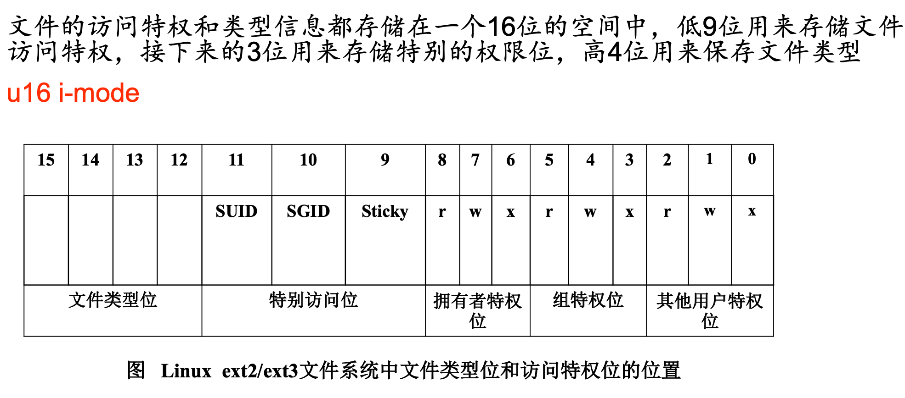

#### 2.2.1 `r,w,x`访问权限

对于某一个文件，有三种访问权限：

- r，表示允许读
- w，表示允许写
- x，表示允许执行

| 权限 | 文件 | 目录                                                |
| ---- | ---- | --------------------------------------------------- |
| r    | 读   | 可以使用`ls`读出目录内容                            |
| w    | 写   | 可以使用`cp, mkdir`等在该目录下创建或删除文件(目录) |
| x    | 执行 | 可以使用`cd`进入该目录                              |

将策略一二组合，有3x3=9种用户/访问权限，需要用9bits来表示


#### 2.2.2 特殊访问位`SUID, SGID, Sticky`

##### SUID(set user ID)

作用对象：仅对二进制可执行文件有效

用途：在执行该二进制文件时，执行者将具有该文件拥有者的权限（临时）

例子：

- 文件/etc/passwd，只有超级用户有权访问该文件 。用户执行passwd命令，试图去更改 /etc/passwd文件来写入新的登录密码，但此时命令却没有对/etc/passwd文件的访问特权。但是因为passwd命令设置了suid权限位，所以普通用户通过执行passwd命令，临时拥有root权限，间接的修改/etc/passwd，以达到修改自己密码的权限。
- 其他命令如lp、mail、mv、ps同理。


##### SGID(set group ID)

作用对象：目录或文件

对目录：

- 使用者若对于此目录具有 r 与 x 的权限时，该使用者能够进入此目录

- 使用者在此目录下的群组将会变成该目录的群组

- 若使用者在此目录下具有 w 的权限(可以新建文件)，则使用者所创建的新文件，该新文件的群组与此目录的群组相同

对二进制可执行文件：

- 执行者对于该文件来说，需具备 x 的权限

- 执行者在执行的过程中将会获得该文件群组的支援（用于改文件群组的权限）


##### Sticky Bit

作用对象：目录

sticky位被设置时，即使其他用户有写权限(w)，也只有文件拥有者可以删除或重命名某个目录 下的文件。


### 2.3 使用`ls -l`查看访问特权等信息

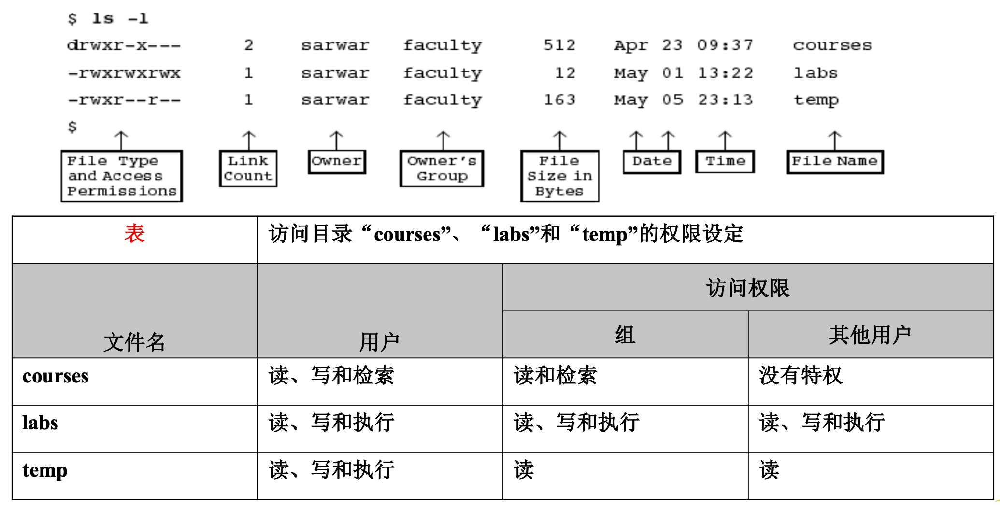


#### 特殊访问位的显示

- 当设置SUID位为1时，如果**用户**对该文件有执行权限，那么执行位被设置位‘s’，否则执行位变为‘S’

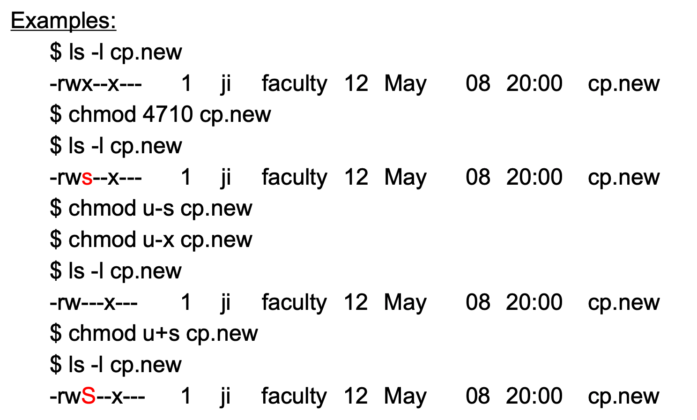

- 当SGID位被置位1的时候，如果**组**对应的可执行位是x，那么则改为小写的‘s’，否则被改为 大写的‘S’。

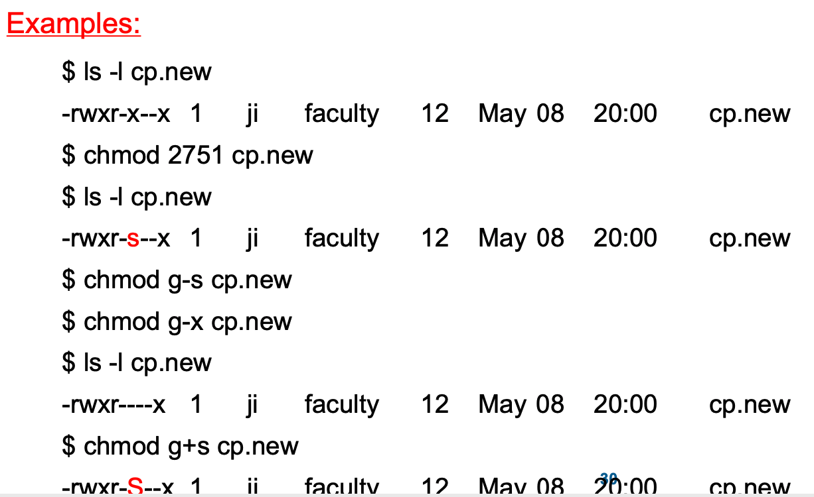

- 如果sticky位为1，并且其他用户对目录有可执行的权限，那么该权限位变为小写的‘t’，如果没有可执行的权限，那么该权限位就变为大写的‘T’。

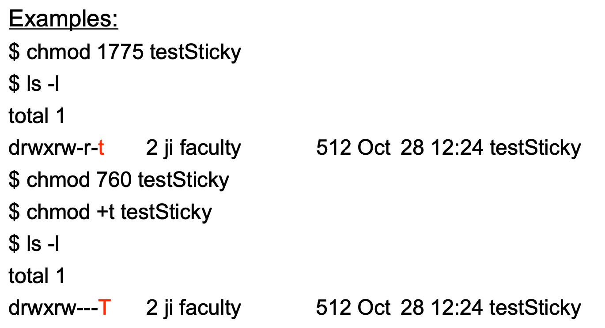


### 2.4 使用`chmod`改变文件的访问特权

#### 2.4.1 命令格式

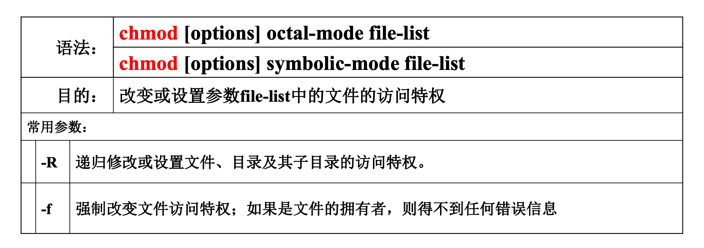

> 注：所谓递归修改，即修改目录内所有文件的访问特权（对于目录中的子目录，同样修改访问特权）

#### 2.4.2 符号模式

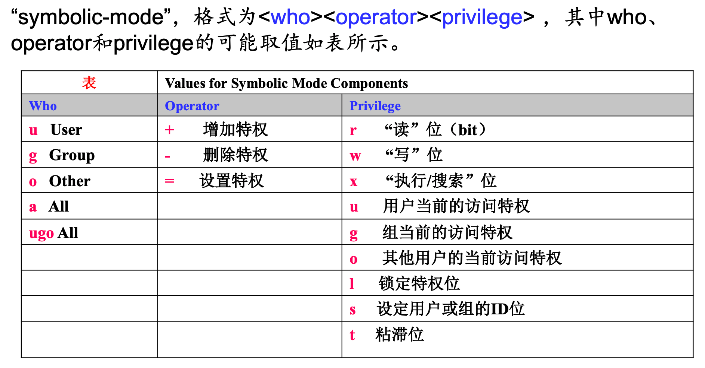

例子：

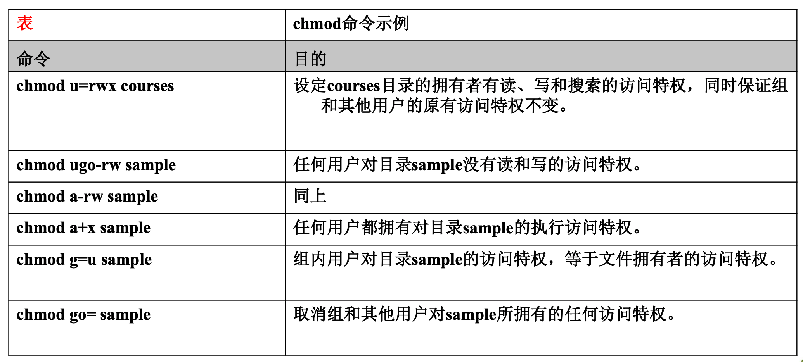

- SUID设置方法:

  ```shell
  chmod 4xxx *file-list* (in octal mode, xxx is the permissions of ugo)
  chmod u+s *file-list* (symbolic mode)
  ```

- SGID设置方法：

  ```shell
  chmod 2xxx file-list
  chmod g+s file-list
  ```

- Sticky设置方法：

  ```shell
  chmod 1xxx file-list 
  chmod +t file-list
  ```

  

#### 2.4.3 八进制模式

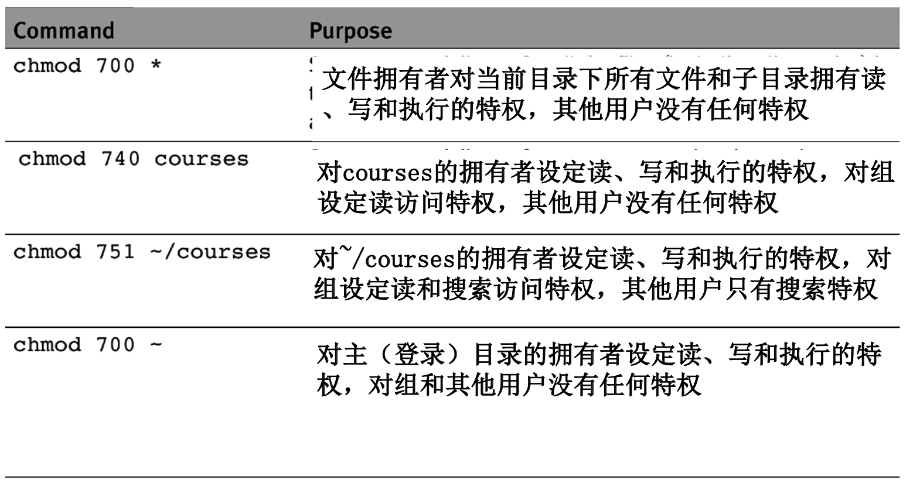

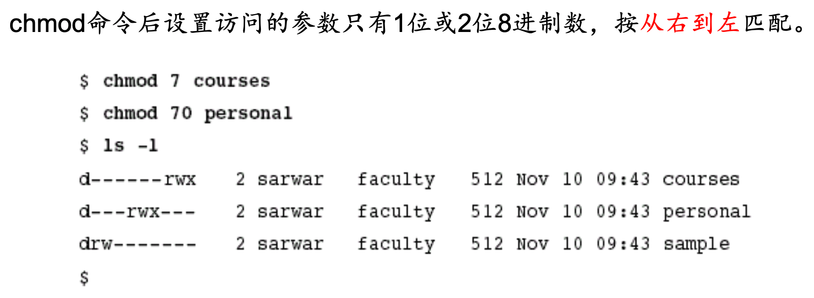


### 2.5 使用`umask`设定默认的文件访问特权

命令umask的参数是位的掩码(bit mask)，用八进制表示。掩码位为1表示新创建的文件相应的访问特权被**关闭**。

- 使用`umask`指令（不带参数），显示当前设置的掩码
- 使用`umask mask`，修改默认的文件访问特权
  - 文件访问权限=默认的访问权限 - mask
  - 默认的访问权限：执行文件为777，文本(text)文件为666

例子

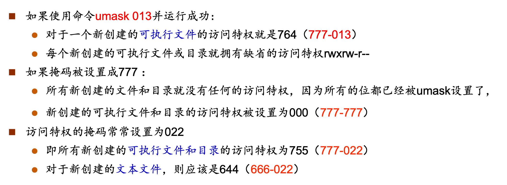

> 注意对于文本文件，默认为666，若mask = 777，不会在减法时发生借位，即666 - 777 = 000


```shell
umask 022
touch foo # 新建foo
umask 077
touch bar		
mkdir foobar # 默认777，777 - 077 = 700
ls -l foo bar foobar

-rw-r--r-- 1 ji faculty 0 Nov 5 16:16 foo 
-rw------- 1 ji faculty 0 Nov 5 16:16 bar 
drwx------ 2 ji faculty 512 Nov 5 16:16 foobar
```


## 3 `chattr`和`lsattr`命令

### 3.1 `chattr`命令：设置文件属性

```shell
chattr [-RV] [-+=AacDdijsSu] [-v version] files...
```

| 参数 | 功能                                                         |
| ---- | ------------------------------------------------------------ |
| -R   | 递归处理，将指定目录下的所有文件及子目录一并处理             |
| +    | 在原有参数设定基础上，追加参数                               |
| -    | 在原有参数设定基础上，减少参数                               |
| =    | 设定参数                                                     |
| A    | 文件或目录的 atime (access time)不可被修改                   |
| a    | 只能向文件中添加数据，而不能删除                             |
| i    | 设定文件不能被删除、改名、设定链接关系，同时不能写入或新增内容。i参数对于文件系统的安全设置有很大帮助 |
| s    | 保密性地删除文件或目录，即硬盘空间被全部收回。               |
| u    | 与s相反，当设定为u时，数据内容其实还存在磁盘中，可以用于undeletion. |


例子

```shell
# touch chattr_test
# chattr +i chattr_test
# rm chattr_test
rm: remove write-protected regular empty file `chattr_test`? y
rm: cannot remove `chattr_test`: Operation not permitted
此时连root本身都不能直接进行删除操作，必须先去除i设置后再删除。
```


### 3.2 `lsattr`命令：查看文件属性

```shell
lsattr [-RVadlv] [files...]
```

| 参数 | 功能                                                         |
| ---- | ------------------------------------------------------------ |
| -R   | 递归列示目录及文件属性                                       |
| -a   | 显示所有文件属性，包括隐藏文件(.)、当时目录(./)及上层目录(../)。 |
| -d   | 仅列示目录属性                                               |


## 4 基于文件链接的文件共享

### 4.1 `ln`命令：建立文件链接

```shell
ln [options] existing-file new-file
ln [options] existing-file-list directory
```

| 参数 | 功能                               |
| ---- | ---------------------------------- |
| -f   | 强迫建立链接                       |
| -n   | 如果“new-file”已存在，不创建链接。 |
| -s   | 建立一个符号链接而不是硬链接       |
| -d   | 建立目录的硬链接                   |


### 4.2 硬连接

硬连接是一个指向文件索引节点(inode)的指针。没有创建新的文件，只是给inode创建了另一个别名


**例子：**

```shell
$ ls -il test1
2513974 -rw-r--r-- 1 root root 556 Jul 12 21:06 test1
$ ln test1 test2
$ ls -il test*
2513974 -rw-r--r-- 2 root root 556 Jul 12 21:06 test1
2513974 -rw-r--r-- 2 root root 556 Jul 12 21:06 test2 # 建立新链接, inode相同
```

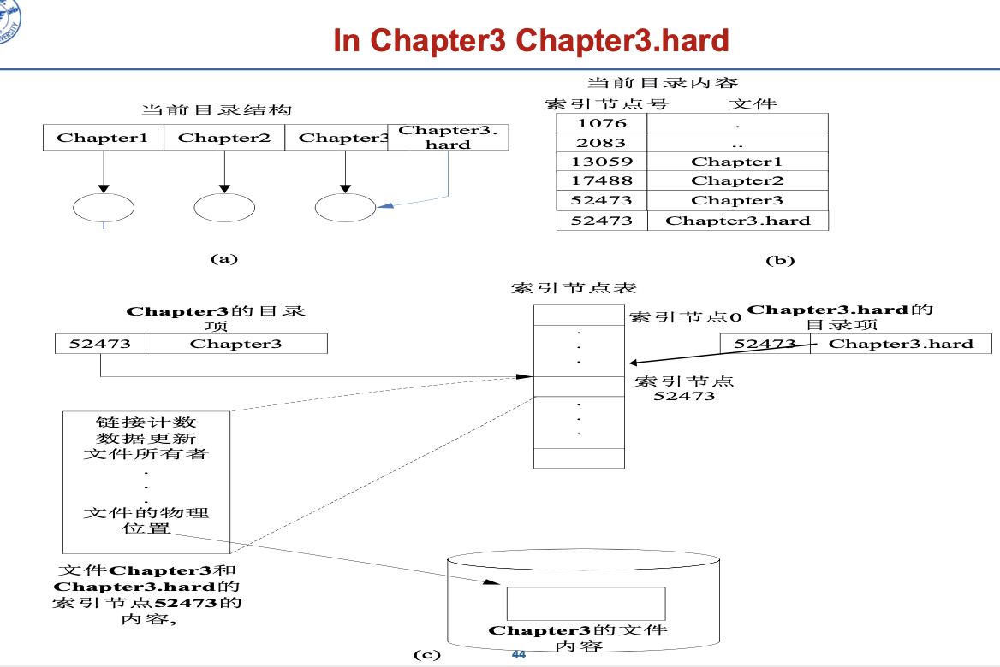


**特点**

- 不可跨越文件系统
- 只有超级用户才可以建立目录硬链接
- 不占用空间


### 4.3 符号连接（软连接）

> 也即windows系统中的快捷方式

- 系统为共享的用户创建一个link类型的新文件，登记在该用户共享目录项中，这个link型文件内容是连接文件的路径名。
- 连接文件在用ls命令长列表显示时，文件类型为l。
- 当用户要访问共享文件且要读link型新文件时，操作系统根据link文件类型性质将文件内容作为路径名去访问真正的共享文件。


#### `readlink`命令：读取连接文件的路径

readlink命令用来获取一个符号链接指向的目标文件的路径。

- 当一个符号链接指向的是一个另外的符号链接，而另外一个符号链接又指向其他的目 标。 这时可以使用-f选项直接获取最终的非符号链接的目标。


#### 符号连接的使用

```shell
ln –s Chapter3 Chapter3.soft
```

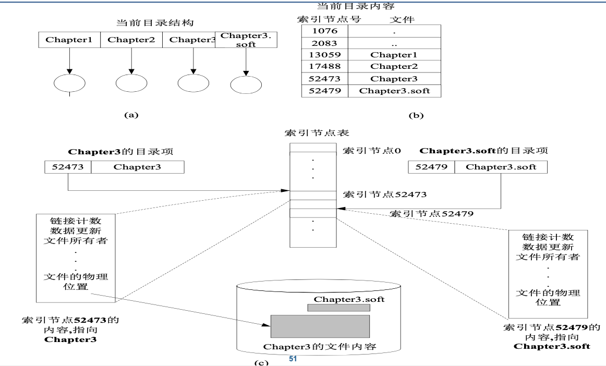

> 符号连接与硬连接不同，符号连接创建了一个新文件，其inode号与被连接者不同。


#### 符号连接特点

- 可跨越文件系统，甚至跨越网络(NFS)
- 如果链接指向的文件从一个目录移动到另一个目录，就无法通过符号链接访问（因为绝对路径改变）
- 占有少量空间，存储inode的信息

