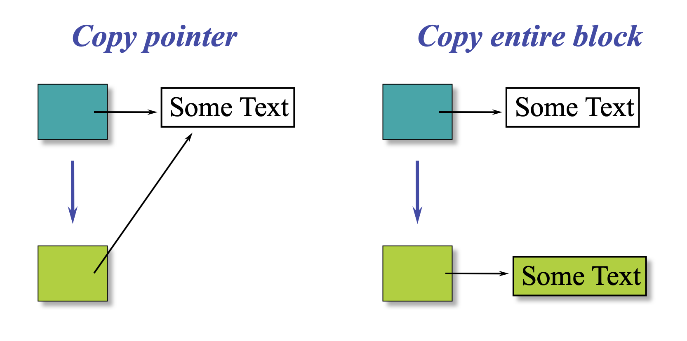

# Constructor & Destructor in C++

[TOC]


## 1 What is Constructor?

- Constructor has the same name as the class itself
- Constructors don’t have input argument
- Constructors don’t have return type
- A constructor is automatically called when an object is created.
- It must be placed in public section of class.


## 2 Three Types of Constructors

### 2.1 Default Constructor

It has **no parameters**.

- **Note:** If we do not specify a constructor, C++ compiler generates a default constructor for object (expects no parameters and has an empty body).

- **Note:** Consider a class derived from another class with the default constructor, or a class containing another class object with the default constructor. The compiler needs to insert code to call the default constructors of the base class/embedded object.

```c++
// CPP program to demonstrate Default constructors
#include <iostream>
using namespace std;

class Base {
public:
	// compiler "declares" constructor
};

class A {
public:
	// User defined constructor
	A() { cout << "A Constructor" << endl; }

	// uninitialized
	int size;
};

class B : public A {
	// compiler defines default constructor of B, and
	// inserts stub to call A constructor

	// compiler won't initialize any data of A
};

class C : public A {
public:
	C()
	{
		// User defined default constructor of C
		// Compiler inserts stub to call A's constructor
		cout << "C Constructor" << endl;

		// compiler won't initialize any data of A
	}
};

class D {
public:
	D()
	{
		// User defined default constructor of D
		// a - constructor to be called, compiler inserts
		// stub to call A constructor
		cout << "D Constructor" << endl;

		// compiler won't initialize any data of 'a'
	}

private:
	A a;
};

// Driver Code
int main()
{
	Base base;

	B b;
	C c;
	D d;

	return 0;
}
```

Output:

```shell
A Constructor
A Constructor
C Constructor
A Constructor
D Constructor
```


### 2.2 Parameterized Constructors

- The constructors can be called explicitly or implicitly.

  - Single Parameter

  ```c++
  Tree t = 12; 
  Tree t(12);
  ```
  - More than 2 parameters

  ```c++
  Example e = Example(0, 50); // Explicit call
  
  Example e(0, 50);           // Implicit call
  
  Example e = {1,50}; //illegal
  ```

- Whenever we define one or more non-default constructors( with parameters ) for a class, the compiler **will not provide a default constructor** in this case. 

  ```c++
  // Illustration
  #include <iostream>
  using namespace std;
  
  class point {
  private:
  double x, y;
  
  public:
  
  // Non-default Constructor &
  // default Constructor
  point (double px, double py)
  {
  	x = px, y = py;
  }
  };
  
  int main(void)
  {
  
  // Define an array of size
  // 10 & of type point
  // This line will cause error
  point a[10];
  
  // Remove above line and program
  // will compile without error
  point b = point(5, 6);
  }
  ```
  
```c++
  Y y1[] = {Y(1), Y(2), Y(3)}; //legal
  Y y2[2] = {Y(1)}; //illegal
  Y y4; //illegal
```


### 2.3 Copy Constructor

#### What is a copy constructor?

```c++
ClassName (const ClassName &old_obj); 
```

#### When is copy constructor called?

In C++, a Copy Constructor may be called in the following cases: 

1. When an object of the class is returned by value. 

2. When an object of the class is passed (to a function) by value as an argument. 

3. When an object is constructed based on another object of the same class. 

   ```c++
   A a(b);
   A a = c;
   ```

4. **When the compiler generates a temporary object.**


1和4联合例子：

- 理论上会发生两次拷贝构造
- 但实际情况依赖于编译器的优化情况。有的编译器会优化成`d = temp = aa`，一次拷贝构造都不会发生。

```c++
A f() {
	A aa;
  return aa; 	// 理论上发生拷贝构造：A temp(aa);
}

/* when call in main() */
A d = f();		// 理论上发生拷贝构造：A d(temp);
```


#### 什么时候要自己写拷贝构造函数？

> member有指针；想要部分成员拷贝

If we don’t define our own copy constructor, the C++ compiler creates a **default copy constructor** for each class which does a **member-wise copy** between objects.

- 对于原始类型，bit-wise = member-wise
- 对于类内的自定义类的对象，会调用该类的拷贝构造函数
- 对于指针类型，默认拷贝构造会导致两个对象中的两个指针指向同一片内存



```c++
#include<iostream>
#include<cstring>
using namespace std;

class String
{
private:
	char *s;
	int size;
public:
	String(const char *str = NULL); // constructor
	~String() { delete [] s; }// destructor
	String(const String&); // copy constructor
	void print() { cout << s << endl; } // Function to print string
	void change(const char *); // Function to change
};

String::String(const char *str)
{
	size = strlen(str);
	s = new char[size+1];
	strcpy(s, str);
}

void String::change(const char *str)
{
	delete [] s;
	size = strlen(str);
	s = new char[size+1];
	strcpy(s, str);
}

String::String(const String& old_str)
{
	size = old_str.size;
	s = new char[size+1];
	strcpy(s, old_str.s);
}

int main()
{
	String str1("GeeksQuiz");
	String str2 = str1;

	str1.print(); // what is printed ?
	str2.print();

	str2.change("GeeksforGeeks");

	str1.print(); // what is printed now ?
	str2.print();
	return 0;
}
```

Output: 

```c++
GeeksQuiz
GeeksQuiz
GeeksQuiz
GeeksforGeeks
```


```c++
#include<iostream>
#include<cstring>
using namespace std;

class String
{
private:
	char *s;
	int size;
public:
	String(const char *str = NULL); // constructor
	~String() { delete [] s; }// destructor
	void print() { cout << s << endl; }
	void change(const char *); // Function to change
};

String::String(const char *str)
{
	size = strlen(str);
	s = new char[size+1];
	strcpy(s, str);
}

void String::change(const char *str)
{
	delete [] s;
	size = strlen(str);
	s = new char[size+1];
	strcpy(s, str);
}

int main()
{
	String str1("GeeksQuiz");
	String str2 = str1;

	str1.print(); // what is printed ?
	str2.print();

	str2.change("GeeksforGeeks");

	str1.print(); // what is printed now ?
	str2.print();
	return 0;
}
```

Output: 

```c++
GeeksQuiz
GeeksQuiz
GeeksforGeeks
GeeksforGeeks
```


#### **Why argument to a copy constructor must be passed as a reference?** 

A copy constructor is called when an object is passed by value. Copy constructor itself is a function. So if we pass an argument by value in a copy constructor, a call to copy constructor would be made to call copy constructor which becomes a non-terminating chain of calls. Therefore compiler doesn’t allow parameters to be passed by value.


#### Copy constructor vs Assignment Operator

```c++
// CPP Program to demonstrate the use of copy constructor
// and assignment operator
#include <iostream>
#include <stdio.h>
using namespace std;

class Test {
public:
	Test() {}
	Test(const Test& t)
	{
		cout << "Copy constructor called " << endl;
	}

	Test& operator=(const Test& t)
	{
		cout << "Assignment operator called " << endl;
		return *this;
	}
};

// Driver code
int main()
{
	Test t1, t2;
	t2 = t1;
	Test t3 = t1;	//等价于Test t3(t1);
	getchar();
	return 0;
}
```

**Output**

```c++
Assignment operator called 
Copy constructor called 
```


## 3 What is Destructor?

```c++
~constructor-name();
```

#### Properties of Destructor:

- Destructor function is automatically invoked when the objects are destroyed.
- It cannot be declared static or const.
- The destructor does not have arguments.
- It has no return type not even void.
- ***An object of a class with a Destructor cannot become a member of the union.***
- ***A destructor should be declared in the public section of the class.***
- The programmer cannot access the address of destructor.


#### When is destructor called? 

A destructor function is called automatically when the object goes out of scope: 

- the function ends 
- the program ends 
- a block containing local variables ends 
- a `delete` operator is called 

#### The order of deconstruction

先构造的后析构，是栈结构


#### When do we need to write a user-defined destructor? 

**If we do not write our own destructor in class, compiler creates a default destructor for us.** The default destructor works fine unless we have dynamically allocated memory or pointer in class. When **a class contains a pointer to memory allocated in class**, we should write a destructor to release memory before the class instance is destroyed. This must be done to avoid memory leak.

如果有继承，父类的析构函数最好声明为`virtual`，否则容易造成内存泄漏。


#### Can there be more than one destructor in a class? 

No, there can only one destructor in a class with classname preceded by ~, no parameters and no return type.