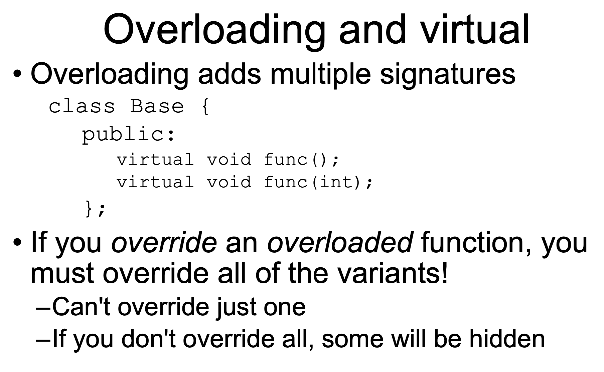
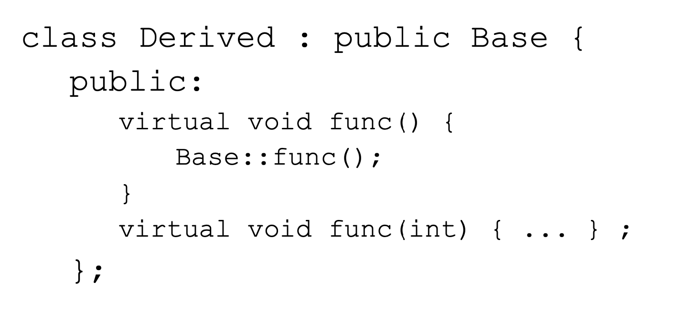
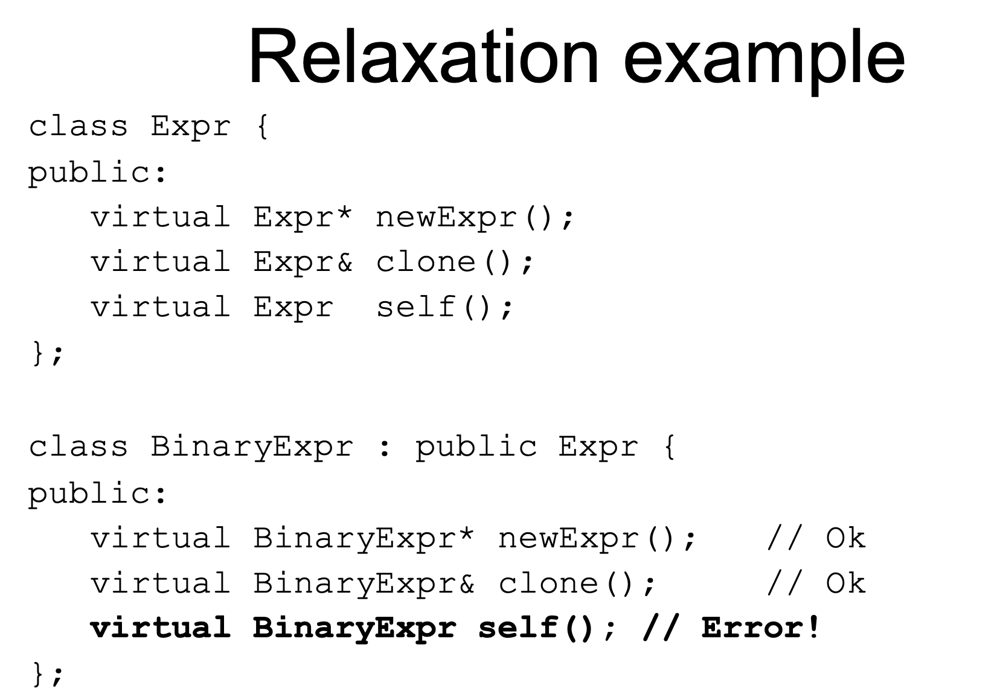
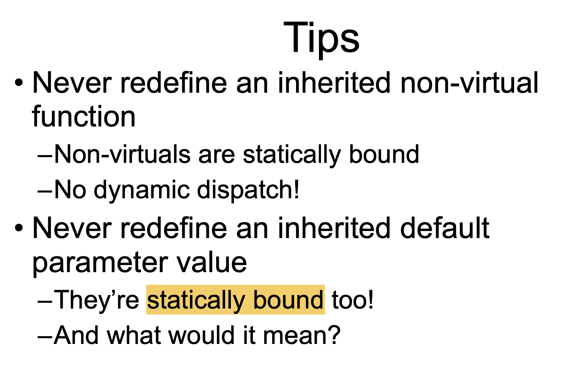

# Inheritance in C++

[TOC]

## 1 继承的基本概念

### 1.1 类之间的关系

- **Has-A**，包含关系，一个类的对象是另一个类的成员变量

```c++
class book {
private:
	string book_id; //class book has-a class string
};
```

- **Use-A**，一个类使用另一个类，通过类之间的成员函数相互联系，定义*友元*或者通过*传递参数*的方式来实现。

```c++
class B;
class A {
private:
	int i;
public:
	friend class B; //class B use-a class A
};
```

- **Is-A**，继承关系，关系具有传递性。

```c++
class A {
private:
	int i;
public:
	A() {
		cout << "A()" << endl;
	}
};

class B : public A {
private:
	int j;
public:
	A() {
		cout << "B()" << endl;
	}
};
```

### 1.2 继承的特点

- 子类继承父类的所有属性和方法（除了构造函数和析构函数）
- 子类一般是父类的超集，即拥有父类没有的属性和方法
- 没有被继承的内容：
  - 构造函数
  - 析构函数（Up-cast时需要使用virtual d'tor）
  - ==Assignment Operation，运算符重载被继承了吗？==
  - Private Member is hidden, but present

### 1.3 为什么要使用继承

- 提高代码重用
- 增加可扩展性


## 2 Access Control in Inheritance

### 2.1 public, protected, private继承

- public继承：父类中的public成员继承为public，protected成员继承为protected，**父类的private成员对子类不可见（但是存在）**
- protected继承：父类中的public成员继承为protected，protected成员继承为protected，父类的private成员对子类不可见
- private继承：父类中的public, protected成员继承为private，父类的private成员对子类不可见

**Note:** 

- **如果不设置继承方式，则默认为private继承**

- public继承是OOP语义上的继承方式。


### 2.2 成员的访问控制

- 需要被外界访问的成员设置为public。
- 只能在当前类中访问设置为private。
- 只能在当前类和子类中访问，设置为protected。


## 3 Name Hidden

- **同名成员变量**：如果父类的成员和子类的成员变量名称相同，我们可以通过作用域操作符`::`来显式使用父类的成员，否则默认使用的是子类的成员变量。

- ==**同名成员函数**：如果父类的某个成员函数有函数重载，此时在子类中定义同名函数，则父类的所有重载函数将被隐藏（无法访问），不管有没有Virtual关键字。==






## 4 继承中的构造函数和析构函数

### 4.1 构造函数的调用顺序

- 先调用父类的构造函数，再调用子类的构造函数（如果有祖先类，则顺序为祖先->父类->子类）
- 如果子类不显式调用父类的构造函数，则父类的默认构造函数将被调用（此时父类必须要存在默认构造函数，否则将出错）
- 从父类继承而来的变量，应由父类的构造函数构造。也就是说，在子类的构造函数的初始化列表中调用父类的构造函数。如下例：

```c++
class Vehicle { 
protected: 
    int wheels; 
    float weight; 
public: 
    Vehicle(int wheels,float weight); 
    int get_wheels(); 
    float get_weight(); 
    float wheel_load(); 
    void show(); 
}; 

class Car : public Vehicle {
private:
    int pass_load;
public:
    //使用父类的构造函数构造wheels和weight
    Car(int wheels, float weight, int pass) 
    : Vehicle(wheels, weight), pass_load(pass) {} 
    void show(); // name hidden
};
```

- 如果既存在继承，又存在组合（即类的成员变量是另一个类的对象），构造函数调用顺序是：**先调用父类的构造函数，再调用成员变量的构造函数，最后调用自己的构造函数。**

- **析构函数调用顺序和构造函数相反。**


### 4.2 虚析构函数

> 在C++中，没有语法保证一个类不会被继承。因此每一个类如果要设计析构函数，都应该设计成虚函数。

**为什么要使用虚析构函数**

如果虚构函数不是虚函数，当用一个基类的指针删除一个派生类的对象时，将只调用对应于指针类型的析构函数，此时没有删除派生类对象，造成内存泄漏。

基类的析构函数通常为虚函数，当用一个基类的指针删除一个派生类的对象时，将调用派生类析构然后自动调用基类析构，从而将从派生类到基类所有对象都删除。

**虚析构函数实例**

```c++
// A program with virtual destructor
#include <iostream>

using namespace std;

class base {
public:
	base()	
	{ cout << "Constructing base\n"; }
	virtual ~base()
	{ cout << "Destructing base\n"; }	
};

class derived : public base {
public:
	derived()	
	{ cout << "Constructing derived\n"; }
	virtual ~derived()
	{ cout << "Destructing derived\n"; }
};

int main() {
  derived *d = new derived();
  base *b = d;
  delete b;
  getchar();
  return 0;
}
```

Output:

```
Constructing base
Constructing derived
Destructing derived
Destructing base
```


## 5 Virtual

> - 虚函数是用于多态中virtual修饰父类函数，确保父类指针调用子类对象时，运行子类函数（Override)
>
>   - 子类继承父类
>
>   - **函数名称相同，参数表相同，返回类型相同**（父类返回子类指针，子类返回父类指针，这件事情不允许，而下图中父类返回父类指针/引用，子类返回子类指针/引用，是可以算作virtual的）
>
>     
>
>   - ```c++
>     class A {
>     public:
>         virtual void f(int i) {
>             cout << 1 <<endl;
>     } };
>     class B: public A {
>     public:
>         virtual void f(double i) {
>             cout << 2 << endl;
>     } };
>     int main() {
>     A* pa = new B; pa->f(1); return 0;
>     }
>     ```
>
>     如上不构成virtual的关系，因为函数的参数表不同
>
>   -  父类的该函数声明为virtual（子类会自动继承virtual，但最好显式地声明）
>
> - 纯虚函数是用来定义接口的，也就是基类中定义一个纯虚函数，基类不用实现，让子类来实现
>
> - 虚基类是用来在多继承中，如果父类继承自同一个父类，就只实例化一个父类(说的有点绕，就是只实例化一个爷爷的意思）

### 5.1 虚函数

> Up-casting 和 dynamic-binding是多态的前提

#### 5.1.1 Up-casting（向上造型）

**Up-casting**

- 子类对象的指针赋值给父类对象的指针
- 父类的引用指向一个子类的对象

```c++
class A {
public:
	void f() {cout << "A::f()" << endl;}
};
class B: public A {
public:
	void f() {cout << "B::f()" << endl;}
};

A* ap;
B b;
ap = &b; // up-casting
ap->f(); // will print "A::f()"

A& ar = b;
ar.f(); // will print "A::f()"
```

**Up-casting的内存基础**

假定Animal是父类，Fish继承了Animal，则一个Fish对象的内存如下表示：


可以看到，在不存在虚函数的继承情况中，子类对象的内存中首先是父类对象的成员变量，其次才是子类成员变量。

当使用父类的指针指向一个子类时，父类指针将对子类成员变量部分的内存“视而不见”。

**作用**

- 以父类的眼光看待子类

- 是虚函数能够使用的前提之一


**注意：子类对象赋给父类对象不是up-cast, 而会slice off!**


- 子类的成员变量将被slice off
- 子类的VPTR不会赋给父类对象


#### 5.1.2 Static Binding & Dynamic Binding

##### Dynamic Binding: call the function of the specific object

==**动态绑定的条件**==

只有满足条件1、2才是动态绑定：

- 条件1：`f()`是某对象的**虚函数**

- 条件2: 使用**指针或引用**调用`f()`
  - 对象指针p，调用`p->f()`
  - 对象引用p，调用`p.f()`

**动态绑定的时机**

动态绑定在**运行时**才会确定哪一个函数将被调用。


##### Static Binding: call the function as the code

除了以上情况，C++默认为静态绑定。

静态绑定在**编译时**完成。


#### 5.1.3 虚函数的实现及细节

```c++
#include <iostream>
using namespace std;
class A{ 
public: 
    virtual void f() { cout<<"A::f()\n"; } 
}; 

class B:public A{ 
public:
    void f() {cout<<"B::f()\n"; } 
}; 

int main() { 
    B b;
    A &p = b;
		p.f(); 	// dynamic binding, will print "B::f()\n"
    return 0;
}
```

**Note:**

- If we have created a virtual function in the base class and it is being overridden in the derived class then **we don’t need virtual keyword in the derived class**, functions are automatically considered as virtual functions in the derived class.
- 在构造函数中调用虚函数，不是动态绑定！一定会调用本类的该函数。

```c++
class A{ 
private:
  	int i;
public: 
  	A() { cout << "A()\n"; f(); } // here must call A::f()
    virtual void f() { cout<<"A::f()\n"; } 
}; 

class B:public A{ 
private:
    int j;
public:
    void f() {cout<<"B::f()\n"; } 
}; 

int main() { 
    B b;
    A &p = b;
		p.f(); 	// dynamic binding, will print "B::f()\n"
    return 0;
}
```

含有虚函数的类，其对象内存由`VPTR`（虚表指针）、父类成员变量、本类成员变量三个部分组成。在本例中，执行`B b`语句，实例化了一个B类的对象。在这个过程中，进行如下几个步骤：

- 调用A的构造函数。
  - 在调用构造函数前，首先初始化VPTR指针，指向A的vtable，此时vtable里有一个虚函数`A::f()`。
  - 为成员变量`i`分配内存。
  
- 调用B的构造函数。
  - 在vtable中，`B::f()`override`A::f()`
  - 为成员变量`j`分配内存。


##### ==不能是虚函数的函数==

- 普通函数不能是虚函数，也就是说这个函数必须是某一个类的成员函数，不可以是一个全局函数，否则会导致编译错误。
- 静态成员函数不能是虚函数。
- 内联函数不能是虚函数。**如果内联函数被virtual修饰，计算机会忽略inline使它变成存粹的虚函数。**
- **构造函数不能是虚函数**，否则会出现编译错误。


#### 5.1.4 虚函数的内存本质

在对象内存中添加VPTR指针域，VPTR指向虚函数表vtable，实现多态。


如果我们在子类中定义了从父类继承来的虚函数，

- 对于父类来说情况是不变的

- 对于子类来说它的虚函数表与之前的虚函数表是一样的，但是此时子类定义了自己的（从父类那继承来的）相应函数，所以它的虚函数表当中这个函数的指针，会指向自己定义的相应函数。
  - 这样如果用父类的指针，指向子类的对象，就会通过子类对象当中的虚函数表指针找到子类的虚函数表，从而通过子类的虚函数表找到子类的相应虚函数地址，
  - 而此时的地址已经是该函数自己定义的虚函数入口地址，而不是父类的相应虚函数入口地址，所以执行的将会是子类当中的虚函数。


#### 5.1.5 关于默认参数



default parameter由object, pointer 或者 reference的静态类型决定。由A的指针调用`f()`，使用的是`A`类的默认参数；由B的指针调用`f()`，则使用的是`B`类的默认参数。

```c++
struct A {
  virtual void f(int a = 7);
};
struct B : public A {
  void f(int a);
};
void m()
{
  B* pb = new B;
  A* pa = pb;
  pa->f(); //OK, calls pa->B::f(7)
  pb->f(); //error: wrong number of arguments for B::f()
}
```


### 5.2 虚继承与虚基类

> C++历史：为什么只有C++有多继承？
>
> C++不是单根结构。为了实现容器，采取了多继承的解决办法。
>
> ```c++
> 容器 放item类
> 想在该容器内放apple类
> 但是apple和item没关系
> 所以要多继承apple和item构造子类itemApple，才可以放在容器里
> ```

> `class B : virtual public A`
>
> 菱形继承

**多继承中的二义性**


如果实例化D类，则会创造两个A类的对象。此时使用A里面的属性则会出现编译器无法知道是使用A1的还是A2的。

```c++
class B1 { int m_i; };
class D1 : public B1 {};
class D2 : public B1 {};
class M : public D1, public D2 {};
void main() {
  Mm; //OK
  B1* p = new M; // ERROR: which B1
  B1* p2 = dynamic_cast<D1*>(new M); // OK
}
```

因此C++为我们提供了虚继承这个概念，即B和C虚继承自A，则在构造A对象的时候，只创建一个A的对象。

虚基类可以解决二义性的问题 ，就是解决多重多级继承造成的二义性问题。

**注意：** When we use `virtual` keyword, **the default constructor of grandparent class is called by default even if the parent classes explicitly call parameterized constructor.**

```c++
class CRAFT {
protected:
    double speed;
public:
    CRAFT() {}
    CRAFT(double speed) {
        this->speed = speed;
        cout << "创建航行器(速度: " << this->speed << ")" << endl;
    }
    virtual ~CRAFT() {
        cout <<"销毁航行器(速度: " << speed << ")" << endl;
    }
    virtual void Show() {
        cout <<"航行(速度: " << speed << ")" << endl;
    }
};

class PLANE : virtual public CRAFT {
protected:
    double width;
public:
    PLANE(double speed, double width) 
    :CRAFT(speed), width(width) {
        cout << "创建飞机(翼展: " << this->width << ")" << endl;
    }
    virtual ~PLANE() {
        cout << "销毁飞机(翼展: " << width << ")" << endl;
    }
    void Show() {
        cout << "航行(速度: " << speed << ", 翼展: " << width << ")" << endl;
    }
};

class SHIP : virtual public CRAFT {
protected:
    double depth;
public:
    SHIP(double speed, double depth)
    :CRAFT(speed), depth(depth) {
        cout << "创建船(吃水: " << this->depth << ")" << endl;
    }
    virtual ~SHIP() {
        cout << "销毁船(吃水: " << depth << ")" << endl;
    }
    void Show() {
        cout << "航行(速度: " << speed << ", 吃水: " << depth << ")" << endl;
    }
};

class SEAPLANE : public PLANE, public SHIP {
public:
    SEAPLANE(double speed, double width, double depth) 
      //必须在这里显式地调用CRAFT类的构造函数，才能成功初始化speed
    :CRAFT(speed), PLANE(speed, width), SHIP(speed, depth) {
        cout << "创建水上飞机" << endl;
    }
    virtual ~SEAPLANE() {
        cout << "销毁水上飞机" << endl;
    }
    void Show() {
        cout << "航行(速度: " << speed << ", 翼展: " << width << ", 吃水: " << depth <<  ")" << endl;
    }
};
```


### 5.3 纯虚函数与抽象类

纯虚函数：

```c++
virtual void render() = 0; // mark render() pure
```

#### 抽象类(Abstract Base Class, ABC)

抽象类：只要类中有一个纯虚函数，则该类就为抽象类。抽象类无法实例化（即创造对象）

如果一个 ABC 的子类需要被实例化，则必须实现每个虚函数，这也意味着 C++ 支持使用 ABC 声明接口。如果没有在派生类中重写纯虚函数，就尝试实例化该类的对象，会导致编译错误。

- Must derive a new class (or classes)

- Must supply definitions for all pure virtuals before class can be instantiated

**Why use them?**

- Modeling
- Force correct behavior
- Define interface without defining an implementation

**When to use them?**

– Not enough information is available
 – When designing for interface inheritance

**Example**

```c++
// 基类
class Shape {
public:
   // 提供接口框架的纯虚函数
   virtual int getArea() = 0;
   void setWidth(int w) {
      width = w;
   }
   void setHeight(int h) {
      height = h;
   }
protected:
   int width;
   int height;
};
 
// 派生类
class Rectangle: public Shape {
public:
   int getArea() { 
      return (width * height); 
   }
};
class Triangle: public Shape {
public:
   int getArea() { 
      return (width * height)/2; 
   }
};
```


#### Interface Classes

> 一种特殊的抽象类，只有纯虚函数，作为接口

- All non-static member functions are *pure* virtual except destructor
- Virtual destructor with empty body
- No non-static member variables, inherited or otherwise
  - May contain static members

```c++
//Unix character device
class CDevice {
public:
  virtual ~CDevice();
	virtual int read(...) = 0;
  virtual int write(...) = 0;
  virtual int open(...) = 0;
  virtual int close(...) = 0;
  virtual int ioctl(...) = 0;
};
```

